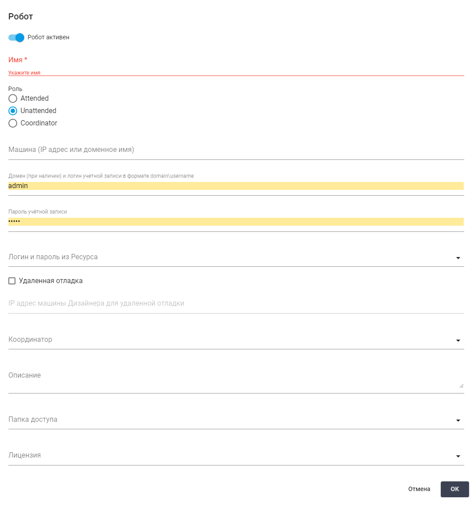
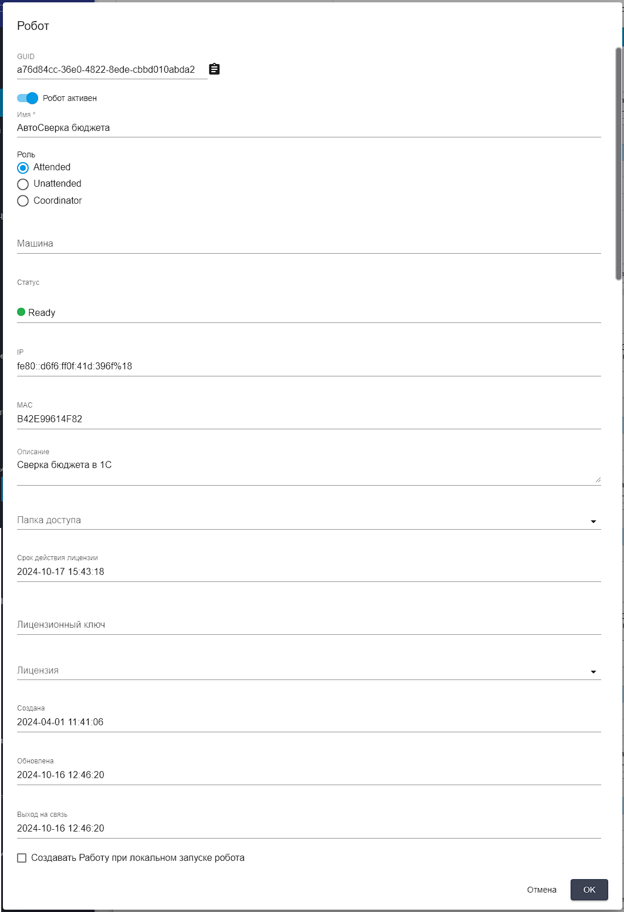
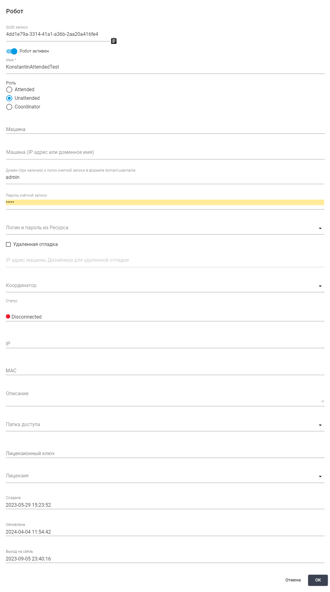
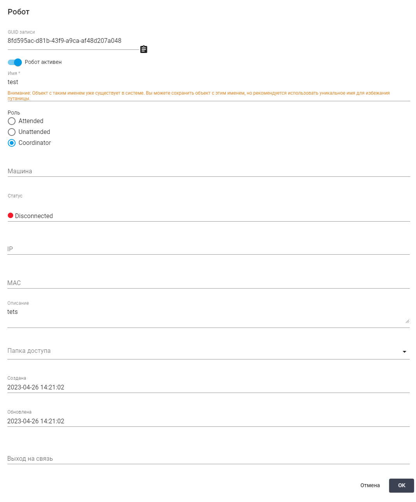

# Роботы

**Роботы** — экземпляры программного обеспечения платформы Sherpa RPA, развернутые на конкретных рабочих местах Пользователей, виртуальных машинах и терминальных серверах и подключенные для управления к Оркестратору. Роботы могут быть объединены в Группы Роботов. При этом один Робот может быть включен в несколько Групп.

Для более гибкого управления доступом Робота к тем или иным ресурсам, один и тот же Робот может быть назначен для разбора разных Очередей Задач по разным Процессам.

Экран “Роботы” содержит две таблицы: “Группы роботов” и “Роботы”.

<figure><figcaption></figcaption></figure>

Таблица “Группы роботов” включает следующую информацию:

<table data-header-hidden><thead><tr><th width="169"></th><th></th></tr></thead><tbody><tr><td><strong>Название колонки</strong></td><td><strong>Описание</strong></td></tr><tr><td>Имя</td><td>Содержит название для Группы роботов.</td></tr><tr><td>Описание</td><td>Может включать в себя информацию о Процессах, которые выполняют Роботы в Группе, или о сценариях, в которых они используются.</td></tr><tr><td>Папка доступа</td><td>Указывает на Папку доступа, к которой относится Группа роботов. Папка доступа служит средством разграничения доступа, позволяя взаимодействовать с Группой роботов только тем Пользователям, чьи Роли обеспечивают доступ к ней. Таким образом, Папка доступа не только позволяет контролировать, кто может видеть Группу роботов и управлять ими, но и гарантирует безопасность данных, создавая четкую структуру прав Пользователей.</td></tr></tbody></table>

Таблица “Роботы” включает следующую информацию:

<table data-header-hidden><thead><tr><th width="187"></th><th></th></tr></thead><tbody><tr><td><strong>Название</strong></td><td><strong>Описание</strong></td></tr><tr><td>Робот активен</td><td>Указывает на текущий статус активности Робота. Он позволяет не только понять, активен ли Робот в данный момент или отключен, но и изменить статус активности вручную с помощью переключателя . Важно отметить, что изменение этого статуса не выключает Робота на удаленной машине (физически), а просто информирует Оркестратор, что этому Роботу не следует назначать никаких Работ. Это освобождает Робота от выполнения задач, но не влияет на его функционирование или доступность для системы.</td></tr><tr><td>Имя</td><td>Содержит название каждого Робота.</td></tr><tr><td>Статус</td><td>
Содержит состояние каждого Робота, включает значения:
<ul><li>Disconnected (Отключен);</li><li>Ready (Готов);</li><li>Working (Работает);</li><li>Unlicensed (Без Лицензии).</li></ul></td></tr><tr><td>Тип</td><td>Содержит тип Робота, определяя его функциональные возможности и предназначение. Включает значения: “Attended”, “Unattended”, “Coordinator”.</td></tr><tr><td>Описание</td><td>Содержит дополнительную информацию о Роботе, например, это может быть его предназначение, особенности работы или детали конфигурации.</td></tr><tr><td>Срок действия лицензии</td><td>Указывает дату окончания действия Лицензии, необходимой для корректной работы Робота.</td></tr><tr><td>Лицензия</td><td>Содержит данные о типе Лицензии, используемой каждым Роботом в данной группе.</td></tr><tr><td>Выход на связь</td><td>Указывает дату, когда происходил последний обмен данными между Роботом и сервером.</td></tr><tr><td>Папка доступа</td><td>Указывает на Папку доступа, к которой относится Робот. Папка доступа служит средством разграничения доступа, позволяя взаимодействовать с Роботом только тем Пользователям, чьи Роли обеспечивают доступ к ней. Таким образом, Папка доступа не только позволяет контролировать, кто может видеть Робота и управлять им, но и гарантирует безопасность данных, создавая четкую структуру прав Пользователей.</td></tr></tbody></table>

Каждую колонку можно [закрепить, изменить размер или настроить фильтрацию](../rabochaya-oblast-orkestratora.md#deistviya-s-dannymi-tablic-ekranov-orkestratora) по нажатию на иконку .

Также можно отсортировать строки таблицы по возрастанию/убыванию значений в выбранной колонке, если нажать на свободную область соответствующего заголовка. Это позволяет быстро и удобно организовывать данные в необходимом порядке.

## **Создание нового Робота**

Для создания нового Робота необходимо нажать на кнопку “Создать” в таблице “Роботы” и заполнить открывшуюся форму:

<figure><figcaption></figcaption></figure>

<table data-header-hidden><thead><tr><th width="49"></th><th></th></tr></thead><tbody><tr><td></td><td><strong>Если не заполнить поле “Роль” и сохранить, то по умолчанию, флаг будет установлен на Роли “Attended”.</strong></td></tr></tbody></table>

### **Создание Attended-робота**

**Attended-роботы** — это Роботы, которые запускаются на компьютере Пользователя вручную, из автозагрузки, по комбинации клавиш или по расписанию из [планировщика заданий Windows](../../../sherpa-designer/nastroika-zapuska-robota-cherez-planirovshik-windows.md).

Для Attended-роботов достаточно задать отображаемое название и выбрать используемую Роботом [Лицензию](../../../licenzii/).

<table data-header-hidden><thead><tr><th width="56"></th><th width="264"></th><th></th></tr></thead><tbody><tr><td><strong>№</strong> <strong>п/п</strong></td><td><strong>Элемент интерфейса</strong></td><td><strong>Описание</strong> </td></tr><tr><td>1.</td><td>переключатель “Робот активен”</td><td>Включенный переключатель указывает на то, что Робот включен на стороне Оркестратора. В случае, если переключатель находится в положении “Робот неактивен”, при запросе данного Робота к Оркестратору будет передана команда на выключение.</td></tr><tr><td>2.</td><td>текстовое поле “Имя”</td><td>Имя Робота. Обязательное для заполнения поле.</td></tr><tr><td>3.</td><td>флаг “Роль Attended”</td><td>Роль Робота.</td></tr><tr><td>4.</td><td>текстовое поле “Описание”</td><td>Описание Робота.</td></tr><tr><td>5.</td><td>текстовое поле "Папка доступа"</td><td>Позволяет указать Папку доступа для создаваемого Робота.</td></tr><tr><td>6.</td><td>поле “Лицензия”</td><td>
Позволяет выбрать тип Лицензии Робота. Доступные варианты:
<ul><li>Local license (локальная Лицензия);</li><li>Attended Лицензия, добавленная в Оркестратор и назначенная определенному Роботу. </li></ul></td></tr><tr><td>7.</td><td>флаг "Создавать работу при локальном запуске робота"</td><td>Позволяет автоматически создавать Работу при локальном запуске Робота из Sherpa Assistant.</td></tr></tbody></table>

### **Создание Unattended-робота**

**Unattended-роботы** — это Роботы, которые запускает [Координатор](roboty.md#sozdanie-koordinatora). Координатор запускает Роботов если для них есть Работа на экране "Работы". Работа может быть создана вручную, по Триггеру или через API.

<figure><figcaption></figcaption></figure>

<table data-header-hidden><thead><tr><th width="54"></th><th width="266"></th><th></th></tr></thead><tbody><tr><td><strong>№ п/п</strong></td><td><strong>Элемент интерфейса</strong></td><td><strong>Описание</strong> </td></tr><tr><td>1.</td><td>переключатель “Робот активен”</td><td>Включенный переключатель указывает на то, что Робот включен на стороне Оркестратора. В случае, если переключатель находится в положении “Робот неактивен”, при запросе данного Робота к Оркестратору будет передана команда на выключение.</td></tr><tr><td>2.</td><td>текстовое поле “Имя”</td><td>Имя Робота. Обязательное для заполнения поле.</td></tr><tr><td>3.</td><td>флаг “Роль Unattended”</td><td>Роль Робота.</td></tr><tr><td>4.</td><td>текстовое поле “Машина (IP адрес или доменное имя)”</td><td>IP адрес терминального сервера или виртуальной машины, на которой развернут данный Робот.</td></tr><tr><td>5.</td><td>текстовое поле “Домен (при наличии) и логин учетной записи в формате domain\username”</td><td>Доменное имя терминального сервера или виртуальной машины, на которой развернут данный Робот или логин Учетной записи (при необходимости включающий домен), в которой должен запускаться Робот.</td></tr><tr><td>6.</td><td>текстовое поле “Пароль учетной записи”</td><td>Пароль от пользовательской Учетной записи, в которой должен запускаться Робот.</td></tr><tr><td>7.</td><td>текстовое поле "Логин и Пароль из Ресурса"</td><td>Позволяет указать для данного Робота логин и пароль из выбранного Ресурса. </td></tr><tr><td>8.</td><td>чекбокс “Удаленная отладка”</td><td>Позволяет зафиксировать, что Робот будет запускаться в режиме удаленной отладки через Sherpa Designer.</td></tr><tr><td>9.</td><td>текстовое поле "IP адрес машины Дизайнера для удаленной отладки"</td><td>IP-адрес машины, где находится Sherpa Designer, через который Робот будет запускаться в режиме удаленной отладки.</td></tr><tr><td>10.</td><td>текстовое поле “Сервер удаленной отладки”</td><td>Сервер, на котором будет проводиться удаленная отладка данного Робота.</td></tr><tr><td>11.</td><td>текстовое поле “Координатор”</td><td>Экземпляр Координатора, который будет использован для запуска данного Робота.</td></tr><tr><td>12.</td><td>текстовое поле “Описание”</td><td>Описание Робота.</td></tr><tr><td>13.</td><td>текстовое поле “Папка доступа”</td><td>Позволяет указать Папку доступа для создаваемого Робота.</td></tr><tr><td>14.</td><td>текстовое поле “Лицензия”</td><td>
Позволяет выбрать тип Лицензии Робота. Доступные варианты:
<ul><li>Local license (локальная Лицензия);</li><li>Unattended Лицензия, добавленная в Оркестратор и назначенная определенному Роботу.</li></ul></td></tr></tbody></table>

### **Создание Координатора**

**Координатор** — это сервис, который используется для запуска Unattended-роботов в пользовательских Учетных записях, где требуется автоматический вход в Учетные записи Роботов. Он устанавливается из соответствующего дистрибутива Sherpa Coordinator, предоставляемого вендором, не требует отдельной Лицензии. Подробнее о Координаторе и его установке в разделе о [Координаторе](../../razvertyvanie-platformy-pod-upravleniem-orkestratora/ustanovka-sherpa-rpa-coordinator/).

<figure><figcaption></figcaption></figure>

<table data-header-hidden><thead><tr><th width="56"></th><th width="265"></th><th></th></tr></thead><tbody><tr><td><strong>№ п/п</strong></td><td><strong>Элемент интерфейса</strong></td><td><strong>Описание</strong> </td></tr><tr><td>1.</td><td>переключатель “Робот активен”</td><td>Включенный переключатель указывает на то, что Робот включен на стороне Оркестратора. В случае, если переключатель находится в положении “Робот неактивен”, при запросе данного Робота к Оркестратору будет передана команда на выключение.</td></tr><tr><td>2.</td><td>текстовое поле “Имя”</td><td>Имя Координатора. Обязательное для заполнения поле.</td></tr><tr><td>3.</td><td>флаг “Роль Coordinator”</td><td>Роль Координатора.</td></tr><tr><td>4.</td><td>текстовое поле “Описание”</td><td>Описание Координатора.</td></tr><tr><td>5.</td><td>текстовое поле "Папка доступа"</td><td>Позволяет указать Папку доступа для создаваемого Робота.</td></tr></tbody></table>

Для сохранения созданного Робота, после заполнения формы необходимо нажать кнопку “ОК”. Робот будет создан.

## **Редактирование ранее созданного Робота**

### **Редактирование ранее созданного Attended-робота**

Для просмотра и редактирования свойств конкретного Робота необходимо выбрать его в списке и нажать на кнопку  (1) (1).png>). После этого откроется форма с настройками выбранного Робота, в которую можно внести необходимые изменения. Помимо полей заполняемых при создании нового Робота в форме редактирования есть дополнительные настройки.&#x20;

<table data-header-hidden><thead><tr><th width="52"></th><th width="213"></th><th></th></tr></thead><tbody><tr><td><strong>№ п/п</strong></td><td><strong>Элемент интерфейса</strong></td><td><strong>Описание</strong> </td></tr><tr><td>1.</td><td>текстовое поле “GUID”</td><td>Уникальный идентификатор, присвоенный Роботу после его создания. Данное поле нельзя отредактировать. </td></tr><tr><td>2.</td><td>текстовое поле “Статус”</td><td>
Статус Робота. Возможные варианты:
<ul><li>Disconnected (Отключен);</li><li>Ready (Готов);</li><li>Working (Работает);</li><li>Unlicensed (Без Лицензии).</li></ul>
 Данное поле нельзя отредактировать.
</td></tr><tr><td>3.</td><td>текстовое поле “IP” </td><td>IP адрес терминального сервера или виртуальной машины, на которой развернут данный Робот. Поле можно редактировать только для Unattended и Attended Роботов. </td></tr><tr><td>4.</td><td>текстовое поле “MAC”</td><td>MAC-адрес терминального сервера или виртуальной машины, на которой развернут данный Робот. Поле можно редактировать.</td></tr><tr><td>5.</td><td>текстовое поле "Срок действия лицензии"</td><td>Срок действия Лицензии. Данное поле нельзя отредактировать.</td></tr><tr><td>6.</td><td>текстовое поле “Лицензионный ключ”</td><td>Лицензионный ключ Робота. Данное поле можно редактировать.</td></tr><tr><td>7.</td><td>поле “Создана”</td><td>Дата и время создания Робота.  Данное поле нельзя отредактировать.</td></tr><tr><td>8.</td><td>поле “Обновлена”</td><td>Дата и время обновления записи текущего Робота в Оркестраторе. Данное поле нельзя отредактировать.</td></tr><tr><td>9.</td><td>поле “Выход на связь”</td><td>Дата и время выхода на связь Робота. Данное поле нельзя редактировать.</td></tr></tbody></table>

<figure><figcaption></figcaption></figure>

### **Редактирование ранее созданного Unattended-робота**

<figure><figcaption></figcaption></figure>

<table data-header-hidden><thead><tr><th width="53"></th><th width="197"></th><th></th></tr></thead><tbody><tr><td><strong>№ п/п</strong></td><td><strong>Элемент интерфейса</strong></td><td><strong>Описание</strong> </td></tr><tr><td>1.</td><td>текстовое поле “GUID”</td><td>Уникальный идентификатор, присвоенный Роботу после его создания. Данное поле нельзя отредактировать. </td></tr><tr><td>2.</td><td>текстовое поле “Статус”</td><td>
Статус Робота. Возможные варианты:
<ul><li>Disconnected (Отключен);</li><li>Ready (Готов);</li><li>Working (Работает);</li><li>Unlicensed (Без Лицензии).</li></ul>
 Данное поле нельзя отредактировать.
</td></tr><tr><td>3.</td><td>текстовое поле “IP”</td><td>IP адрес терминального сервера или виртуальной машины, на которой развернут данный Робот. Поле можно редактировать только для Unattended и Attended Роботов. </td></tr><tr><td>4.</td><td>текстовое поле “MAC”</td><td>MAC-адрес терминального сервера или виртуальной машины, на которой развернут данный Робот. Поле можно редактировать.</td></tr><tr><td>5.</td><td>текстовое поле “Лицензионный ключ”</td><td>Лицензионный ключ Робота. Данное поле можно редактировать.</td></tr><tr><td>6.</td><td>поле “Создано”</td><td>Дата и время создания Робота.  Данное поле нельзя отредактировать.</td></tr><tr><td>7.</td><td>поле “Обновлена”</td><td>Дата и время обновления записи текущего Робота в Оркестраторе. Данное поле нельзя отредактировать.</td></tr><tr><td>8.</td><td>поле “Выход на связь”</td><td>Дата и время выхода на связь Робота. Данное поле нельзя редактировать.</td></tr></tbody></table>

### **Редактирование ранее созданного Координатора**

<figure><figcaption></figcaption></figure>

<table data-header-hidden><thead><tr><th width="56"></th><th width="211"></th><th></th></tr></thead><tbody><tr><td><strong>№ п/п</strong></td><td><strong>Элемент интерфейса</strong></td><td><strong>Описание</strong> </td></tr><tr><td>1.</td><td>текстовое поле “GUID”</td><td>Уникальный идентификатор, присвоенный Роботу после его создания. Данное поле нельзя отредактировать. </td></tr><tr><td>2.</td><td>текстовое поле “Статус”</td><td>
Статус Робота. Возможные варианты:
<ul><li>Disconnected (Отключен);</li><li>Ready (Готов);</li><li>Working (Работает);</li><li>Unlicensed (Без Лицензии).</li></ul>
 Данное поле нельзя отредактировать.
</td></tr><tr><td>3.</td><td>текстовое поле “IP”</td><td>IP адрес терминального сервера или виртуальной машины, на которой развернут данный Робот. Поле можно редактировать только для Unattended и Attended Роботов. </td></tr><tr><td>4.</td><td>текстовое поле “MAC”</td><td>MAC-адрес терминального сервера или виртуальной машины, на которой развернут данный Робот. Поле можно редактировать.</td></tr><tr><td>5.</td><td>поле “Создано”</td><td>Дата и время создания Робота.  Данное поле нельзя отредактировать.</td></tr><tr><td>6.</td><td>поле “Обновлена”</td><td>Дата и время обновления записи текущего Робота в Оркестраторе. Данное поле нельзя отредактировать.</td></tr><tr><td>7.</td><td>поле “Выход на связь”</td><td>Дата и время выхода на связь Робота. Данное поле нельзя редактировать.</td></tr></tbody></table>

## Создание новой Группы роботов

Таблица “Группы роботов” позволяет группировать Роботов между собой, объединять их в логические группы.

Например, при необходимости можно создать Группу для работы в рамках определенного терминального сервера, присвоить ей имя и добавить в нее соответствующих Роботов.

Для того, чтобы в таблице “Роботы” отобразился список Роботов, предварительно нужно выбрать необходимую Группу роботов.

Группа “All Robots” перечисляет всех доступных Роботов, имеющихся в Оркестраторе. Она создается автоматически и недоступна для удаления.

При выборе интересующей Группы роботов, в нижней таблице “Роботы” отобразится список всех Роботов, относящихся к выбранной Группе, в том числе и Робот с функцией Координатор (для Unattended-роботов).

<table data-header-hidden><thead><tr><th width="51"></th><th></th></tr></thead><tbody><tr><td></td><td><strong>Координатор всегда находится во включенном состоянии, о чем сигнализирует зеленый индикатор. Данный сервис обеспечивает создание и удержание сессий пользовательских Учетных записей для Unattended-роботов в рамках используемого терминального сервера.</strong></td></tr></tbody></table>

Все остальные Роботы – это технические Учетные записи, запущенные на том же терминальном сервере.

Для создания новой Группы роботов необходимо нажать на кнопку “Создать” в таблице “Группы роботов” и заполнить открывшуюся форму: указать имя Группы роботов (обязательно), описание Группы роботов и Папку доступа. Для сохранения созданной Группы роботов, после заполнения формы необходимо нажать кнопку “ОК”. Группа роботов будет создана.

<figure><figcaption></figcaption></figure>

## **Редактирование ранее созданной Группы роботов**

Для просмотра и редактирования свойств конкретной Группы роботов необходимо выбрать ее в списке и нажать на иконку .png>) ("Изменить").&#x20;

После этого откроется форма с настройками выбранной Группы роботов, в которую можно внести необходимые изменения.&#x20;

<figure><figcaption></figcaption></figure>

Помимо полей, заполняемых при создании новой Группы роботов, в форме редактирования есть дополнительное поле:&#x20;

“**GUID записи**” – это уникальный идентификатор, присвоенный Группе роботов после ее создания. Данное поле нельзя отредактировать.
