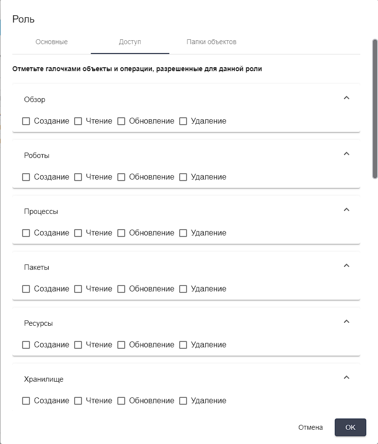

# Роли

**Роль** – это параметр, который определяет набор прав доступа к экранам Оркестратора, а также функциям в рамках выбранных экранов.

Экран “Роли” содержит таблицу “Роли”.

<figure><figcaption></figcaption></figure>

## **Создание новой роли**

Для создания новой роли необходимо нажать на кнопку “Создать” в таблице “Роли” и заполнить открывшуюся форму.\
Форма создания новой роли содержит две вкладки:

* Основные;
* Доступ;
* Папки объектов.

### **Вкладка “Основные”**

Во вкладке “Основные” находятся два текстовых поля:

* Имя (Имя роли. Обязательное для заполнения поле);
* Описание (описание роли).

<figure><figcaption></figcaption></figure>

### **Вкладка “Доступ”**

Во вкладке “Доступ” необходимо отметить флажками те функции для тех экранов, которые будут доступны пользователю с создаваемой ролью. Доступные функции для каждого экрана:

* Создание;
* Чтение;
* Обновление;
* Удаление.

<figure><figcaption></figcaption></figure>

<figure><figcaption></figcaption></figure>

<figure><figcaption></figcaption></figure>

### **Вкладка “Папки объектов”**

Во вкладке “Папки объектов” необходимо отметить флажками те папки объектов, права которые будут доступны пользователю с создаваемой ролью.

Примечание: папки объектов создаются отдельно на соответствующем экране Оркестратора.

<figure><figcaption></figcaption></figure>

## **Редактирование ранее созданной роли**

Для просмотра и редактирования роли необходимо выбрать ее в списке и нажать на кнопку . После этого откроется форма редактирования роли, в которую можно внести необходимые изменения. Помимо полей, заполняемых при создании роли, при редактировании в форме указан GUID (уникальный идентификатор, присвоенный роли после ее создания). Данное поле нельзя отредактировать.
