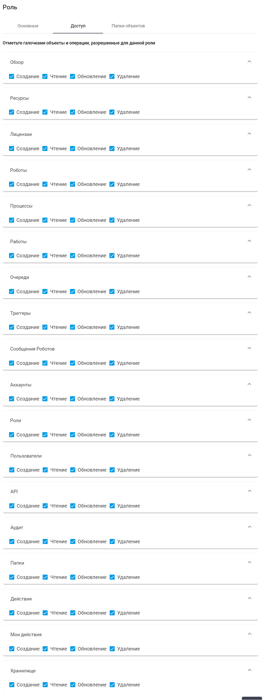

# Роли

**Роль** – это параметр, который определяет набор прав доступа к экранам Оркестратора, а также функциям в рамках выбранных экранов.

**Минимальные необходимые права Роли Пользователя:**

* Право на чтение Dashboards;
* Право на чтение Folders (Папок Доступа);

Если Пользователю требуется редактировать Роботов, то ему необходимо предоставить:

* Право на чтение Dashboards;
* Право на чтение Folders (Папок Доступа);
* Право на чтение Assets (Ресурсов);
* Право на чтение Licenses (Лицензий).

_Примечание:_ на экране редактирования Робота происходит обращение к этим данным для формирования списков в соответствующих полях ввода.

Экран “Роли” содержит таблицу “Роли”:

<figure><figcaption></figcaption></figure>

## **Создание новой Роли**

Для создания новой Роли необходимо нажать на кнопку “Создать” над таблицей “Роли” и заполнить открывшуюся форму:

<figure><figcaption></figcaption></figure>

Форма создания новой Роли содержит две вкладки:

* Основные;
* Доступ;
* Папки объектов.

### **Вкладка “Основные”**

Во вкладке “Основные” находятся два текстовых поля:

* “Имя\*” - имя Роли, обязательное для заполнения поле;
* “Описание” - описание Роли, где можно указать какие функции будет выполнять Роль, права доступа к различным экранам и действия, которые могут выполняться Пользователями с данной Ролью.

### **Вкладка “Доступ”**

Во вкладке “Доступ” необходимо отметить флажками те функции для тех экранов, которые будут доступны Пользователю с создаваемой Ролью. Доступные функции для каждого экрана:

* чекбокс “Создание” - позволяет Пользователю с данной Ролью создавать новые элементы в системе. Включите этот чекбокс, если вы хотите предоставить Пользователю возможность добавлять соответствующие новые элементы;
* чекбокс “Чтение” - предоставляет Пользователю с данной Ролью доступ к просмотру информации на выбранном экране. Включите этот чекбокс, если вы хотите, чтобы Пользователь мог видеть и читать данные, находящиеся на соответствующем экране;
* чекбокс “Обновление” - позволяет Пользователю с данной Ролью изменять уже существующие элементы в системе. Включите этот чекбокс, если вы хотите, чтобы Пользователь смог редактировать существующую информацию;
* чекбокс “Удаление” - дает Пользователю возможность удалять элементы из системы. Включите этот чекбокс, если необходимо позволить Пользователю удалять соответствующие элементы.

<figure><figcaption></figcaption></figure>

### **Вкладка “Папки объектов”**

Во вкладке “Папки объектов” необходимо заполнить чекбоксы у тех Папок объектов, права которые будут доступны Пользователю с создаваемой Ролью.

<figure><figcaption></figcaption></figure>

[Папки объектов](papki-obektov.md) создаются отдельно на соответствующем экране Оркестратора.

## **Редактирование ранее созданной Роли**

Для просмотра и редактирования Роли необходимо выбрать ее в списке и нажать на иконку .png>). После этого откроется форма редактирования Роли, в которую можно внести необходимые изменения. Помимо полей, заполняемых при создании роли, при редактировании в форме указан GUID (уникальный идентификатор, присвоенный роли после ее создания). Данное поле нельзя отредактировать.

<figure><figcaption></figcaption></figure>
