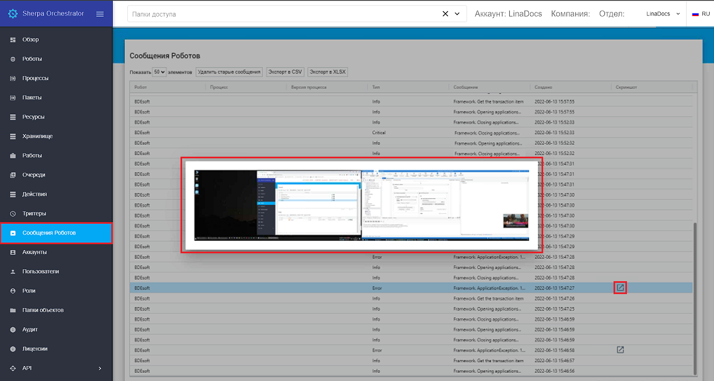

# Сообщения Роботов

**Сообщения роботов (логи)** — это сообщения, которые роботы отправляют в Оркестратор по мере выполнения работ.

Экран “Сообщения роботов” содержит таблицу “Сообщения Роботов”.\
Каждое сообщение роботов (лог) отражается в таблице “Сообщения Роботов” как одна строка.

<table data-header-hidden><thead><tr><th width="101"></th><th width="169"></th><th></th></tr></thead><tbody><tr><td><strong>№ п/п</strong></td><td><strong>Колонка</strong></td><td><strong>Описание колонки</strong></td></tr><tr><td>1.</td><td>Робот</td><td>Отображает имя робота.</td></tr><tr><td>2.</td><td>Процесс</td><td>Отображает процесс, который выполняется роботом.</td></tr><tr><td>3.</td><td>Версия процесса</td><td>Отображает версию процесса, которая выполняется роботом.</td></tr><tr><td>4.</td><td>Работа</td><td>Отображает работу, которую выполняет робот.</td></tr><tr><td>5.</td><td>Тип</td><td>
Отображает присвоенный сообщению робота (логу) тип. Возможные значения:
<ul><li>Info — информация;</li><li>Critical — критично;</li><li>Error — ошибка;</li><li>Warning — предупреждение;</li><li>Debug — отладка.</li></ul></td></tr><tr><td>6.</td><td>Сообщение</td><td>Отображает сообщение робота.</td></tr><tr><td>7.</td><td>Создано</td><td>Отображает дату и время создания данного сообщения робота.</td></tr></tbody></table>

<figure><figcaption></figcaption></figure>

Все колонки таблицы “Сообщения роботов” могут быть настроены пользователем. Функции настройки колонок таблиц описаны [здесь](../rabochaya-oblast-orkestratora.md).

## **Логирование в Оркестратор на стороне Дизайнера**

Логи в Оркестраторе — это логи, которые роботы отправляют сами. Есть некоторое количество системных логов. Системные логи записываются, если внутри сценария произошла ошибка, которая нигде не была обработана, и сценарий завершился аварийно.\
Логировать можно любые сообщения или значения переменных. Для этого в Дизайнере предусмотрено два блока:

* “Логировать в Оркесторатор”;
* “Лог”.

### **Логирование с помощью блока “Логировать в Оркестратор”**

В параметрах блока “Логировать в Оркестратор” необходимо указать сообщение (любая переменная любого типа) и уровень его критичности.

<figure><figcaption></figcaption></figure>

При использовании данного блока можно выбирать уровень логирования:

* Info — информация;
* Critical — критично;
* Error — ошибка;
* Warning — предупреждение;
* Debug — отладка.

Также можно вместе с сообщением отправить в Оркестратор скриншот, предварительно установив флаг “Скриншот”.

<figure><figcaption></figcaption></figure>

Сообщение будет отображаться на экране “Сообщения Роботов”.

В случае если к сообщению от робота был прикреплен скриншот, соответствующая иконка появится в колонке “Скриншот”. Кликните на иконку, чтобы увидеть скриншот в исходном размере.

<figure><figcaption></figcaption></figure>

### **Логирование с помощью блока “Лог”**

Другой способ логирования – в Дизайнере в блоке “Лог” установить флаг “Оркестратор. Логировать”.

<figure><figcaption></figcaption></figure>

**Примечание:** _не рекомендуется использовать логирование в Оркестратор внутри тела циклов с коротким интервалом, т.к. это может привести к появлению большого количества лишних сообщений. В целях безопасности Оркестратор может ограничивать максимальное число получаемых в единицу времени сообщения от робота._

\
