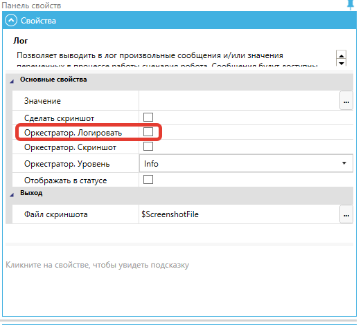

# Сообщения Роботов

**Сообщения Роботов (Логи)** — это сообщения, которые Роботы отправляют в Оркестратор по мере выполнения Работ.

Экран “Сообщения Роботов” содержит таблицу “Сообщения Роботов”.

Каждое сообщение Роботов (Лог) отражается в таблице “Сообщения Роботов” как одна строка.

<figure><figcaption></figcaption></figure>

<table data-header-hidden><thead><tr><th width="53"></th><th width="117"></th><th width="363"></th></tr></thead><tbody><tr><td><strong>№ п/п</strong></td><td><strong>Колонка</strong></td><td><strong>Описание колонки</strong></td></tr><tr><td>1.</td><td>Робот</td><td>Отображает имя Робота.</td></tr><tr><td>2.</td><td>Процесс</td><td>Отображает Процесс, который выполняется Роботом.</td></tr><tr><td>3.</td><td>Версия Процесса</td><td>Отображает версию Процесса, которая выполняется Роботом.</td></tr><tr><td>4.</td><td>Работа</td><td>Отображает Работу, которую выполняет Робот.</td></tr><tr><td>5.</td><td>Тип</td><td>
Отображает присвоенный сообщению Робота (Логу) тип. Возможные значения:
<ul><li>Info — информация;</li><li>Critical — критично;</li><li>Error — ошибка;</li><li>Warning — предупреждение;</li><li>Debug — отладка.</li></ul></td></tr><tr><td>6.</td><td>Сообщение</td><td>Отображает сообщение Робота.</td></tr><tr><td>7.</td><td>Поля</td><td>Отображает параметры запросов и ответов, которые могут включать в себя тип данных и идентификаторы.</td></tr><tr><td>8.</td><td>Создано</td><td>Отображает дату и время создания данного сообщения Робота.</td></tr></tbody></table>

Все колонки таблицы “Сообщения Роботов” могут быть настроены Пользователем. Функции настройки колонок таблиц описаны [здесь](../rabochaya-oblast-orkestratora.md).

## **Логирование в Оркестратор на стороне Дизайнера**

Логи в Оркестраторе — это Логи, которые Роботы отправляют сами. Есть некоторое количество системных Логов. Системные Логи записываются, если внутри сценария произошла ошибка, которая нигде не была обработана, и сценарий завершился аварийно.

Логировать можно любые сообщения или значения переменных. Для этого в Дизайнере предусмотрено два блока:

* “Логировать в Оркесторатор”;
* “Лог”.

### **Логирование с помощью блока “Логировать в Оркестратор”**

В параметрах блока “Логировать в Оркестратор” необходимо указать сообщение (любая переменная любого типа) и уровень его критичности.

<figure><figcaption></figcaption></figure>

При использовании данного блока можно выбирать уровень логирования:

* Info — информация;
* Critical — критично;
* Error — ошибка;
* Warning — предупреждение;
* Debug — отладка.

Также можно вместе с сообщением отправить в Оркестратор скриншот, предварительно установив флаг “Скриншот”:

<figure><figcaption></figcaption></figure>

Сообщение будет отображаться на экране “Сообщения Роботов”.

В случае если к сообщению от Робота был прикреплен скриншот, соответствующая иконка появится в колонке “Скриншот”. Кликните на иконку, чтобы увидеть скриншот в исходном размере:

<figure><figcaption></figcaption></figure>

### **Логирование с помощью блока “Лог”**

Другой способ логирования – в Дизайнере в блоке “Лог” заполнить чекбокс “Оркестратор. Логировать”:

<figure><figcaption></figcaption></figure>

<table data-header-hidden><thead><tr><th width="52"></th><th width="477"></th></tr></thead><tbody><tr><td></td><td>Не рекомендуется использовать логирование в Оркестратор внутри тела циклов с коротким интервалом, т.к. это может привести к появлению большого количества лишних сообщений. В целях безопасности Оркестратор может ограничивать максимальное число получаемых в единицу времени сообщения от Робота.</td></tr></tbody></table>
