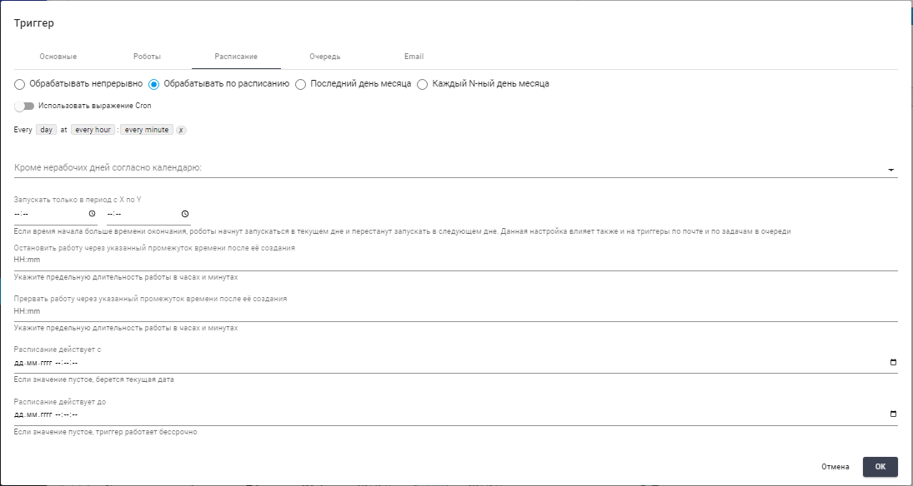
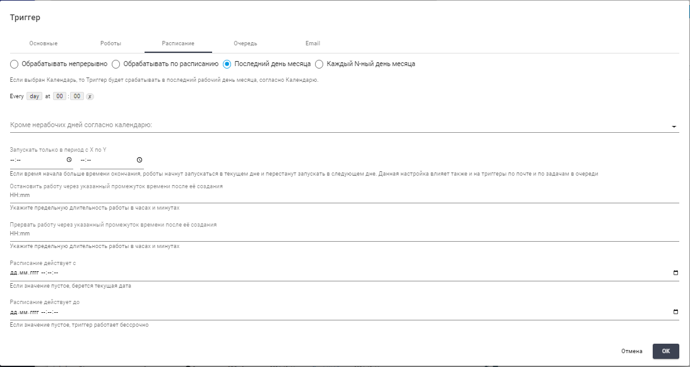

# Триггеры

**Триггеры** необходимы для того, чтобы автоматически по заданным условиям создавать Работы, которые, далее, передаются Роботам для обработки.

Экран “Триггеры” содержит таблицу “Триггеры”.

<figure><figcaption></figcaption></figure>

Для работы с Триггерами на экране есть следующие кнопки:

| Название            | Описание                                                                                                                                                                                                |
| ------------------- | ------------------------------------------------------------------------------------------------------------------------------------------------------------------------------------------------------- |
| Создать             | Позволяет пользователю создать новый Триггер. При нажатии открывается форма для ввода необходимых данных и настройки параметров нового Триггера.                                                        |
| Обновить            | Позволяет обновить информацию о выбранном Триггере.                                                                                                                                                     |
| Удалить выбранное   | Позволяет удалить один или несколько выбранных Триггеров.                                                                                                                                               |
| Включить выбранное  | Активирует выбранные Триггеры, позволяя им начать Работу в системе.                                                                                                                                     |
| Выключить выбранное | Деактивирует выбранные Триггеры, останавливая их выполнение.                                                                                                                                            |
| Протестировать      | Позволяет протестировать выбранный Триггер, создав Работу согласно указанным в Триггере настройкам.  Это помогает убедиться в том, что Триггер работает корректно и выполняет запланированные действия. |
| Импорт из CSV       | Позволяет пользователю загружать данные о Триггерах из файла формата CSV. При выборе этой опции открывается диалоговое окно для загрузки файла с необходимыми данными.                                  |
| Экспорт в CSV       | Позволяет сохранить информацию о Триггерах в формате CSV.                                                                                                                                               |
| Экспорт в XLSX      | Позволяет экспортировать данные о Триггерах в формате XLSX.                                                                                                                                             |

## **Создание нового триггера**

Для создания нового Триггера необходимо нажать на кнопку “Создать” в таблице “Триггеры” и заполнить открывшуюся форму.\
Форма создания нового Триггера содержит несколько вкладок:

* [Основные](triggery.md#vkladka-osnovnye)
* [Роботы](triggery.md#vkladka-roboty)
* [Расписание](triggery.md#vkladka-raspisanie)
* [Очередь](triggery.md#vkladka-ochered)
* [Email](triggery.md#vkladka-email)

### **Вкладка “Основные”**

Вкладка “Основные” содержит основные параметры создаваемого Триггера:

<table data-header-hidden><thead><tr><th width="97"></th><th width="261"></th><th></th></tr></thead><tbody><tr><td><strong>№ п/п</strong></td><td><strong>Элемент интерфейса</strong></td><td><strong>Описание</strong> </td></tr><tr><td>1.</td><td>переключатель “Триггер включен”</td><td>Позволяет выбрать будет ли Триггер активирован(включен) непосредственно после его создания.</td></tr><tr><td>2.</td><td>текстовое поле “Имя”</td><td>Имя Триггера. Обязательное для заполнения поле.</td></tr><tr><td>3.</td><td>текстовое поле “Описание”</td><td>Описание Триггера.</td></tr><tr><td>4.</td><td>поле "Папка доступа"</td><td>Папка доступа для Триггера.</td></tr><tr><td>5.</td><td>поле “Процесс”</td><td>Процесс, который будет запускаться при срабатывании Триггера. Процесс можно выбрать из числа ранее созданных Процессов на экране “Процессы”. Обязательное для заполнения поле.</td></tr><tr><td>6.</td><td>текстовое поле “Макс. количество запусков”</td><td>Максимальное количество запусков Триггера. Если ограничений нет, в данном поле необходимо поставить 0. </td></tr><tr><td>7.</td><td>флаг “Если все Роботы заняты, создавать Работу после их освобождения”</td><td>
Позволяет включить функцию создания Работы после освобождения Роботов. 

 
</td></tr></tbody></table>

<figure><figcaption></figcaption></figure>

### **Вкладка “Роботы”**

Вкладка “Роботы” позволяет  выбрать какому Роботу или Группе роботов будет передана Работа, созданная Триггером после срабатывания.

<table data-header-hidden><thead><tr><th width="98"></th><th width="230"></th><th></th></tr></thead><tbody><tr><td><strong>№ п/п</strong></td><td><strong>Элемент интерфейса</strong></td><td><strong>Описание</strong> </td></tr><tr><td>1.</td><td>флаг “Передавать Работу определенному Роботу”</td><td>Позволяет передать созданную Триггером Работу  определенному Роботу (выбранному в поле “Робот”)</td></tr><tr><td>2.</td><td>поле “Робот”</td><td>Позволяет выбрать конкретного Робота из числа ранее созданных на экране “Роботы” с помощью выпадающего списка.</td></tr><tr><td>3.</td><td>флаг “Распределить Работу по Группе роботов”</td><td>Позволяет передать созданную Триггером Работу определенной  Группе роботов. (Выбранной в поле “Группа роботов”) В этом случае созданная Триггером Работа будет отдана одному из Роботов указанной группы.</td></tr><tr><td>4.</td><td>поле “Группа роботов”</td><td>Позволяет выбрать конкретную Группу роботов из числа ранее созданных на экране “Роботы” с помощью выпадающего списка.</td></tr><tr><td>5.</td><td>текстовое поле “Максимальное количество одновременно запущенных Роботов”</td><td>Максимальное количество одновременно запущенных Роботов, которые будут выполнять Работы, созданные данным Триггером. Данная настройка позволяет произвести балансировку нагрузки на Роботов. Важно отметить, что это значение также влияет на количество создаваемых Работ в режиме “Создавать Работу без заранее присвоенного Робота”. Таким образом, число Работ в статусе Pending для Группы роботов не может превышать установленное значение “Максимальное количество одновременно запущенных Роботов”, если оно не равно 0.</td></tr><tr><td>6.</td><td>флаг "Создать Работу без заранее присвоенного Робота. Как только какой-либо Робот в Группе освободится, Работа будет автоматически присвоена ему"</td><td>Данная функция доступна, если в указанной Группе все Роботы заняты.  </td></tr><tr><td>7.</td><td>флаг "Создать Работу для еще занятого Робота Группы, у которого наименьшее число Работ находится в статусе Pending"</td><td>Данная функция доступна, если в указанной Группе все Роботы заняты.  </td></tr></tbody></table>

<figure><figcaption></figcaption></figure>

### **Вкладка “Расписание”**

Вкладка “Расписание” позволяет установить расписание, по которому будет  срабатывать Триггер. Форма создания нового Триггера отличается в зависимости от того, какой из флагов установлен:

* [флаг “Обрабатывать непрерывно”](triggery.md#obrabatyvat-nepreryvno)
* [флаг “Обрабатывать по расписанию”](triggery.md#obrabatyvat-po-raspisaniyu)
* [флаг “Последний день месяца”](triggery.md#poslednii-den-mesyaca)
* [флаг “N-ный день месяца”](triggery.md#n-yi-den-mesyaca)

#### _Обрабатывать непрерывно_

<table data-header-hidden><thead><tr><th width="103"></th><th width="222"></th><th></th></tr></thead><tbody><tr><td><strong>№ п/п</strong></td><td><strong>Элемент интерфейса</strong></td><td><strong>Описание</strong> </td></tr><tr><td>1.</td><td>флаг “Обрабатывать непрерывно”</td><td>Позволяет проводить Работы непрерывно, с учетом ограничений, заданных на других вкладках.</td></tr><tr><td>2.</td><td>поле “Кроме нерабочих дней согласно календарю:”</td><td>Позволяет выбрать определенный календарь из числа ранее созданных на экране “Ресурсы” с помощью выпадающего списка.</td></tr><tr><td>3.</td><td>текстовое поле “Остановить Работу через указанный промежуток времени после ее создания”</td><td>Позволяет указать предельную длительность Работы в часах и минутах в формате часы:минуты до “мягкой” остановки.</td></tr><tr><td>4.</td><td>поле “Запускать только в период с X по Y”</td><td>
Позволяет указать временной период действия Триггера в рамках одного дня.

Если время начала больше времени окончания, Роботы начнут запускаться в текущем дне и перестанут запускать в следующем дне. Данная настройка влияет также и на Триггеры по почте и по задачам в Очереди.
</td></tr><tr><td>5.</td><td>текстовое поле “Прервать Работу через указанный промежуток времени после ее создания”</td><td>Позволяет указать предельную длительность Работы в часах и минутах в формате часы:минуты до “жесткой” остановки.</td></tr><tr><td>6.</td><td>поле “Расписание действует с”</td><td>Позволяет указать дату и время, с которых действует расписание, в формате ДД.ММ.ГГГГ часы:минуты:секунды. Если значение пустое, то берется текущая дата.</td></tr><tr><td>7.</td><td>поле “Расписание действует до”</td><td>Позволяет указать дату и время, до которых действует расписание, в формате ДД.ММ.ГГГГ часы:минуты:секунды. Если значение пустое, то значение будет выставлено по умолчанию в текущее время + 10 лет.</td></tr></tbody></table>

<figure><figcaption></figcaption></figure>

#### _Обрабатывать по расписанию_

<table data-header-hidden><thead><tr><th width="100"></th><th width="261"></th><th></th></tr></thead><tbody><tr><td><strong>№ п/п</strong></td><td><strong>Элемент интерфейса</strong></td><td><strong>Описание</strong> </td></tr><tr><td>1.</td><td>флаг “Обрабатывать по расписанию”</td><td>Позволяет проводить Работы согласно  расписанию.</td></tr><tr><td>2.</td><td>переключатель “Использовать выражение Cron”</td><td>Позволяет  определить расписание для срабатывания Триггера напрямую, указав выражение Cron.</td></tr><tr><td>3.</td><td></td><td>Позволяет установить расписание срабатывания Триггера.</td></tr><tr><td>4.</td><td>поле “Кроме нерабочих дней согласно календарю:”</td><td>Позволяет выбрать определенный календарь из числа ранее созданных на экране Ресурсы с помощью выпадающего списка. В дни, выбранные в указанном календаре, Триггер не будет срабатывать ( дни будут считаться нерабочими)/</td></tr><tr><td>5.</td><td>поле “Запускать только в период с X по Y”</td><td>
Позволяет указать временной период действия Триггера в рамках одного дня.

Если время начала больше времени окончания, роботы начнут запускаться в текущем дне и перестанут запускать в следующем дне. Данная настройка влияет также и на Триггеры по почте и по задачам в Очереди.
</td></tr><tr><td>6.</td><td>текстовое поле “Остановить Работу через указанный промежуток времени после ее создания”</td><td>Позволяет указать предельную длительность Работы в часах и минутах в формате часы:минуты до “мягкой” остановки.</td></tr><tr><td>7.</td><td>текстовое поле “Прервать Работу через указанный промежуток времени после ее создания”</td><td>Позволяет указать предельную длительность Работы в часах и минутах в формате часы:минуты до “жесткой” остановки.</td></tr><tr><td>8.</td><td>поле “Расписание действует с”</td><td>Позволяет указать дату и время, с которых действует расписание, в формате ДД.ММ.ГГГГ часы:минуты:секунды. Если значение пустое, то берется текущая дата.</td></tr><tr><td>9.</td><td>поле “Расписание действует до”</td><td>Позволяет указать дату и время, с которых действует расписание, в формате ДД.ММ.ГГГГ часы:минуты:секунды. Если значение пустое, то значение будет выставлено по умолчанию в текущее время + 10 лет.</td></tr></tbody></table>

<figure><figcaption></figcaption></figure>

#### _Последний день месяца_

<table data-header-hidden><thead><tr><th width="100"></th><th width="219"></th><th></th></tr></thead><tbody><tr><td><strong>№ п/п</strong></td><td><strong>Элемент интерфейса</strong></td><td><strong>Описание</strong> </td></tr><tr><td>1.</td><td>флаг “Последний день месяца”</td><td>Позволяет проводить Работы в последний день месяца. Триггер будет срабатывать в последний календарный день месяца, если ниже не выбран календарь нерабочих дней. В ином случае Триггер будет срабатывать в последний рабочий день месяца, согласно календарю.</td></tr><tr><td>2.</td><td></td><td>Позволяет установить расписание срабатывания Триггера. </td></tr><tr><td>3.</td><td>поле “Кроме нерабочих дней согласно календарю:”</td><td>Позволяет выбрать определенный календарь из числа ранее созданных на экране “Ресурсы” с помощью выпадающего списка. В дни, выбранные в указанном календаре, Триггер не будет срабатывать (дни будут считаться нерабочими).</td></tr><tr><td>4.</td><td>поле “Запускать только в период с X по Y”</td><td>
Позволяет указать временной период действия Триггера в рамках одного дня.

Если время начала больше времени окончания, Роботы начнут запускаться в текущем дне и перестанут запускать в следующем дне. Данная настройка влияет также и на Триггеры по почте и по Задачам в Очереди.
</td></tr><tr><td>5.</td><td>текстовое поле “Остановить Работу через указанный промежуток времени после ее создания”</td><td>Позволяет указать предельную длительность Работы в часах и минутах в формате часы:минуты до “мягкой” остановки.</td></tr><tr><td>6.</td><td>текстовое поле “Прервать Работу через указанный промежуток времени после ее создания”</td><td>Позволяет указать предельную длительность Работы в часах и минутах в формате часы:минуты до “жесткой” остановки.</td></tr><tr><td>7.</td><td>поле “Расписание действует с”</td><td>Позволяет указать дату и время, с которых действует расписание, в формате ДД.ММ.ГГГГ часы:минуты:секунды. Если значение пустое, то берется текущая дата.</td></tr><tr><td>8.</td><td>поле “Расписание действует до”</td><td>Позволяет указать дату и время, с которых действует расписание, в формате ДД.ММ.ГГГГ часы:минуты:секунды. Если значение пустое, то значение будет выставлено по умолчанию в текущее время + 10 лет.</td></tr></tbody></table>

<figure><figcaption></figcaption></figure>

#### _N-ый день месяца_

<table data-header-hidden><thead><tr><th width="108"></th><th width="206"></th><th></th></tr></thead><tbody><tr><td><strong>№ п/п</strong></td><td><strong>Элемент интерфейса</strong></td><td><strong>Описание</strong> </td></tr><tr><td>1.</td><td>флаг “N-ный день месяца”</td><td>Позволяет проводить Работы каждый N-ный день месяца. Триггер будет срабатывать в N-ный календарный день месяца, если ниже не выбран календарь нерабочих дней. В ином случае Триггер будет срабатывать в N-ный рабочий день месяца, согласно календарю.</td></tr><tr><td>2.</td><td></td><td>Позволяет установить расписание срабатывания Триггера. </td></tr><tr><td>3.</td><td>поле “Кроме нерабочих дней согласно календарю:”</td><td>Позволяет выбрать определенный календарь из числа ранее созданных на экране Ресурсы с помощью выпадающего списка. Обязательное для заполнения поле. В дни, выбранные в указанном календаре, Триггер не будет срабатывать (дни будут считаться нерабочими). Если выбран календарь, то Триггер будет срабатывать не в каждый N-ный календарный  день месяца, а в каждый N-ный рабочий день месяца.</td></tr><tr><td>4.</td><td>поле “Запускать только в период с X по Y”</td><td>
Позволяет указать временной период действия Триггера в рамках одного дня.

Если время начала больше времени окончания, Роботы начнут запускаться в текущем дне и перестанут запускать в следующем дне. Данная настройка влияет также и на Триггеры по почте и по Задачам в Очереди.
</td></tr><tr><td>5.</td><td>текстовое поле “N-ный день”</td><td>Позволяет указать N-ный день месяца. Обязательное для заполнения поле.</td></tr><tr><td>6.</td><td>текстовое поле “Остановить Работу через указанный промежуток времени после ее создания”</td><td>Позволяет указать предельную длительность Работы в часах и минутах в формате часы:минуты до “мягкой” остановки.</td></tr><tr><td>7.</td><td>текстовое поле “Прервать Работу через указанный промежуток времени после ее создания”</td><td>Позволяет указать предельную длительность Работы в часах и минутах в формате часы:минуты до “жесткой” остановки.</td></tr><tr><td>8.</td><td>поле “Расписание действует с”</td><td>Позволяет указать дату и время, с которых действует расписание, в формате ДД.ММ.ГГГГ часы:минуты:секунды. Если значение пустое, то берется текущая дата.</td></tr><tr><td>9.</td><td>поле “Расписание действует до”</td><td>Позволяет указать дату и время, с которых действует расписание, в формате ДД.ММ.ГГГГ часы:минуты:секунды. Если значение пустое, то значение будет выставлено по умолчанию в текущее время + 10 лет.</td></tr></tbody></table>

<figure><figcaption></figcaption></figure>

### **Вкладка “Очередь”**

Вкладка “Очередь” позволяет создавать Работы при появлении новых Задач в Очереди.

<table data-header-hidden><thead><tr><th width="103"></th><th width="211"></th><th></th></tr></thead><tbody><tr><td><strong>№ п/п</strong></td><td><strong>Элемент интерфейса</strong></td><td><strong>Описание</strong> </td></tr><tr><td>1.</td><td>флаг “Создавать Работы при появлении новых Задач в Очереди”</td><td>Позволяет включить функцию создания Работ при появлении новых Задач в Очереди. </td></tr><tr><td>1.2.</td><td>поле “Очередь”</td><td>Позволяет выбрать определенную Очередь из числа ранее созданных на экране “Очереди” с помощью выпадающего списка.</td></tr><tr><td>1.3.</td><td>текстовое поле “Запустить когда новых Задач больше чем”</td><td>Позволяет указать значение больше 0, если Робот будет запускаться не сразу при появлении Задачи в выбранной Очереди, а когда в Очереди будет заданное количество новых Задач, например, 5.</td></tr><tr><td>1.4.</td><td>поле “Установить статус полученной из Очереди Задачи”</td><td>
Позволяет указать статус Задачи. Возможные варианты:
<ul><li>Создано;</li><li>В процессе.</li></ul></td></tr><tr><td>1.5.</td><td>флаг “Завершить при пустой Очереди”</td><td>Позволяет включить функцию завершения Триггера (будет установлен статус “Завершено”) при отсутствии Задач в Очереди.</td></tr><tr><td>2.</td><td>флаг “Назначить Задачу по умолчанию создаваемым Работам”</td><td>Позволяет привязать Триггер к определенной Задаче и использовать эту Задачу  в качестве Задачи по умолчанию при создании Работ Триггером.</td></tr><tr><td>2.1.</td><td>поле “Задача”</td><td>Позволяет выбрать определенную Задачу из числа ранее созданных на экране “Очереди” с помощью выпадающего списка.</td></tr></tbody></table>

<figure><figcaption></figcaption></figure>

### **Вкладка “Email”**

Вкладка “Email” позволяет настроить Триггер с определенными условиями при необходимости создания Работ, связанных с обработкой электронной почты.

<table data-header-hidden><thead><tr><th width="102"></th><th width="212"></th><th></th></tr></thead><tbody><tr><td><strong>№ п/п</strong></td><td><strong>Элемент интерфейса</strong></td><td><strong>Описание</strong> </td></tr><tr><td>1.</td><td>флаг “Создать Работу по поступлению Email”</td><td>Позволяет создать Работу при поступлении письма на электронную почту.</td></tr><tr><td>2.</td><td>флаги “Протокол: “POP3” и “IMAP”</td><td>Протокол получения электронной почты.</td></tr><tr><td>3.</td><td>флаги “Кодировка сервера: “UTF-8” и “US-ASCII”</td><td>Кодировка сервера.</td></tr><tr><td>4.</td><td>текстовое поле “Почтовый сервер”</td><td>Почтовый сервер.</td></tr><tr><td>5.</td><td>текстовое поле “Порт”</td><td>Порт почтового сервера. Если порт не задан, то используется порт по умолчанию для выбранного протокола.</td></tr><tr><td>6.</td><td>текстовое поле “Логин”</td><td>Логин для доступа к почтовому серверу. </td></tr><tr><td>7.</td><td>текстовое поле “Пароль”</td><td>Пароль для доступа к почтовому серверу. </td></tr><tr><td>8.</td><td>текстовое поле “Название общего почтового ящика”</td><td>Название общего почтового ящика. Указывается только в случаях, когда несколько пользователей имеют доступ к одному почтовому ящику.</td></tr><tr><td>9.</td><td>текстовое поле “Папка”</td><td>Папка в почтовом ящике. Если папка не задана, то будет проверяться папка “Входящие”. Для вложенных папок возможны несколько вариантов разделителей в пути: / , \ , | или . (зависит от почтового сервера. К примеру, у Яндекса разделитель / )</td></tr><tr><td>10.</td><td>флаг “Использовать SSL”</td><td>Указывает использовать ли SSL при подключении к почтовому серверу.</td></tr><tr><td>11.</td><td>флаг “Обрабатывать только непрочитанные письма”</td><td>Позволяет включить обработку только непрочитанных писем.</td></tr><tr><td>12.</td><td>флаг “Пометить как прочитанное”</td><td>Позволяет пометить как прочитанное письма, по которым были созданы Работы.</td></tr><tr><td>13.</td><td>флаг “Создать одну Работу по факту появления любого количества новых писем / Создать Работу для каждого нового письма”</td><td>Позволяет включить функцию создания одной Работы по факту появления любого количества новых писем или по отдельной Работе для каждого нового письма.</td></tr><tr><td>14.</td><td>текстовое поле “Обрабатывать, если тема письма содержит любую из указанных подстрок”</td><td>Подстроки, которые должны содержаться в теме письма. При указании нескольких подстрок необходимо разделять их запятыми. В случае, если проверка не нужна следует оставить текстовое поле пустым. </td></tr><tr><td>15.</td><td>текстовое поле “Обрабатывать, если тело письма содержит любую из указанных подстрок”</td><td>Подстроки, которые должны содержаться в теле письма. При указании нескольких подстрок необходимо разделять их запятыми. В случае, если проверка не нужна следует оставить текстовое поле пустым.</td></tr><tr><td>16.</td><td>текстовое поле “Обрабатывать, если письмо содержит вложения с любым из указанных имен файлов”</td><td>Имена файлов, которые должны содержаться во вложениях письма. При указании нескольких имен файлов необходимо разделять их запятыми, при необходимости можно использовать маски * и ?. В случае, если проверка не нужна следует оставить текстовое поле пустым.</td></tr><tr><td>17.</td><td>поле “Обрабатывать когда подходящих писем больше чем”</td><td>Позволяет запускать обработку (проверка условий Триггера и создание работ, если необходимо) если подходящих по условиям писем больше указанного числа. </td></tr><tr><td>18.</td><td>поле “Проверять почту каждые N минут”</td><td>Позволяет установить временной интервал (в минутах), через который осуществляется проверка почты на сервере и создание Работ, если необходимо (если выполнены указанные выше условия Триггера). </td></tr><tr><td>19.</td><td>кнопка “Тест получения почты”</td><td>Позволяет проверить подключение к почтовому серверу и получить информацию о количестве писем, соответствующих условиям, заданным в Триггере.</td></tr></tbody></table>

<figure><figcaption></figcaption></figure>

<figure><figcaption></figcaption></figure>

<figure><figcaption></figcaption></figure>

## **Редактирование ранее созданного Триггера**

Для просмотра и редактирования свойств конкретного Триггера необходимо выбрать его в списке и нажать на кнопку . После этого откроется форма с настройками Триггера, в которую можно внести необходимые изменения. Новых полей в ранее созданном Триггере нет.

[Процесс создания нового Триггера описан здесь.](../nachalo-raboty-v-sherpa-orchestrator/sozdanie-i-nastroika-triggerov-v-orkestratore.md)
