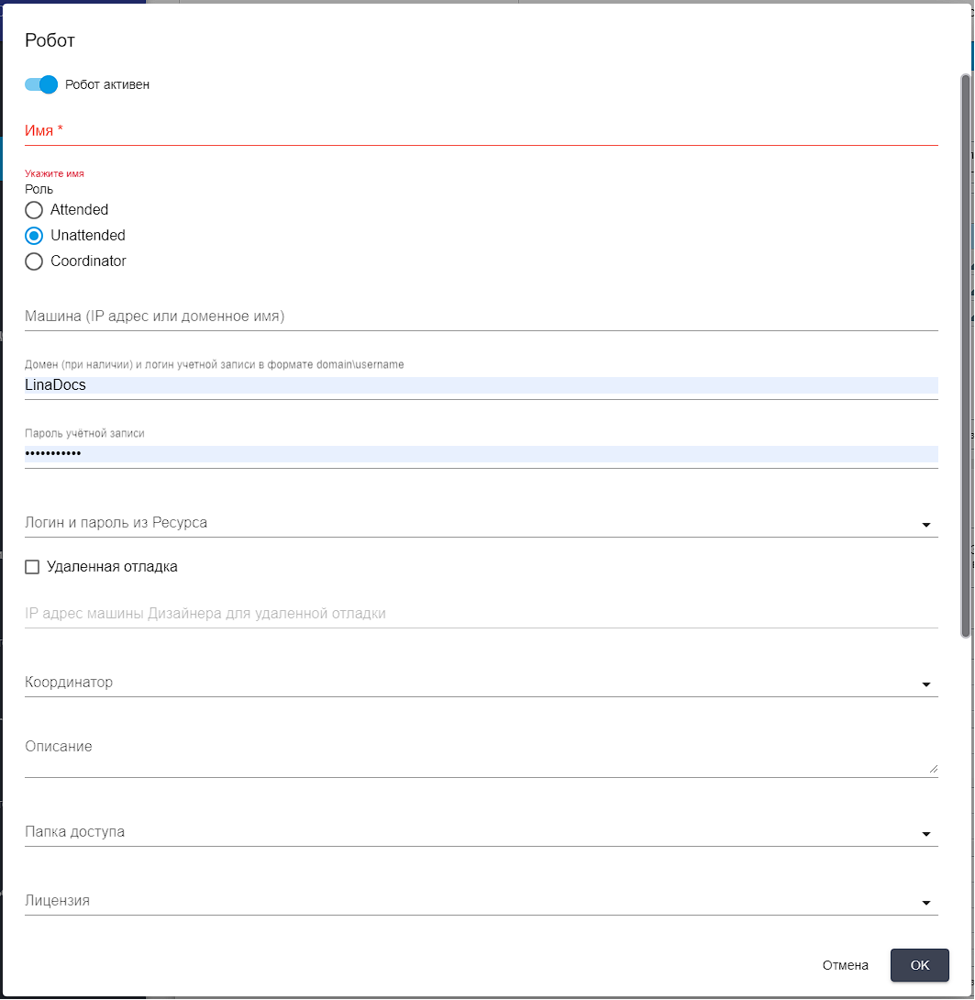

# Добавление робота в Оркестраторе

Для добавления робота в Оркестратор перейдите на экран “Роботы”. Данный экран содержит две таблицы: “Группы роботов” и “Роботы”.&#x20;

При необходимости создайте группу роботов, в которой будет находится робот. Нажмите кнопку “Создать” в таблице “Группы роботов” и заполните открывшуюся форму.

<figure><figcaption></figcaption></figure>

Далее выберите группу роботов с помощью флага, чтобы добавлять роботов в конкретную группу.

Чтобы добавить робота нажмите кнопку “Создать” в таблице “Роботы” и заполните открывшуюся форму.

<figure><figcaption></figcaption></figure>

* Переключатель “Робот активен”. Во включенном положении он указывает на то, что робот включен на стороне Оркестратора, в случае, если переключатель находится в выключенном положении, при запросе данного робота к Оркестратору будет передана команда на выключение.
* Поле “Имя”. Обязательное  для заполнения поле.&#x20;
* Поле "Описание". Заполняется при необходимости.
* Поле "Папка доступа". Папка доступа для добавляемого робота.
* Поле "Лицензия". Выбор лицензии для добавляемого робота.
* Флаг "Создавать Работу при локальном запуске робота". Установите флаг, если необходимо создавать работу при локальном запуске данного робота.

При выборе роли робота “Attended” задайте роботу имя, которое будет отображаться в Оркестраторе, описание робота (при необходимости) и выберите используемую роботом лицензию.&#x20;

При выборе роли робота “Unattended” кроме имени, описания, папки доступа и лицензии:

* укажите IP-адрес или доменное имя терминального сервера или виртуальной машины, на которой развернут данный робот,&#x20;
* укажите логин (при необходимости включающий домен) и пароль от пользовательской учетной записи, в которой должен запускаться робот. Логин и пароль можно выбрать из ранее созданного ресурса в соответствующем поле формы.
* установите флаг “Удаленная отладка”, если робот будет запускаться в режиме удаленной отладки через Sherpa Designer и укажите  IP-адрес и порт машины Дизайнера для удаленной отладки в формате “IP:порт”.
* выберите экземпляр Координатора, который будет использован для запуска робота.

Координатор — это сервис, который используется для запуска Unattended-роботов в пользовательских учетных записях, где требуется автоматический вход в учетные записи Роботов. Он устанавливается из соответствующего дистрибутива Sherpa Coordinator, предоставляемого вендором, не требует отдельной лицензии. Подробнее о Координаторе и его установке в разделе “Sherpa Coordinator”.

<figure><figcaption></figcaption></figure>

После заполнения карточки нажмите кнопку “ОК” для сохранения внесенных данных. Робот будет создан.
