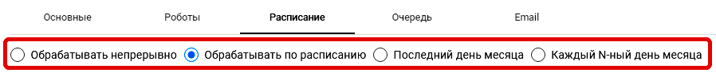
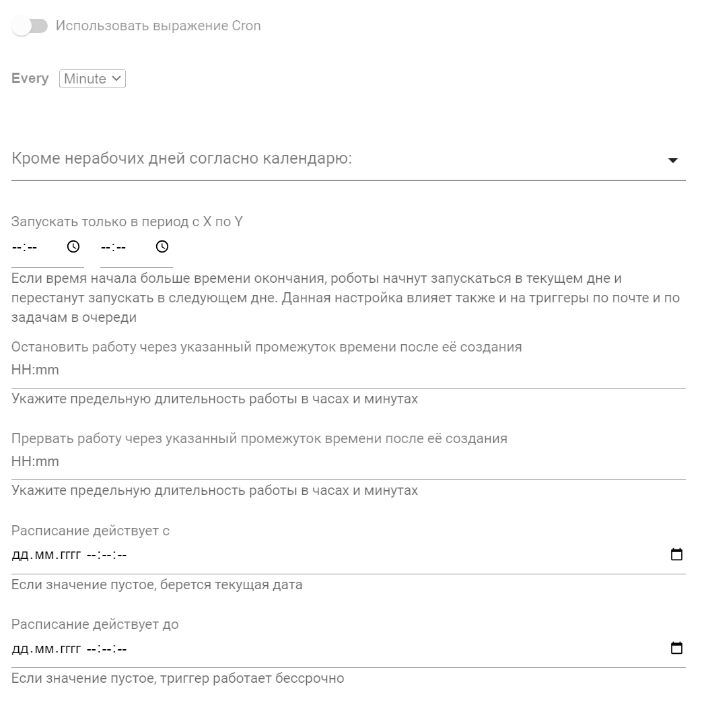
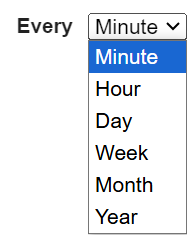
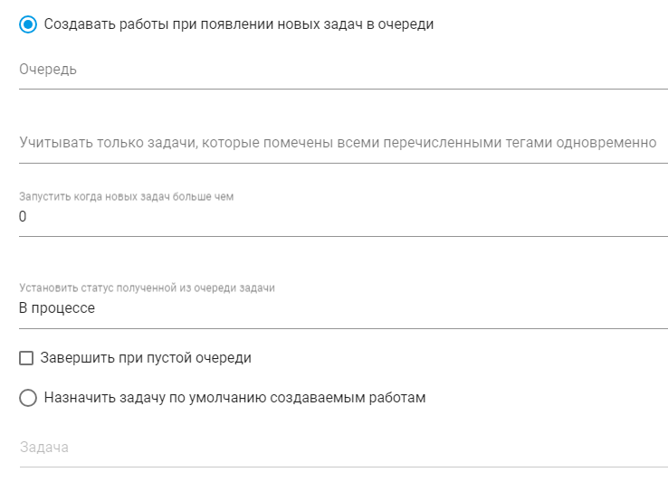
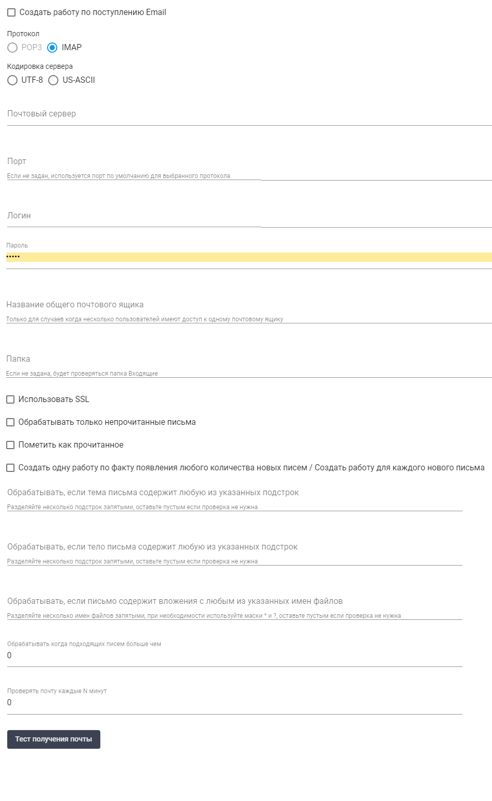

# Создание и настройка Триггеров в Оркестраторе

Триггеры необходимы для создания работ по заданным условиям автоматически. Созданные работы далее передаются Роботам для обработки.

Для создания нового Триггера в Оркестраторе перейдите на экран “Триггеры”. Данный экран содержит таблицу “Триггеры”:

<figure><figcaption></figcaption></figure>

Для работы с Триггерами на экране есть следующие кнопки:

<table><thead><tr><th width="147">Название</th><th>Описание</th></tr></thead><tbody><tr><td>Создать</td><td>

Позволяет пользователю создать новый триггер. При нажатии открывается форма для ввода необходимых данных и настройки параметров нового триггера.
</td></tr><tr><td>Обновить</td><td>Позволяет обновить информацию о выбранном триггере. </td></tr><tr><td>Удалить выбранное</td><td>Позволяет удалить один или несколько выбранных триггеров.</td></tr><tr><td>Включить выбранное</td><td>Активирует выбранные триггеры, позволяя им начать работу в системе. </td></tr><tr><td>Выключить выбранное </td><td>Деактивирует выбранные триггеры, останавливая их выполнение и отключая их функции.</td></tr><tr><td>Протестировать</td><td>Позволяет протестировать выбранный триггер. Это помогает убедиться в том, что триггер работает корректно и выполняет запланированные действия.</td></tr><tr><td>Импорт из CSV </td><td>Позволяет пользователю загружать данные о триггерах из файла формата CSV. При выборе этой опции открывается диалоговое окно для загрузки файла с необходимыми данными.</td></tr><tr><td>Экспорт в CSV</td><td>Позволяет сохранить информацию о триггерах в формате CSV. </td></tr><tr><td>Экспорт в XLSX</td><td>Позволяет экспортировать данные о триггерах в формате XLSX. </td></tr></tbody></table>

## Кнопка "Создать"

Чтобы создать новый Триггер, нажмите на кнопку “Создать” над таблицей “Триггеры” и заполните открывшуюся форму. Для удобства, настройка Триггеров разделена на несколько вкладок:

<figure><figcaption></figcaption></figure>

* “**Основные**”. Основные данные Триггера;
* “**Роботы**”. Выбор Робота или Группы роботов для работы, которым будет передана Работа после срабатывания Триггера;
* “**Расписание**”. Расписание по которому будет срабатывать Триггер. Доступны следующие варианты расписания: “Обрабатывать непрерывно”, “Обрабатывать по расписанию”, “Последний день месяца”, “N-ный день месяца”;
* “**Очередь**”. Настройка создания Работ при появлении новых Задач в Очереди;
* “**Email**”. Настройка Триггера с определенными условиями при необходимости создания Работ, связанных с обработкой электронной почты.

Рассмотрим подробнее каждую из вкладок.

### Вкладка "Основные"

Во вкладке “Основные” заполните следующие поля:

<figure><figcaption></figcaption></figure>

* поле “**Имя**”. Обязательное для заполнения поле с названием Триггера;
* поле “**Описание**”. Описание Триггера при необходимости;
* поле “**Папка доступа**”. Выберите из выпадающего списка Папку доступа;
* поле “**Процесс**”. Выберите из выпадающего списка Процесс, который будет запускаться при срабатывании Триггера (Процесс можно выбрать только из числа ранее созданных на экране “Процессы”). Обязательное для заполнения поле;
* поле “**Макс. количество запусков**”. Укажите максимальное количество запусков Триггера. Если ограничений нет, то в данном поле необходимо поставить `0`;
* переключатель “**Включено**”. Активируйте переключатель, если необходимо, чтобы Триггер был включен непосредственно после его создания;
* чекбокс “**Если все роботы заняты, создавать работу после их освобождения**”. Поставьте галочку, если необходимо, чтобы создавалась Работа после освобождения Роботов;

### Вкладка "Роботы"

Во вкладке “Роботы” укажите следующие данные:

<figure><figcaption></figcaption></figure>

* флаг “**Передавать работу определенному роботу**”. Заполните, если необходимо, чтобы Работу выполнял конкретный Робот. В поле “**Робот**”, расположенном ниже, выберите нужного Робота из выпадающего списка;
* флаг “**Распределить работу по группе роботов**”. Заполните, если необходимо передать Работу определенной Группе роботов. В поле “**Группа роботов**”, расположенном ниже, выберите из выпадающего списка нужную Группу роботов;
* поле “**Максимальное количество одновременно запущенных роботов**”. Укажите максимальное количество одновременно запущенных Роботов, которые будут выполнять Работы, созданные данным Триггером.&#x20;

Дополнительные флаги для заполнения, если в указанной Группе все Роботы заняты:

<figure><figcaption></figcaption></figure>

* флаг “**Создать работу без заранее присвоенного робота. Как только какой-либо робот в группе освободится, работа будет автоматически присвоена ему**”;
* флаг “**Создать работу для еще занятого робота группы, у которого наименьшее число работ находится в статусе Pending**".

### Вкладка "Расписание"

Вкладка “Расписание” выглядит по-разному, в зависимости от того, какой вариант расписания Вы выберете:

<figure><figcaption></figcaption></figure>

#### <mark style="color:red;">Обрабатывать непрерывно</mark>

Выберите вариант “Обрабатывать непрерывно”, если необходимо, чтобы Работы проводились непрерывно, с учетом ограничений, заданных на других вкладках. В форме укажите следующие данные:

<figure><figcaption></figcaption></figure>

* поле  “**Кроме нерабочих дней согласно календарю:**”. С помощью выпадающего списка выберите нужный календарь из числа ранее созданных на экране “Ресурсы”;
* поле “**Остановить работу через указанный промежуток времени после ее создания**”. Укажите предельную длительность работы в формате часы:минуты до “мягкой” остановки;
* поле “**Прервать работу через указанный промежуток времени после ее создания**”. Укажите предельную длительность работы в формате часы:минуты до “жесткой” остановки;
* поля “**Расписание действует с**” и “**Расписание действует до**”. Укажите дату и время в формате ДД.ММ.ГГГГ часы:минуты:секунды (с которого и до которого, соответственно, будет действовать расписание).&#x20;

#### <mark style="color:red;">Обрабатывать по расписанию</mark>

Выберите вариант “Обрабатывать по расписанию”, если необходимо, чтобы Работы проводились по установленному расписанию. Данная форма практически идентична варианту “Обрабатывать непрерывно”, за исключением следующих элементов:&#x20;

* переключатель “**Использовать выражение Cron**”. Нажмите, если необходимо определить расписание для срабатывания Триггера напрямую;

<figure><figcaption></figcaption></figure>

* список “**Every**”. Выберите нужный вариант для установки расписания Триггера.

<figure><figcaption></figcaption></figure>

#### <mark style="color:red;">Последний день месяца</mark>

Выберите вариант “Последний день месяца”, если необходимо, чтобы Работы проводились в последний день месяца. Данная форма практически идентична варианту “Обрабатывать непрерывно”, за исключением поля с выпадающим списком: .png>), которое необходимо использовать для установки расписания Триггера.

#### <mark style="color:red;">Каждый N-ный день месяца</mark>

Выберите вариант “Каждый N-ный день месяца”, если необходимо, чтобы Работы проводились каждый N-ный день месяца. Данная форма практически идентична варианту “Последний день месяца”, за исключением поля .png>), в которой необходимо указать нужное число вручную с клавиатуры, или с помощью всплывающего счетчика .png>).&#x20;

### Вкладка "Очередь"

Во вкладке “Очередь” укажите следующие данные:

<figure><figcaption></figcaption></figure>

* флаг  “**Создавать работы при появлении новых задач в очереди**”. Заполните, чтобы  включить функцию создания Работ при появлении новых задач в Очереди;
* поле “**Очередь**”. С помощью выпадающего списка выберите определенную Очередь из числа ранее созданных на экране “Очереди”;
* поле "**Учитывать только задачи, которые помечены всеми перечисленными тегами одновременно**". Укажите теги, которыми должны быть помечены задачи;
* поле “**Запустить когда новых задач больше чем**”. Укажите количество новых задач в Очереди, после которого будет запускаться Робот;
* поле “**Установить статус полученной из очереди задачи**”. С помощью выпадающего списка укажите статус задачи, выбрав его из предложенных вариантов: “Создано” или “В процессе”;
* чекбокс “**Завершить при пустой очереди**”. Поставьте галочку, если необходимо завершить Триггер при отсутствии задач в Очереди. В этом случае у Триггера будет установлен статус “Завершено”;
* флаг “**Назначить задачу по умолчанию создаваемым работам**”. Заполните, если необходимо привязать Триггер к к определенной задаче и использовать эту задачу  в качестве задачи по умолчанию при создании Работ Триггером;
* поле “**Задача**”. С помощью выпадающего списка выберите определенную задачу из числа ранее созданных на экране “Очереди”.

### Вкладка "Email"

Во вкладке “Email” укажите следующие данные:

<figure><figcaption></figcaption></figure>

* чекбокс “**Создать работу по поступлению Email**”. Поставьте галочку, чтобы создавать Работу при поступлении письма на электронную почту;
* флаг “**Протокол**”. Выберите протокол получения электронной почты из предложенных вариантов: “POP3” и “IMAP”;
* флаг “**Кодировка сервера**”. Выберите вариант кодировки из предложенных вариантов: “UTF-8” и “US-ASCII”;
* поля “**Почтовый сервер**” и “**Порт**”. Укажите почтовый сервер и его порт соответственно;
* поля “**Логин**” и “**Пароль**”. Укажите логин и пароль доступа к почтовому сервису;
* поле “**Название общего почтового ящика**”. Укажите название общего почтового ящика, его следует указывать только в случаях, когда несколько Пользователей имеют доступ к одному почтовому ящику;
* поле “**Папка**”. Укажите папку в почтовой ящике. Если папка не задана, то по умолчанию будет проверяться папка “Входящие”;
* чекбокс “**Использовать SSL**”. Поставьте галочку, если необходимо использовать SSL при подключении к почтовому серверу;
* чекбокс “**Обрабатывать только непрочитанные письма**”. Поставьте галочку, если необходимо обрабатывать только непрочитанные письма;
* чекбокс “**Пометить как прочитанное**”. Поставьте галочку, если необходимо, чтобы как “Прочитанное” отмечались письма, по которым были созданы Работы;
* чекбокс “**Создать одну работу по факту появления любого количества новых писем / Создать работу для каждого нового письма**”. Поставьте галочку, если необходимо создавать одну Работу по факту появления любого количества новых писем, или по отдельной Работе для каждого нового письма;
* поле “**Обрабатывать, если тема письма содержит любую из указанных подстрок**”. Укажите подстроки, которые должны содержаться в теме письма (при указании нескольких подстрок необходимо разделять их запятыми), если это необходимо;
* поле “**Обрабатывать, если тело письма содержит любую из указанных подстрок**”. Укажите подстроки, которые должны содержаться в теле письма (при указании нескольких подстрок необходимо разделять их запятыми), если это необходимо;
* поле “**Обрабатывать, если письмо содержит вложения с любым из указанных имен файлов**”. Укажите имена файлов, которые должны содержаться во вложениях письма (при указании нескольких имен файлов необходимо разделять их запятыми, при необходимости можно использовать маски \* и ?), если это необходимо;
* поле “**Обрабатывать когда подходящих писем больше чем**”. Укажите количество писем, после которого будет запускаться обработка (проверка условий Триггера и создание Работ, если необходимо);
* поле “**Проверять почту каждые N минут**”. Укажите временной интервал в минутах, через который будет осуществляться проверка почты на сервере и создание Работ, если необходимо (если выполнены указанные выше условия Триггера).

После заполнения полей нажмите на кнопку “ОК”, чтобы сохранить Триггер.
