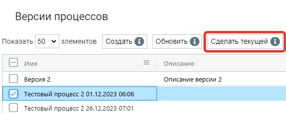

# Создание нового Процесса (сценария) в Оркестраторе

Для добавления нового Процесса в Оркестратор перейдите на экран “Процессы”. Данный экран содержит две таблицы: “Процессы” и “Версии процессов”. &#x20;

<figure><figcaption></figcaption></figure>

Нажмите на кнопку “Создать” над таблицей “Процессы” и заполните открывшуюся форму:

<figure><figcaption></figcaption></figure>

* поле “**Имя\***” (является обязательным для заполнения, по умолчанию) - наименование Процесса, текущая дата и время создания версии. Эти данные, при необходимости, можно изменить на актуальное название;
* поле “**Запускать на версии Sherpa RPA Runtime не ниже чем**” - номер версии Sherpa RPA Runtime, ниже которой Процесс не будет запускаться;
* поле “**Описание**” (при необходимости) - описание для создаваемого Процесса;
* поле "**Папка доступа**" - папка доступа для создаваемого Процесса;
* флаг "**Доступен через Sherpa Assistant**" (установите флаг, если необходимо) - данный Процесс доступен через Sherpa Assistant.

После заполнения полей нажмите на кнопку “ОК”, чтобы сохранить Процесс. В таблице “Процессы” появится новый Процесс. У нового Процесса нет версий. Для создания версии Процесса установите флаг рядом с Процессом, версию которого Вы хотите создать.

<figure><figcaption></figcaption></figure>

Если Процесс не выбран, то Оркестратор предупредит Вас об этом сообщением:

<figure><figcaption></figcaption></figure>

Над таблицей “Версии процессов” нажмите на кнопку “Создать” и заполните открывшуюся форму:

<figure><figcaption></figcaption></figure>

* поле “**Имя\***” (является обязательным для заполнения);
* поле “**Описание**” (при необходимости);

С помощью кнопки “Выберите файл процесса” прикрепите файл Процесса, выбрав его из файлов на Вашем компьютере. После прикрепления файла, рядом с ним появится кнопка "Скачать":

<figure><figcaption></figcaption></figure>

<table data-header-hidden><thead><tr><th width="54"></th><th></th></tr></thead><tbody><tr><td></td><td>Требуется обязательно приложить файл Процесса (файл с расширением .robot). Без файла версия Процесса не будет сохранена.</td></tr></tbody></table>

Для каждого Процесса можно создавать несколько его версий. Текущая версия Процесса выделена ярко-голубым цветом:

<figure><figcaption></figcaption></figure>

Для определения версии Процесса текущей выберите версию с помощью мыши и нажмите на кнопку “Сделать текущей”:

<figure><figcaption></figcaption></figure>
