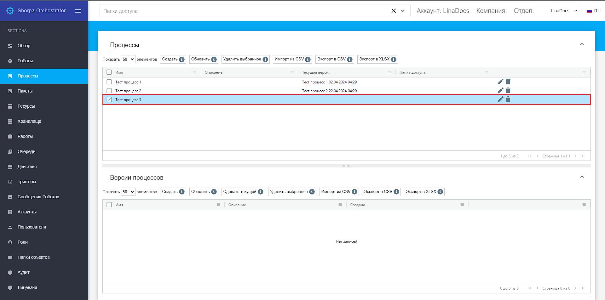
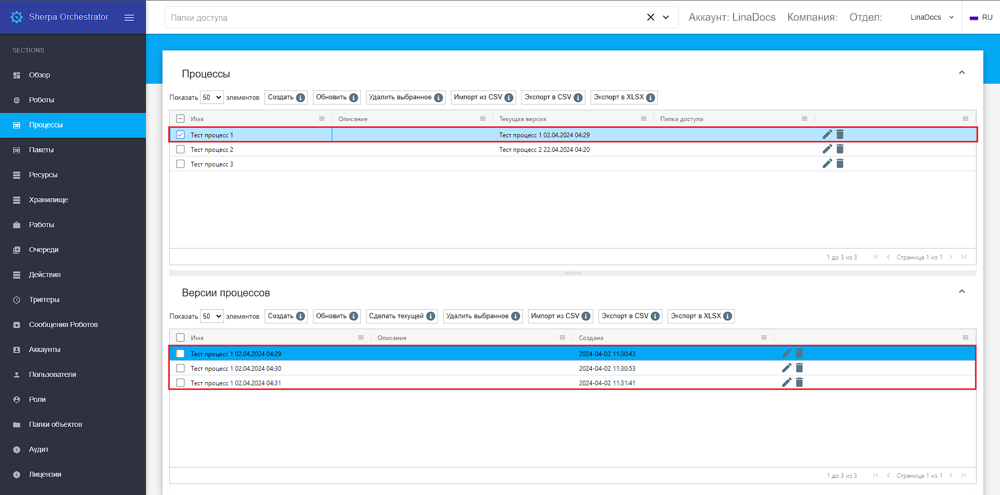

# Создание нового Процесса (сценария) в Оркестраторе

Для добавления нового процесса в Оркестратор перейдите на экран “Процессы”. Данный экран содержит две таблицы: “Процессы” и “Версии процессов”. &#x20;

<figure><figcaption></figcaption></figure>

Нажмите на кнопку “Создать” в таблице “Процессы” и заполните открывшуюся форму:

* поле “Имя” (является обязательным для заполнения, по умолчанию, в поле указывается наименование процесса, текущая дата и время создания версии, эти данные, при необходимости, можно изменить на актуальное название);
* поле “Запускать на версии Sherpa RPA Runtime не ниже чем” (укажите номер версии Sherpa RPA Runtime, ниже которой процесс не будет запускаться);
* поле “Описание” (при необходимости);
* поле "Папка доступа" (папка доступа для создаваемого процесса);
* флаг "Доступен через Sherpa Assistant" (установите флаг, если необходимо, чтобы данный процесс был доступен через Sherpa Assistant).

<figure><figcaption></figcaption></figure>

После заполнения полей нажмите кнопку “ОК”, чтобы сохранить процесс. В таблице “Процессы” появился новый процесс. У нового процесса нет версий. Для создания версии процесса установите флаг рядом с процессом, версию которого Вы хотите создать.

<figure><figcaption></figcaption></figure>

Если процесс не выбран, то Оркестратор предупредит Вас об этом сообщением.&#x20;

&#x20;&#x20;

<figure><figcaption></figcaption></figure>

В таблице “Версии процессов” нажмите кнопку “Создать” и заполните открывшуюся форму:

* поле “Имя” (является обязательным  для заполнения);
* поле “Описание” (при необходимости);
* с помощью кнопки “Выберите файл процесса” прикрепите файл процесса, выбрав его из файлов на Вашем компьютере.

<figure><figcaption></figcaption></figure>

Требуется обязательно приложить файл процесса (файл с расширением .robot). Без файла версия не будет сохранена.

<figure><figcaption></figcaption></figure>

Для каждого процесса можно создавать несколько его версий. Текущая версия процесса выделена ярко-голубым цветом.&#x20;

<figure><figcaption></figcaption></figure>

Для определения версии процесса текущей выберите версию с помощью мыши и нажмите кнопку “Сделать текущей”.&#x20;

<figure><figcaption></figcaption></figure>
