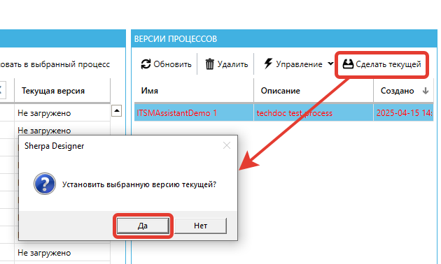

# Создание новой версии Процесса в Sherpa Designer

Новую версию Процесса можно создать из Дизайнера с помощью кнопки “Опубликовать”. Нажмите на  кнопку “Опубликовать” на панели "Файл" и выберите вариант “Опубликовать в Оркестратор…”:

<figure><figcaption></figcaption></figure>

После нажатия кнопки откроется окно с перечнем добавляемых Процессов и списком версий этих Процессов:

<figure><figcaption></figcaption></figure>

Выберите нужный Процесс и его версию, а затем нажмите кнопку “Опубликовать в выбранный процесс”:

<figure><figcaption></figcaption></figure>

После этого выбранный Процесс появляется в Оркестраторе:

<figure><figcaption></figcaption></figure>

После публикации в перечне версий выбранного Процесса появится новая версия, по умолчанию она не является текущей.&#x20;

Если необходимо подключиться к другому Оркестратору из Дизайнера, или для смены параметров подключения, воспользуйтесь кнопкой “Настройка подключения...”:

<figure><figcaption></figcaption></figure>

Для того, чтобы сделать выбранную версию Процесса текущей, нажмите кнопку “Сделать текущей”:

<figure><figcaption></figcaption></figure>

<table data-header-hidden><thead><tr><th width="51"></th><th></th></tr></thead><tbody><tr><td></td><td>
Помимо встроенного функционала версионирования Процессов, Sherpa Designer также содержит интеграцию с системой контроля версий Git, которая может быть использована в процессе разработки.

После завершения разработки Процесса, он может быть опубликован из Sherpa Designer в Оркестратор. Сам Оркестратор поддержки прямой работы с Git не имеет.
</td></tr></tbody></table>
