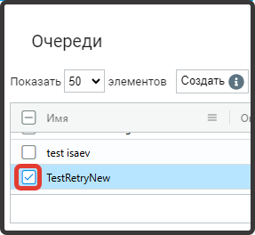
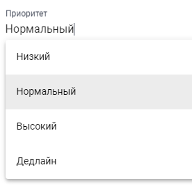
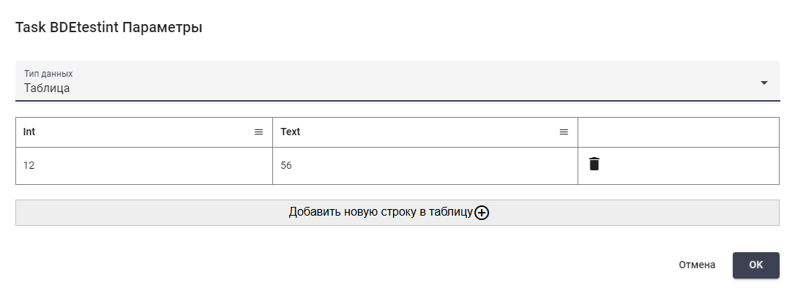

# Создание Задачи в Оркестраторе

Выберите в таблице “Очереди” очередь, в рамках которой нужно создать задачу, и отметьте ее флагом.&#x20;

<figure><figcaption></figcaption></figure>

Далее нажмите кнопку “Создать” в таблице “Задачи” и заполните открывшуюся форму.

<figure><figcaption></figcaption></figure>

* поле “Имя” (является обязательным для заполнения);
* поле “Описание”  (при необходимости);
* поле “Комментарий” (при необходимости);
* поле “Приоритет” (с помощью выпадающего списка выберите приоритет выполнения задачи).

<figure><figcaption></figcaption></figure>

* поле “Теги” (при необходимости);
* поле “Повтор” (количество повторов выполнения задачи).

После заполнения формы нажмите кнопку “ОК”, чтобы сохранить созданную задачу.

У каждой созданной задачи в колонке “Статус” указан ее текущий статус.&#x20;

<figure><figcaption></figcaption></figure>

* статус “Создана” (New) – новая задача;
* статус “В процессе” (InProgress) — задача находится в работе;
* статус “Успешно” (Success) — задача успешно выполнена;
* статус “Неудачно (Приложение)” Failed (Application) — обнаружена ошибка при выполнении задачи. Данный статус присваивается задачам, если возникшая проблема может быть решена при повторном выполнении задачи (например, при зависании системы, с которой работает робот);
* статус “Неудачно (Бизнес)” Failed (Business) — обнаружена ошибка при выполнении задачи. Данный статус используется, когда автоматическая попытка сигнализирует о проблемах с входными данными или со статусами внешних информационных систем, с которыми работает робот, и повторное выполнение задачи ожидаемо будет безрезультатным;
* статус “Отложена до” (Postponed) – задача отложена. Данный статус автоматически устанавливается из сценария Дизайнера в случае, если мы хотим отложить задачу до определенного времени, чтобы Оркестратор в течение этого времени вернул эту задачу обратно в очередь;
* статус “Заброшена” (Abandoned) – данный статус проставляется, если задача была взята в работу, но в течение более 1 суток не была выполнена.

При создании задачи по умолчанию проставляется статус “Создана”. При необходимости статус задачи можно изменить в процессе ее редактирования. Для этого нажмите кнопку  (1) (1).png>) в строке с нужной задачей, после чего откроется форма редактирования задачи.

<figure><figcaption></figcaption></figure>

В данной форме можно изменить не только статус задач, но также указать дату, время до которых задача отложена, дату, время дедлайна, если это необходимо.

Также для каждой задачи можно установить набор параметров. Благодаря этой опции можно передать суть задачи, например, указать ID документа, с которым должен работать робот, а также указать путь к папке, в которой расположен документ.

Для установки параметров задачи нажмите кнопку  (1) (1).png>), здесь доступны три типа данных:

* Текст;
* Таблица;
* Хэш-таблица.

При выборе типа данных “Текст” Вы можете сохранить необходимый текст в качестве параметра задачи в предназначенном для этого текстовом поле.&#x20;

<figure><figcaption></figcaption></figure>

При выборе типа данных “Таблица” Вы можете создать и сохранить таблицу в качестве параметра задачи в предназначенном для этого редакторе таблицы.

<figure><figcaption></figcaption></figure>

При выборе типа данных  “Хэш-таблица” Вы можете создать и сохранить\
хэш-таблицу (указать пары ключ-значение) в качестве параметра задачи в предназначенных для этого полях, где параметр – это ключ.

<figure><figcaption></figcaption></figure>

Важно! К задачам из сценария обращаются по GUID, который присваивается каждой созданной задаче после ее создания. В конце выполнения задачи, ее статус нужно снова изменить, в зависимости от того, была она завершена успешно или не успешно. Пока Статус задачи не изменен на “В процессе”, ее может взять любой робот, но со статусом “В процессе” задача закрепляется за конкретным роботом.
