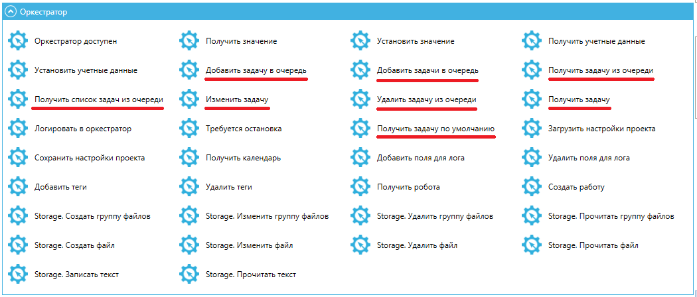
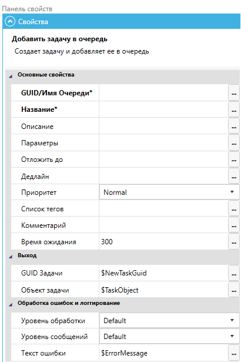
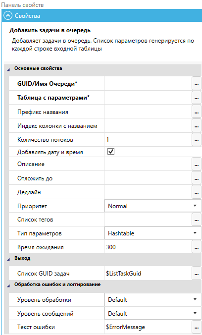
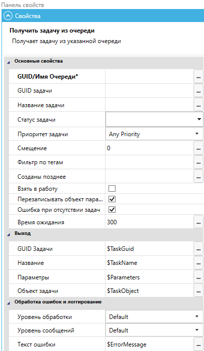
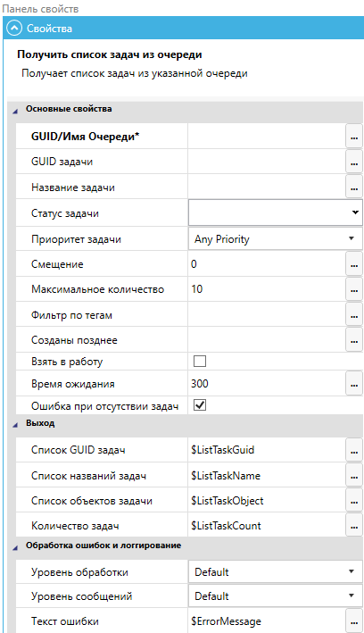
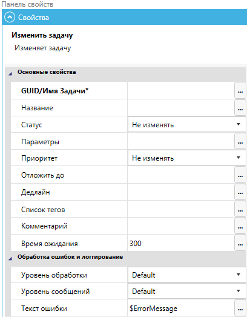
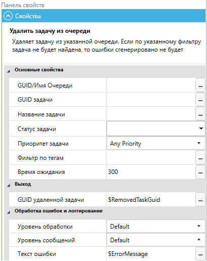
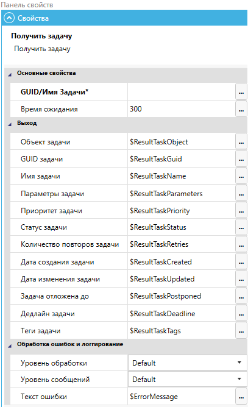

# Работа с Задачами в Sherpa Designer

На стороне Дизайнера работа с Задачами осуществляется через следующие блоки палитры Оркестратора:

* **Добавить Задачу в Очередь;**
* **Добавить Задачи в Очередь;**
* **Получить Задачу из Очереди;**
* **Получить список Задач из Очереди;**
* **Изменить Задачу;**
* **Удалить Задачу из Очереди;**
* **Получить Задачу;**
* **Получить Задачу по умолчанию.**

<figure><figcaption></figcaption></figure>

Рассмотрим подробнее работу каждого из блоков.

## Добавить Задачу в Очередь

При использовании блока “**Добавить задачу в очередь**” на панели свойств блока укажите следующие данные:

<figure><figcaption></figcaption></figure>

* “**GUID/Имя Очереди**” (обязательное для заполнения поле);
* “**Название\***” – название Задачи (обязательное для заполнения поле);
* “**Описание**” – укажите описание Задачи при необходимости;
* “**Параметры**” – укажите словарь с параметрами для Задачи;
* “**Отложить до**” – укажите дату и время, до которых отложена Задача в формате: ДД.ММ.ГГГГ часы:минуты;
* “**Дедлайн**” –  укажите дату и время дедлайна для выполнения данной Задачи в формате: ДД.ММ.ГГГГ часы:минуты. В случае, если указанное время уже прошло, Задача получит наивысший приоритет в Очереди\
  (т.е., когда Робот получает очередную Задачу из Очереди в порядке приоритета, эта Задача будет получена раньше, чем Задачи с приоритетом “Высокий”);
* “**Приоритет**” –  укажите, если Вам необходимо отфильтровать Задачи по их приоритету, при их поступлении. При выборе любого приоритета Задачи будут поступать в порядке от высокого приоритета к низкому;
* “**Список тегов**” – укажите список тегов Задачи через точку с запятой;
* “**Комментарий**” – укажите комментарий Задачи;
* “**Время ожидания**” – укажите время выполнения запроса в секундах.

На выходе Вы получите сформированные “**GUID Задачи**” и “**Объект Задачи**” типа $TaskObject. С данным объектом вы сможете работать в любом блоке, выражении, для этого воспользуйтесь подсказками в окне [“Редактировать выражение” ](../../../../sherpa-designer/rabota-v-sherpa-designer/paneli-svoistv-i-peremennykh-i-rabota-s-nimi/panel-svoistv/)“Примеры работы с объектами задачи TaskObject”.

## Добавить Задачи в Очередь

При использовании блока “**Добавить задачи в очередь**” в его свойствах на панели свойств блока укажите следующие данные:

<figure><figcaption></figcaption></figure>

* “**GUID/Имя Очереди**” (обязательное для заполнения поле);
* “**Таблица с параметрами**” – укажите таблицу с параметрами, по каждой строке которой будет создана новая Задача;
* “**Префикс названия**” – укажите префикс названий Задач. Данное свойство позволяет приписывать создаваемые Задачам одинаковые префиксы в названии Задачи. В случае указания непустого префикса, каждая созданная данным блоком Задача будет иметь название, начинающееся на этот префикс, и к нему будет приписаны текущие дата и время;
* “**Индекс колонки с названием**” – укажите индекс колонки с названиями Задач во входной таблице;
* “**Количество потоков**” – укажите количество потоков создания Задач. Если указано значение больше, чем 2, то процесс создания Задач будет разбит на потоки.&#x20;
* “**Добавлять дату и время**” – установите флаг, если Вам необходимо, чтобы к имени добавлялась текущая дата и время при включении;
* “**Описание**” – описание Задач (при необходимости);
* “**Отложить до**” – укажите дату и время, до которых отложены Задачи в формате: ДД.ММ.ГГГГ часы:минуты;
* “**Дедлайн**” –  укажите дату и время дедлайна для выполнения Задач в формате: ДД.ММ.ГГГГ часы:минуты. В случае, если указанное время уже прошло, Задачи получат наивысший приоритет в Очереди (т.е., когда Робот получает очередную Задачу из Очереди в порядке приоритета, эти Задачи будут получены раньше, чем Задачи с приоритетом “Высокий”);
* “**Приоритет**” – укажите, если Вам необходимо отфильтровать Задачи по их приоритету, при их поступлении. При выборе любого приоритета Задачи будут поступать в порядке от высокого приоритета к низкому;
* “**Список тегов**” – укажите список тегов Задач через точку с запятой;
* “**Тип параметров**” – выберите типа параметров Задач. Возможные значения: Hashtable (словарь) и DataTable (таблица данных с одной строкой);
* “**Время ожидания**” – укажите время выполнения запроса в секундах.

На выходе Вы получите сформированный список GUID созданных Задач.

## Получить Задачу из Очереди

При использовании блока “**Получить задачу из очереди**” в его свойствах на панели свойств блока укажите следующие данные:

<figure><figcaption></figcaption></figure>

* “**GUID/Имя Очереди**” (обязательное для заполнения поле);
* “**GUID задачи**” – укажите, если Вам необходима конкретная Задача;
* “**Название задачи**” – укажите название Задачи, если Вам необходимо отфильтровать Задачи по их названию;
* “**Статус задачи**” – укажите, если Вам необходимо получать Задачи только с определенным статусом;
* “**Приоритет задачи**” – укажите, если Вам необходимо отфильтровать Задачи по их приоритету при поступлении. При выборе любого приоритета Задачи будут поступать в порядке от высокого приоритета к низкому.
* “**Смещение**” – используйте это свойство, если Вам необходимо получить из очереди не первую Задачу, а n-ую по счету (5, 10 и т.д.);
* “**Фильтр по тегам**” – укажите теги через точку с запятой, если Вам необходимо отфильтровать Задачи по ним. Если необходимо, чтобы конкретный тег присутствовал в Задаче, поставьте перед ним “+”, если необходимо исключить Задачи с определенным тегом поставьте перед ним “-”;
* “**Созданы позднее**” – используйте это свойство, если Вам необходимо, чтобы в результат попали только те Задачи, у которых CreatedAt больше или равно значению этого поля. Дату и время следует указывать в формате: ДД.ММ.ГГГГ часы:минуты;
* “**Взять в работу**” – используйте это свойство, если Вам необходимо получить Задачу из Очереди и сразу взять ее в работу по принципу атомарной операции. Данная опция полезна в случае, если одновременно несколько Роботов заканчивают работу с предыдущей Задачей и пытаются взять в работу следующую Задачу из Очереди. Установленный флаг “Взять в работу” гарантирует, что определенная Задача будет взята в работу конкретным Роботом. Если флаг не был установлен, и сложилась описанная выше ситуация, то в Дизайнере появится уведомление об ошибке;
* “**Перезаписывать объект параметров**” – установите флаг, если Вам необходимо, чтобы уже указанный объект параметров перезаписывался. Данное свойство актуально для таблицы данных, если используется ссылка на строку этой таблицы, т.к. при включении ссылка на строку не будет потеряна;
* “**Ошибка при отсутствии задач**” – установите флаг, если Вам необходимо, чтобы в случае, если Задача не будет найдена, была сгенерирована ошибка. Иначе в свойстве "Объект задачи" возвратится пустая строка;
* “**Время ожидания**” –  укажите время выполнения запроса в секундах.

На выходе Вы получите следующие данные: &#x20;

* **GUID Задачи;**
* **Название;**
* **Параметры;**
* **Объект задачи.**

## Получить список Задач из Очереди

При использовании блока “**Получить список задач из очереди**” в его свойствах на панели свойств блока укажите следующие данные:

<figure><figcaption></figcaption></figure>

* “**GUID/Имя Очереди**” (обязательное для заполнения поле);
* “**GUID задачи**” – укажите, если Вам необходима конкретная Задача;
* “**Название задачи**” – укажите название Задачи;
* “**Статус задачи**” – укажите, если Вам необходимо получать Задачи только с определенным статусом;
* “**Приоритет задачи**” – укажите, если Вам необходимо отфильтровать Задачи по их приоритету, при их поступлении. При выборе любого приоритета Задачи будут поступать в порядке от высокого приоритета к низкому.
* “**Смещение**” – используйте это свойство, если Вам необходимо получить из Очереди не первую задачу, а n-ую по счету (5, 10 и т.д.);
* “**Максимальное количество**” – укажите максимальное количество Задач,  которое должно возвращаться. Если параметр не указан, возвращается не больше 100 Задач;
* “**Фильтр по тегам**” – укажите теги через точку с запятой, если Вам необходимо отфильтровать Задачи по ним. Если необходимо, чтобы конкретный тег присутствовал в Задаче, поставьте перед ним “+”, если необходимо исключить Задачи с определенным тегом, поставьте перед ним “-”;
* “**Созданы позднее**” – используйте это свойство, если Вам необходимо, чтобы в результат попали только те Задачи, у которых CreatedAt больше или равно значению этого поля. Дату и время следует указывать в формате: ДД.ММ.ГГГГ часы:минуты;
* “**Взять в работу**” – используйте это свойство, если Вам необходимо получить Задачу из Очереди и сразу взять ее в работу по принципу атомарной операции. При использовании блока “Получить список задач из очереди” не рекомендуется использовать данную функцию;
* “**Время ожидания**” – укажите время выполнения запроса в секундах;
* “**Ошибка при отсутствии задач**” –  установите флаг, если Вам необходимо, чтобы в случае, если список Задач не будет найден, была сгенерирована ошибка, иначе возвратится пустой список.

На выходе Вы получите следующие данные:&#x20;

* **Список GUID задач;**
* **Список названий задач;**
* **Список объектов задач;**
* **Количество задач.**

## Изменить Задачу

При использовании блока “**Изменить задачу**” в его свойствах на панели свойств блока укажите следующие данные:

<figure><figcaption></figcaption></figure>

* “**GUID/Имя Задачи**” (обязательное для заполнения поле);
* “**Название**” – укажите название Задачи. В случае, если в поле “GUID/Имя Задачи” указано имя Задачи, данное поле следует оставить пустым;
* “**Статус**” – укажите, если Вам необходимо получить Задачу только с определенным статусом;
* “**Параметры**” – укажите словарь с параметрами для Задачи;
* “**Приоритет**” – укажите, если Вам необходимо отфильтровать Задачи по их приоритету, при их поступлении. При выборе любого приоритета Задачи будут поступать в порядке от высокого приоритета к низкому;
* “**Отложить до**” – укажите дату и время, до которых отложена Задача в формате: ДД.ММ.ГГГГ часы:минуты;
* “**Дедлайн**” –  укажите дату и время дедлайна для выполнения данной Задачи в формате: ДД.ММ.ГГГГ часы:минуты. В случае, если указанное время уже прошло, Задача получит наивысший приоритет в Очереди \
  (т.е., когда Робот получает очередную Задачу из Очереди в порядке приоритета, эта Задача будет получена раньше, чем Задачи с приоритетом “Высокий”);
* “**Список тегов**” – укажите список тегов Задачи через точку с запятой;
* “**Комментарий**” – укажите комментарий Задачи;
* “**Время ожидания**” – укажите время выполнения запроса в секундах.

## Удалить Задачу из Очереди

При использовании блока “Удалить задачу из очереди” в его свойствах на панели свойств блока укажите следующие данные:

<figure><figcaption></figcaption></figure>

* “**GUID/Имя Очереди**” (обязательное для заполнения поле);
* “**GUID задачи**” – укажите, если Вам необходима конкретная Задача;
* “**Название задачи**” – укажите название Задачи;
* “**Статус задачи**” – укажите, если Вам необходимо получать Задачи только с определенным статусом;
* “**Приоритет задачи**” – укажите, если Вам необходимо отфильтровать Задачи по их приоритету, при их поступлении. При выборе любого приоритета Задачи будут поступать в порядке от высокого приоритета к низкому;
* “**Фильтр по тегам**” – укажите теги через точку с запятой, если Вам необходимо отфильтровать Задачи по ним. Если необходимо, чтобы конкретный тег присутствовал в Задаче, поставьте перед ним “+”, если необходимо исключить Задачи с определенным тегом поставьте перед ним “-”;
* “**Время ожидания**” – укажите укажите время выполнения запроса в секундах.

На выходе Вы получите GUID удаленной Задачи.

## Получить Задачу

При использовании блока “**Получить задачу**” в его свойствах на панели свойств блока укажите следующие данные:

<figure><figcaption></figcaption></figure>

* “**GUID/Имя Задачи**” (обязательное для заполнения поле);
* “**Время ожидания**” – укажите укажите время выполнения запроса в секундах.

На выходе Вы получите следующие данные:&#x20;

* **Объект задачи;**
* **GUID задачи;**
* **Имя задачи;**
* **Параметры задачи;**
* **Приоритет задачи;**
* **Статус задачи;**
* **Количество повторов задачи;**
* **Дата создания задачи;**
* **Дата изменения задачи;**
* **Задача отложена до;**
* **Дедлайн задачи;**
* **Теги задачи.**

## Получить Задачу по умолчанию

Блок “**Получить задачу по умолчанию**”  получает Задачу, заданную текущей работой, которую выполняет Робот:

<figure><figcaption></figcaption></figure>

На выходе Вы получите следующие данные:

* **GUID Задачи;**
* **Название;**
* **Параметры;**
* **Объект задачи.**
