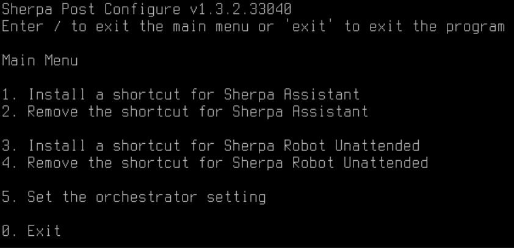

# Установка Sherpa Robot Unattended на RedOS

Для установки необходимы права sudo

&#x20;

Если робот уже установлен, то перейдите к разделу Скачивание и распаковка робота для его обновления.

&#x20;

### Установка .NET Core 8 и Powershell

Общие инструкции по установке приведены на сайте Microsoft:

[https://learn.microsoft.com/ru-ru/dotnet/core/install/linux-fedora](https://learn.microsoft.com/ru-ru/dotnet/core/install/linux-fedora)

[https://learn.microsoft.com/en-us/powershell/scripting/install/install-rhel?view=powershell-7.2](https://learn.microsoft.com/en-us/powershell/scripting/install/install-rhel?view=powershell-7.2)

&#x20;

_Выполняем в терминале:_

sudo dnf install -y dotnet-sdk-8.0

&#x20;

sudo dnf install https://github.com/PowerShell/PowerShell/releases/download/v7.4.2/powershell-7.4.2-1.rh.x86\_64.rpm

### Для работы эмуляции клавиатуры и мышки нужно установить библиотеку libgdiplus

_Выполняем в терминале:_

sudo dnf install libgdiplus

&#x20;

### Для работы с tesseract устанавливаем его.

_Выполняем в терминале:_

sudo dnf install tesseract-langpack-rus

&#x20;

### Для работы с питоном устанавливаем его.

_Выполняем в терминале:_

sudo dnf install python3-devel.x86\_64

&#x20;

### Устанавливаем сервер RDP

Для подключения к этой машине координатора необходимо установить сервер xrdp.

_Выполняем в терминале:_

sudo dnf install xrdp

&#x20;

sudo systemctl restart xrdp

&#x20;

sudo systemctl enable xrdp --now

sudo reboot

&#x20;

### Скачивание и распаковка робота

_Выполняем в терминале:_

rm -f sherpa-robot.zip

&#x20;

wget https://sherparpa.ru/downloads/linux/get-robot.php -O sherpa-robot.zip

&#x20;

sudo unzip -o sherpa-robot.zip -d /usr/lib

&#x20;

sudo chmod a+x /usr/lib/sherpa-robot/Chrome/install\_host.sh

&#x20;

sudo chmod a+x /usr/lib/sherpa-robot/Chrome/process-agent-host

&#x20;

sudo chmod a+x /usr/lib/sherpa-robot/process-agent

&#x20;

sudo chmod a+x /usr/lib/sherpa-robot/sherpa-assistant

&#x20;

sudo chmod a+x /usr/lib/sherpa-robot/sherpa-assistant-console

&#x20;

Внимание. Для установки или обновления робота до последней версии можно ввести в терминале эту команду. В ней собраны все выше описанные команды:

&#x20;

rm -f sherpa-robot.zip && wget https://sherparpa.ru/downloads/linux/get-robot.php -O sherpa-robot.zip && sudo unzip -o sherpa-robot.zip -d /usr/lib && sudo chmod a+x /usr/lib/sherpa-robot/Chrome/install\_host.sh && sudo chmod a+x /usr/lib/sherpa-robot/Chrome/process-agent-host && sudo chmod a+x /usr/lib/sherpa-robot/process-agent && sudo chmod a+x /usr/lib/sherpa-robot/sherpa-assistant && sudo chmod a+x /usr/lib/sherpa-robot/sherpa-assistant-console

&#x20;

### Добавление пользователей для запуска Unattended Роботов

### Заходим в «Центр управления» «Управление пользователями».

Добавляем необходимых пользователей для запуска Unattended роботов.

### Первичная настройка

Данная настройка может быть выполнена для:

1. Добавление ярлыка для Sherpa Assistant
2. Добавление ярлыков в автозагрузку для Unattended роботов
3. Указание сервера оркестратора для Unattended Роботов
4. Указание GUID роботов для учетных записей Unattended роботов

Предварительно необходимо создать учетные записи, на которых будут запускаться Unattended роботы.

&#x20;

_Выполняем в терминале:_

sudo chmod a+x /usr/lib/sherpa-robot/post-configure/post-configure

&#x20;

sudo /usr/lib/sherpa-robot/post-configure/post-configure

<figure><figcaption></figcaption></figure>

1. Команда создает ярлыки на Sherpa Assistant на рабочем столе, а так же в меню «Пуск» -> «Разработка»
2. Команда удаляет ярлыки Sherpa Assistant
3. Команда создает ярлык в автозагрузке у пользователя на запуск Unattended робота
4. Команда удаляет ярлык на запуск Unattended робота
5. Команда позволяет ввести сервер оркестратора и указать GUID роботов

&#x20;

Все команды могут выполняться как для всех учетных записей так и выборочно.

<figure><figcaption></figcaption></figure>

### Для работы робота с Yandex Browser необходимо установить в него плагин.

&#x20;

Данное действие нужно выполнять для каждой учетной записи отдельно.

1. Заходим на учетную запись.
2. Открываем браузер. Идем в раздел "Дополнения".
3. Запускаем менеджер файлов и переходим в папку /usr/lib/sherpa-robot/Chrome
4. Перетаскиваем файл plugin.crx в окно браузера. Добавляем расширение. Закрываем браузер.
5. Запускаем окно терминала в текущей папке и выполняем ./install\_host.sh
6. Запускаем браузер. Если значок плагина Sherpa RPA стал синим, значит плагин успешно установлен.

&#x20;

Так же плагин можно установить с сайта [https://chrome.google.com/webstore/detail/sherpa-rpa/bdnlfnchnkjeempadnmcgbbkbacffobl](https://chrome.google.com/webstore/detail/sherpa-rpa/bdnlfnchnkjeempadnmcgbbkbacffobl)

&#x20;

И после этого выполнить пункты 4, 5, 6

&#x20;

### Для работы робота с Chromium необходимо установить в него плагин.

&#x20;

1. Переходим по ссылке [https://chrome.google.com/webstore/detail/sherpa-rpa/bdnlfnchnkjeempadnmcgbbkbacffobl](https://chrome.google.com/webstore/detail/sherpa-rpa/bdnlfnchnkjeempadnmcgbbkbacffobl) и устанавливаем плагин
2. Переходим в папку /home/user/sherpa-robot/Chrome
3. Запускаем окно терминала в текущей папке. Выполняем:

chmod +x install\_host.sh

./install\_host.sh

cp -f $HOME/.config/google-chrome/NativeMessagingHosts/processagent.sherparpa.json $HOME/.config/chromium/NativeMessagingHosts

4. Запускаем браузер. Если значок плагина Sherpa RPA стал синим, значит плагин успешно установлен.
