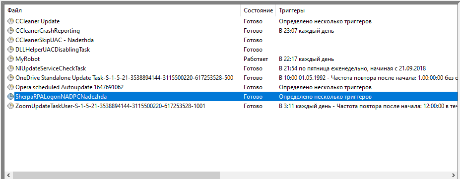
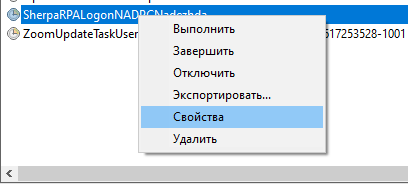
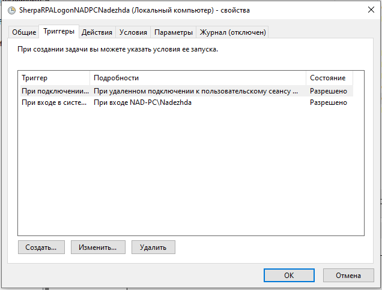
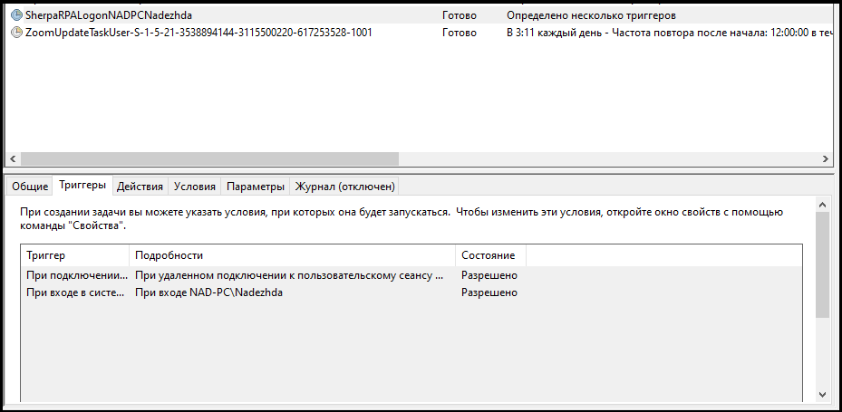

# Установка Sherpa RPA Runtime

**Sherpa RPA Runtime** — это установщик Робота в учетную запись Пользователя для использования без Дизайнера. Sherpa RPA Runtime используется для развертывания на рабочих местах конечных Пользователей Attended-роботов, Unattended-роботов, а также агентов RDP и Citrix. При установке Sherpa RPA Runtime создаются некоторые задания для Windows, а также некоторые установки в реестр для работы RDP.

Установку программы осуществляет инсталлятор, запускаемый файлом [SherpaRPARuntime.exe](https://sherparpa.ru/downloads/SherpaRPARuntime.exe). Сохраните данный файл на компьютер и запустите его.&#x20;

В открывшемся диалоговом окне отметьте необходимые вам параметры установки:

* Режим Робота: “Attended” или “Unattended”;
* Установить для: “Текущего пользователя” или “Всех пользователей”.

Затем нажмите кнопку “Дальше”:

<figure><figcaption></figcaption></figure>

После этого инсталлятор начнет установку программы, которая займет несколько минут:

<figure><figcaption></figcaption></figure>

Когда установка будет завершена, инсталлятор проинформирует Вас с помощью диалогового окна. в котором можно нажать кнопку “Завершить”, чтобы завершить процесс установки.

<figure><figcaption></figcaption></figure>

<table data-header-hidden><thead><tr><th width="50"></th><th></th></tr></thead><tbody><tr><td></td><td>Sherpa RPA Runtime в режиме Attended может работать как для локального запуска Attended-роботов с использованием активированной Лицензии на рабочем месте, так и для удаленного запуска, работы через RDP-подключение из другого Attended или Unattended-робота, в этом случае Лицензия не нужна.</td></tr></tbody></table>

При установке Unattended-робота в планировщике заданий создается одна Задача с двумя Триггерами. На вход в систему и на удаленное подключение.&#x20;

<figure><figcaption></figcaption></figure>

Для того, чтобы увидеть данные Триггеры, можно перейти в свойства Задачи:

<figure><figcaption></figcaption></figure>

После чего перейти во вкладку Триггеры:

<figure><figcaption></figcaption></figure>

Также Триггеры отображаются в нижней панели Планировщика заданий (во вкладке Триггеры):

<figure><figcaption></figcaption></figure>

### Добавление машины в Sherpa Orchestrator

1. Войдите в приложение “Подключение к удаленному рабочему столу”:

<figure><figcaption></figcaption></figure>

2. Введите учетные данные и совершите подключение к удаленному рабочему столу:

<figure><figcaption></figcaption></figure>

3. Установите [Sherpa RPA Runtime](https://docs.sherparpa.ru/sherpa-orchestrator/razvertyvanie-platformy-pod-upravleniem-orkestratora/ustanovka-sherpa-rpa-runtime) , режим Робота: Unattended.

<figure><figcaption></figcaption></figure>

4. Запустите Sherpa Assistant, найдите значок в трее и нажмите на него правой кнопкой мыши. Во всплывающем меню выберите строку “Оркестратор…”:

<figure><figcaption></figcaption></figure>

5.  В поле “Домен сервера / IP” вставьте адрес вашего оркестратора, например: `https://ваш-домен-или-ip`.\

    <figure><figcaption></figcaption></figure>

Для того, чтобы заполнить поле “GUID робота”, войдите в Sherpa Orchestrator во вкладку Роботы. В таблице “Группы роботов” нажмите на строку группу “All Robots”. Над таблицей “Роботы” нажмите кнопку “Создать”. В окне “Робот” в поля:

* “Машина (IP адрес или доменное имя)”,&#x20;
* “Домен (при наличии) и логин учетной записи в формате domain\username”,
* “Пароль учётной записи”

введите учетные данные.

<figure><figcaption></figcaption></figure>

Далее в том же окне заполните поля “Координатор” и “Лицензия” нужными данными из выпадающих списков. Нажмите на кнопку “ОК”. После этого данные сохранятся, можно будет выбрать созданного Робота в таблице “Роботы” и справа от его названия нажать иконку “Изменить”:

<figure><figcaption></figcaption></figure>

Скопируйте данные из поля “GUID записи”, вставьте в нужное поле в окно Sherpa Assistant:

<figure><figcaption></figcaption></figure>

Нажмите на кнопку “Подключиться”, которая находится под полем “GUID робота”.

Вернитесь в Sherpa Orchestrator и проверьте, что в таблице Роботы в строке вашего Робота появился статус “Готов”:

<figure><figcaption></figcaption></figure>

6. Войдите во вкладку “Процесс”, проверьте, что нужный вам Процесс создан (или создайте его через кнопку “Создать”). При создании Работы будет возможность выбрать данный Процесс из выпадающего списка.

<figure><figcaption></figcaption></figure>

<table data-header-hidden><thead><tr><th width="61"></th><th width="318" align="center"></th></tr></thead><tbody><tr><td></td><td align="center">
Проверьте в Sherpa Designer, что в сценарии предусмотрено логирование в Sherpa Orchestrator:

 
</td></tr></tbody></table>

Войдите во вкладку “Работы”, нажмите кнопку “Создать”. В поле “Процесс” введите название Процесса, в поле “Робот” название Робота. Нажмите на кнопку “ОК”.

Нажмите кнопку “Обновить”, проверьте, что статус изменился на “В процессе”:

<figure><figcaption></figcaption></figure>

Нажмите кнопку “Обновить”, проверьте, что статус изменился на “Успешно”:

<figure><figcaption></figcaption></figure>

7. Войдите во вкладку “Сообщения роботов” и проверьте строку с вашим Роботом:

<figure><figcaption></figcaption></figure>

Добавление и настройка машины в Sherpa Orchestrator успешно завершено.
