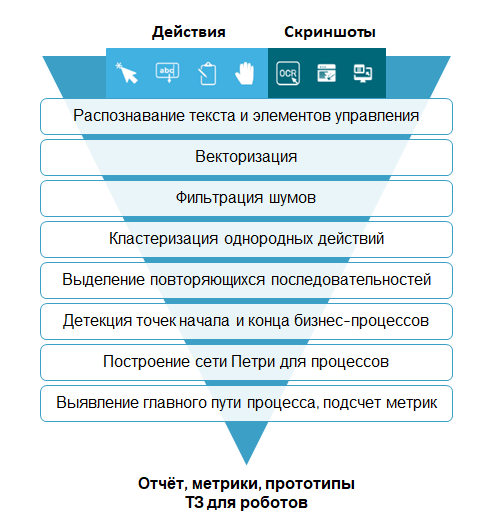

# Sherpa Process Discovery

**Sherpa Process Discovery** — инструмент автоматизации бизнес-процессов на предприятии, обеспечивающий выявление и описание рутинных бизнес-процессов с помощью методов машинного обучения и искусственного интеллекта.

Основная задача Sherpa Process Discovery — определить, какие процессы на предприятии подходят для автоматизации или роботизации. Для этого собираются и обрабатываются данные о деятельности сотрудников в несколько этапов:

1. **Обнаружение Процессов**\
   Нейросеть анализирует повторяющиеся последовательности действий, выявляет их вариации и оценивает потенциал автоматизации. \
   По результатам формируется подробный отчёт (PDD — Process Definition Document) с последовательностями шагов и возможными сценариями роботизации.
2. **Анализ Процессов**\
   Система проводит анализ бизнес-процессов выявляя повторяющиеся рутинные задачи.
3. **Рекомендации по автоматизации**\
   На основе полученных данных создаются рекомендации по автоматизации, а также разрабатываются прототипы решений, описания сценариев для Роботов, что значительно ускоряет этап внедрения.

## Технология Sherpa Process Discovery

<figure><figcaption></figcaption></figure>

В основе системы лежат следующие методы:

* **Компьютерное зрение** (OCR, детекция контуров и объектов) для распознавания элементов интерфейсов.
* **Обработка естественного языка** (NLP, лемматизация, NER) для анализа текста и описаний.
* **Интеллектуальная поддержка принятия решений**: анализ процессов (process mining), генерация сетей Петри.
* **Методы кластеризации и классификации** для сегментации процессов и выявления типичных сценариев.

Основные шаги проводимого исследования:

1. **Установка Agent Process Discovery**\
   На рабочих местах сотрудников устанавливается Агент для фиксации действий сотрудников.
2.  **Сбор данных**

    На протяжении исследования собираются данные о действиях каждого сотрудника в виде логов и изображений.
3.  **Запуск Server Process Discovery**

    По окончании сбора данных на рабочем месте аналитика компании Sherpa RPA запускается Server Process Discovery для автоматической обработки полученных данных.&#x20;
4. **Анализ данных**\
   Формирование выводов и рекомендаций для подготовки отчетов.

## Режимы работы

Sherpa Process Discovery может работать в следующих режимах:

* **Аналитика операций ("Task mining")** — сбор данных о действиях сотрудников (клики мыши, прокрутки, перетаскивания, смены экранов), предназначенная для выявления повторяющихся действий и моделирования рабочих сценариев.
* **Глубинная аналитика операций ("Deep task mining")** — включает все виды данных из предыдущего типа, а также создание принтскринов при каждом действии для более глубокого анализа визуальных элементов интерфейса.
* **Аналитика процессов ("Process Mining")** — загрузка уже подготовленных данных из сторонних систем с информацией о бизнес-процессах для анализа и оптимизации.

## Рекомендации по автоматизации процессов

Рекомендуется автоматизация Процессов, которые характеризуются:

* высокой трудозатратностью (длительностью выполнения/частотой);
* существенными затратами по времени;
* высокой себестоимостью;
* оценкой уровня роботизации более 50 %.

Дополнительно аналитики Sherpa RPA предоставляют комментарии по компании, отделам и отдельным Процессам, а также прогнозы по перспективам внедрения Роботов и ожидаемой экономии.

## Преимущества Sherpa Process Discovery

Использование данной технологии позволяет:

* значительно экономить время на выявление автоматизируемых процессов,&#x20;
* повысить точность анализа и снизить риски внедрения.&#x20;

Автоматизированный сбор данных и аналитика обеспечивают объективность оценки, а интеграция в рабочие контуры предотвращает утечку данных.
