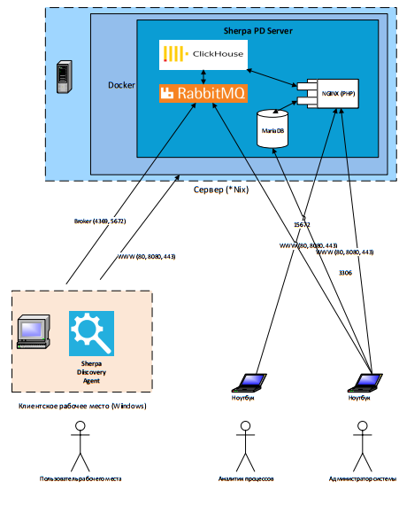

# Диаграмма развертывания

<figure><figcaption></figcaption></figure>

В хорошем качестве можно скачать [здесь](https://drive.google.com/file/d/1GqGmNbjYcBnhdkNN9knNTb6j5jy8qPHj/view?usp=drive_link).

Схема описывает реализацию функционала на верхнем уровне, который использует возможности искусственного интеллекта для выявления бизнес-процессов, наиболее подходящих по заданным критериям для последующей роботизации. Сбор всей необходимой информации по работе пользователей, ее обработка и анализ производятся в фоновом режиме, без отвлечения персонала от основной деятельности. Анализируются действия отдельных пользователей на детальном уровне, по конкретным шагам (кликам, переходам и др).

### Тип собираемых данных

Тип собираемых данных - снимок экрана/метаданные для каждого действия пользователя (скриншот для каждого действия пользователя). Подробные метаданные включают в себя:

* Имя приложения
* Имя пользователя
* Тип события (например, колесо мыши, щелчок левой кнопкой мыши)
* Положение мыши (например, x: 933, y:637)
* Отметка времени

Обеспечивается контроль над тем, какие бизнес-приложения следует отслеживать, используя списки, определяющие приложения для мониторинга. Любые приложения, не одобренные для обнаружения по соображениям безопасности или другим причинам, могут быть исключены из списка приложений для включения, или добавлены в список приложений для исключения. По запросу может быть применена маскировка собираемой текстовой информации по заданному списку регулярных выражений.

### Установка и конфигурация

Все компоненты Sherpa Process Discovery устанавливается локально в сети Банка, без связи с внешними серверами или службами SaaS.

Все данные сохраняются во внутреннем хранилище сервера обнаружения и не передаются и не экспортируются за пределы сервера, автоматически или вручную. По умолчанию развертывание Process Discovery Server осуществляется с помощью Docker-контейнера.&#x20;

Развертывание Sherpa Discovery Agents на рабочих местах пользователей осуществляется вручную с помощью exe-инсталлятора, либо автоматически с помощью msi-инсталлятора, с помощью механизма GPO.

### Логирование

Для логирования используется компонент Monolog. События аудита и системные ошибки сохраняются в выделенную таблицу базы данных.
