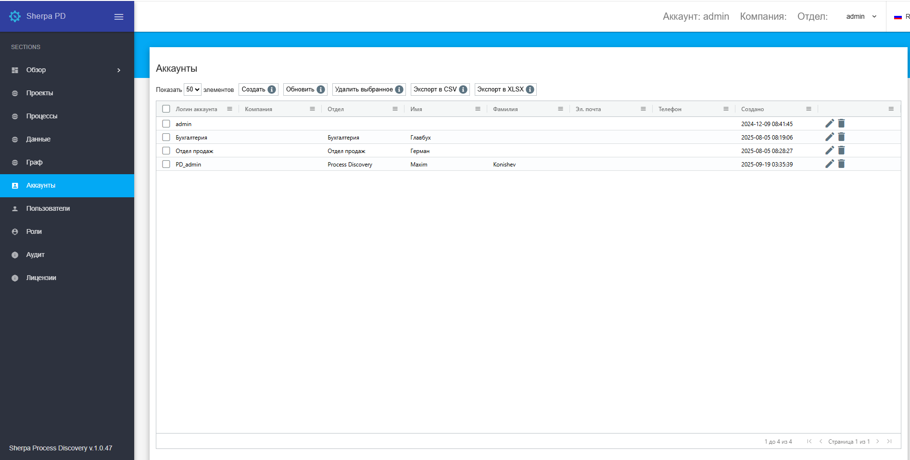

# Аккаунты

**Аккаунты** – это отдельные пространства внутри Sherpa Process Discovery, каждое из которых обладает собственным набором Процессов. Аккаунты абсолютно изолированы друг от друга.

С помощью Аккаунтов Sherpa Process Discovery может быть поделен на несколько логических, не связанных друг с другом, областей (например, по департаментам), и для каждой из них вести отдельный учет и раздельное использование всех объектов.

Аккаунты представляют собой изолированные друг от друга пространства для хранения сущностей Sherpa Process Discovery, доступ к которым осуществляется по логину и паролю Пользователя.

<table data-header-hidden><thead><tr><th width="54"></th><th></th></tr></thead><tbody><tr><td></td><td>Аккаунты внутри Sherpa Process Discovery не являются Пользователями. Для определения прав Пользователей предусмотрен отдельный экран “Пользователи”.</td></tr></tbody></table>

Экран “Аккаунты” содержит таблицу “Аккаунты”:

<figure><figcaption></figcaption></figure>

## **Создание нового Аккаунта**

Для создания нового Аккаунта необходимо нажать на кнопку “Создать” в таблице “Аккаунты” и заполнить открывшуюся форму.

Форма создания нового Аккаунта предлагает три варианта аутентификации, из которых можно выбрать нужную с помощью установки флага:&#x20;

* Локальная аутентификация;
* LDAP аутентификация;
* OpenID аутентификация.

## **Редактирование ранее созданного Аккаунта**

Для просмотра и редактирования свойств конкретного Аккаунта необходимо выбрать его в списке и нажать на иконку .png>). После этого откроется форма с настройками Аккаунта, в которую можно внести необходимые изменения. Помимо полей заполняемых при создании нового Аккаунта в форме редактирования есть дополнительное поле “Ключ API” (уникальный код, используемый для аутентификации при работе с API Sherpa Process Discovery). Данное поле нельзя отредактировать.&#x20;
