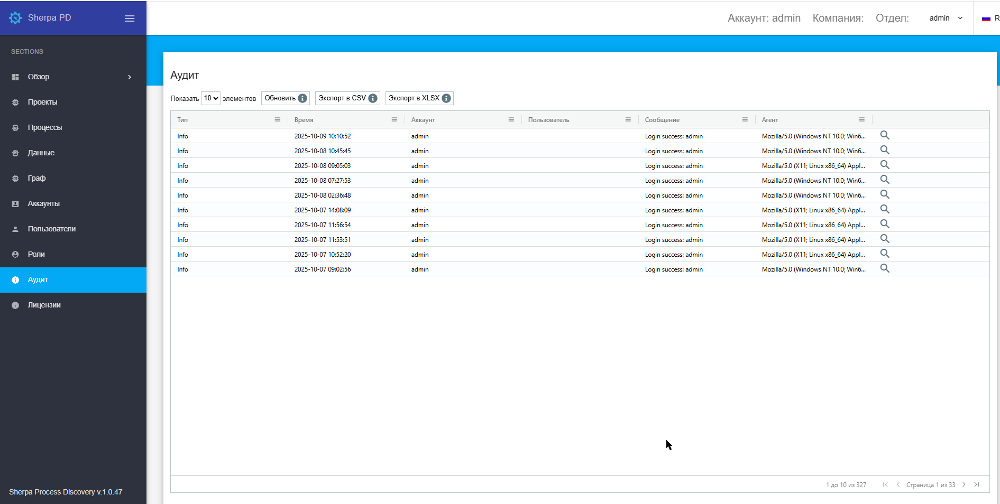

# Аудит

Экран “Аудит” содержит таблицу “Аудит”, которая представляет собой список сообщений о событиях, произошедших внутри Sherpa Process Discovery:

<figure><figcaption></figcaption></figure>

В таблице отображается информация о:

* создании/удалении Аккаунта;
* создании/удалении Пользователя;&#x20;
* попытках ввода логина (успешно/неуспешно) Пользователями;
* манипуляциях Пользователей с различными объектами Sherpa Process Discovery.
