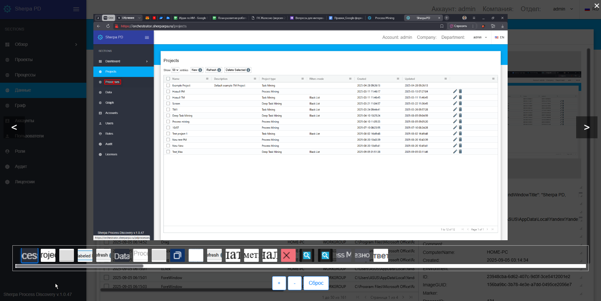
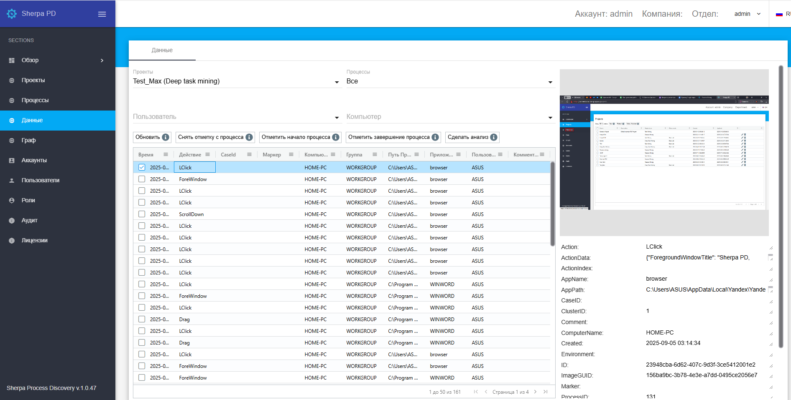
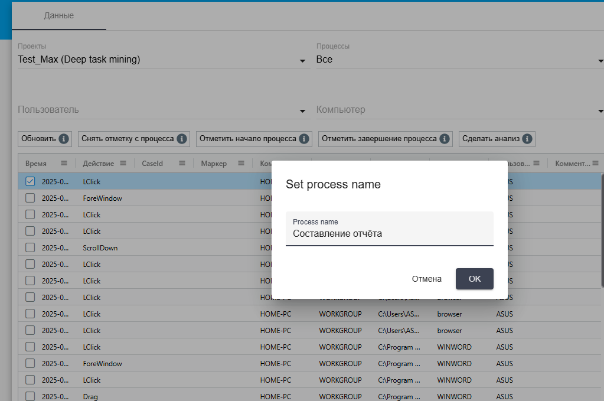

# Данные

Окно "Данные" предоставляет разметчику доступ к детализированной информации о Процессах и действиях Пользователей.

В начале необходимо выбрать проект в поле "Проекты" (содержащее список всех ранее добавленных проектов на экране "Проекты").&#x20;

После того как проект выбран, следует перейти к полю "Процессы" и выбрать нужный Процесс из выпадающего списка. В случае отсутствия Процессов можно выбрать вариант "Все", что позволит отобразить полный перечень доступных данных.

В правом верхнем углу интерфейса размещено окно, в котором отображается скриншот с действием, соответствующим строке данных, выделенной в центральной таблице на экране "Данные". При клике на это окно изображение разворачивается на весь экран для более детального просмотра. Под основным окном расположены миниатюры - отдельные выделенные области скриншота, которые можно выбрать для быстрого перехода к интересующему участку изображения.

<figure><figcaption></figcaption></figure>

Это помогает разметчику детально изучить содержание каждого шага и визуально контролировать ход Процесса. Переходя по строкам действия, разметчик просматривает соответствующие скриншоты, что обеспечивает возможность быстро получить нужные сведенья о Процессе.

Описание столбцов таблицы "Данные":

1. **Время** — отображает точное время, когда было совершено действие, что позволяет отслеживать хронологию событий.
2. **Действие** — краткое описание операции или шага, выполненного пользователем или системой.
3. **CaseId** — уникальный идентификатор, связывающий действие с определенным кейсом для удобства группировки и поиска.
4. **Маркер** — отметка, проставляемая разметчиком для выделения конкретного действия.
5. **Компьютер** — имя или идентификатор компьютера, на котором Пользователь выполнил данное действие.
6. **Группа** — группа Пользователей или подразделение, к которому относится Пользователь, выполнявший действие.
7. **Путь Приложения** — полный путь к программе, в которой в момент действия работал Пользователь (например, путь к "Yandex Browser").
8. **Приложение** — краткое название или идентификатор приложения, где осуществлялось действие.
9. **Пользователь** — имя учетной записи Пользователя, под которой он был залогинен во время выполнения действия.
10. **Комментарий** — дополнительная информация или заметки, которые можно добавить к записи для пояснения или уточнения контекста.

<figure><figcaption></figcaption></figure>

Для удобства и точности анализа доступна возможность фильтрации по пользователю и компьютеру через соответствующие поля "Пользователь" и "Компьютер". Это позволяет сосредоточить внимание на нужных данных и ускорить процесс работы.

Когда разметчик находит строку данных, с которой начинается нужный Процесс, то кликает по ней правой кнопкой мыши и нажимает на кнопку "Отметить начало процесса". В появившемся окне "Set process name" он вводит название Процесса, например "Составление отчета", после чего нажимает на кнопку "ОК".

<figure><figcaption></figcaption></figure>

Теперь отмеченная строка в таблице подсвечивается зелёным цветом, и в колонке "Маркер" появляется отметка о начале Процесса.

Завершение процесса помечается аналогичным образом:

* клик правой кнопкой мыши по строке с завершающим действием,&#x20;
* нажатие на кнопку "Отметить завершение процесса",&#x20;
* ввод названия Процесса и подтверждение.&#x20;

После этого отмеченная строка подсвечивается красным, а в колонке "Маркер" отображается отметка о завершении.

<figure><figcaption></figcaption></figure>

Если требуется внести исправление, есть возможность:

* кликнуть правой кнопкой мыши по строке с выделенным действием,&#x20;
* нажать на кнопку "Снять отметку",
* заново пометить начало или завершение Процесса в таблице "Данные".
