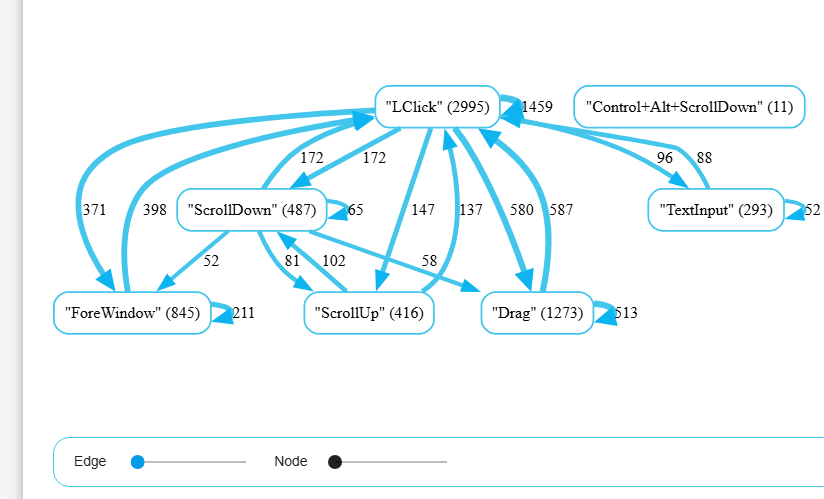
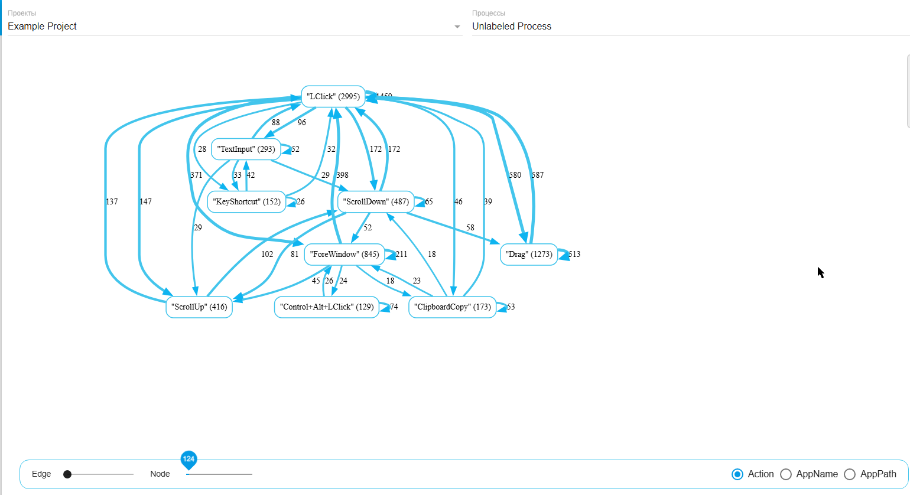
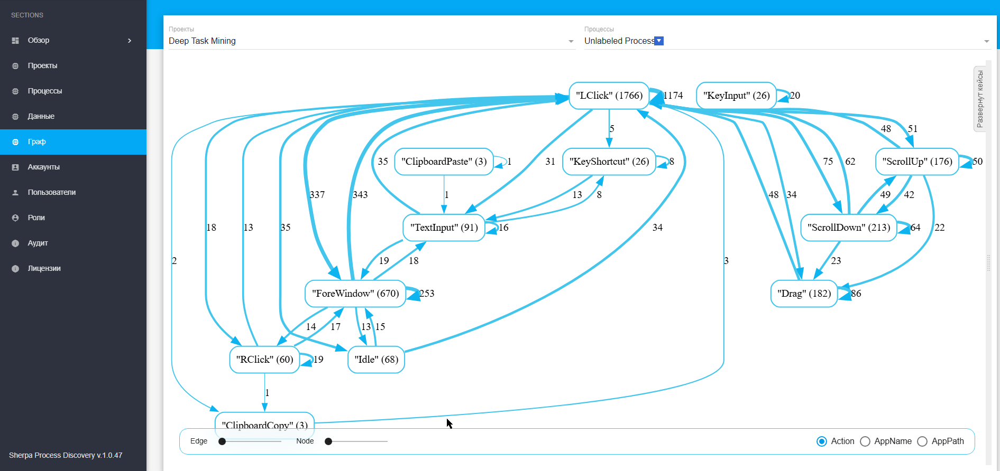
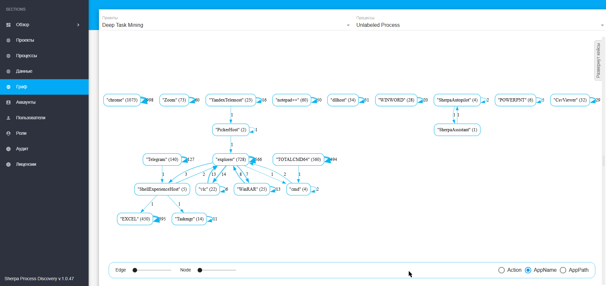
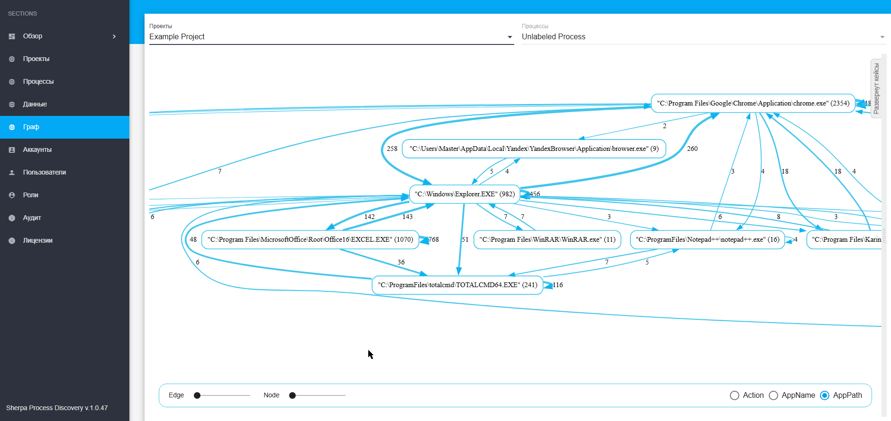

# Граф

На экране "Граф" представлена детализированная визуализация по:

* элементарным действиям,&#x20;
* действиям в программах,
* путям к программам в операционной системе.

Передвижение ползунка "Edge" в левом нижнем углу экрана "Граф" динамически изменяет количество отображаемых узлов на графе. Значение ползунка непосредственно влияет на число узлов, позволяя пользователю регулировать уровень детализации визуализации.

<figure><figcaption></figcaption></figure>

Передвижение ползунка "Node" в левом нижнем углу экрана "Граф" динамически изменяет количество отображаемых связей на графе. Числа, расположенные около связей, показывают, сколько раз происходили переходы между соответствующими действиями. Если значение числа около связи оказывается меньше установленного значения на ползунке, то эта связь автоматически исчезает вместе с узлами, количество взаимодействий между которыми она показывала.

<figure><figcaption></figcaption></figure>

## Элементарные действия

Для визуализации элементарных действий, относящихся к выбранному проекту, необходимо:

* выбрать его в поле "Проекты" (например, нажать на строку "Deep Task Mining"),
* выбрать нужный Процесс в поле "Процессы",
* поставить в правом нижнем углу флаг "Action".

<figure><figcaption></figcaption></figure>

В каждом узле графа в скобках отображается количество элементарных действий, относящихся к данному узлу. Это число показывает, сколько раз конкретное действие или событие было выполнено.

Числа, расположенные рядом со связями (между узлами графа), отражают количество переходов от одного элементарного действия к другому. Эти значения показывают, как часто происходят конкретные переходы.

Элементарные действия включают в себя самые базовые и часто встречающиеся взаимодействия Пользователя с системой: клик левой кнопкой мыши ("LClick"), ввод с клавиатуры ("KeyInput"), прокрутка окна вверх ("ScrollUp") и вниз ("ScrollDown"), а также другие типовые операции.

Такое подробное отображение позволяет не просто видеть общий ход Процесса, но и анализировать его на уровне отдельных шагов и действий, предоставляя глубокое понимание пользовательского поведения и последовательности событий.&#x20;

## Действия в программах

Для визуализации действий в программах, относящихся к выбранному проекту, необходимо:

* выбрать его в поле "Проекты" (например, нажать на строку "Deep Task Mining"),
* выбрать нужный Процесс в поле "Процессы",
* поставить в правом нижнем углу флаг "AppName".

<figure><figcaption></figcaption></figure>

В каждом узле графа в скобках отображается количество действий в программе, относящихся к данному узлу. Это число показывает, сколько раз конкретное действие или событие было выполнено.

Числа, расположенные рядом со связями (между узлами графа), отражают количество переходов от действия в одной программе к действию в другой. Эти значения показывают, как часто происходят конкретные переходы.

Граф с действиями в программах представляет собой визуальную структуру, в которой каждый узел обозначает конкретное приложение или программу, используемую Пользователем в ходе Процесса. Названия программ в узлах помогают наглядно увидеть последовательность работы с разными программными продуктами, отражая переходы Пользователя между ними.

## Пути к программам в операционной системе

Для визуализации путей к программам в операционной системе, относящихся к выбранному проекту, необходимо:

* выбрать его в поле "Проекты" (например, нажать на строку "Example Project"),
* выбрать нужный Процесс в поле "Процессы",
* поставить в правом нижнем углу флаг "AppPath".

Граф с путями к программам в операционной системе представляет собой визуальное отображение последовательностей работы с файлами и приложениями, где каждый узел графа соответствует конкретному пути к программе или исполняемому файлу на диске. Эти узлы отображают полный путь в файловой системе, начиная с корневого каталога и далее по вложенным папкам до самого исполняемого файла.

<figure><figcaption></figcaption></figure>

В каждом узле графа в скобках отображается количество действий, относящихся к данному узлу. Это число показывает, сколько раз конкретное действие или событие было выполнено.

Числа, расположенные рядом со связями (между узлами графа), отражают количество переходов от одного действия по одному пути к программе в операционной системе к другому. Эти значения показывают, как часто происходят конкретные переходы.

Такое представление позволяет наглядно проследить, каким образом Пользователь или система переходят между различными программами, в каких директориях они расположены и как происходит взаимодействие на уровне операционной системы.
