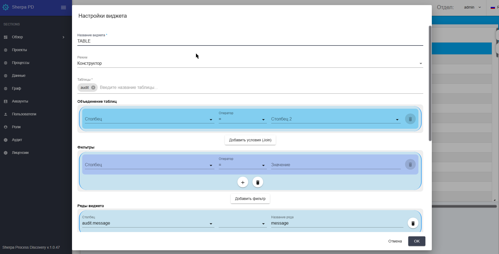
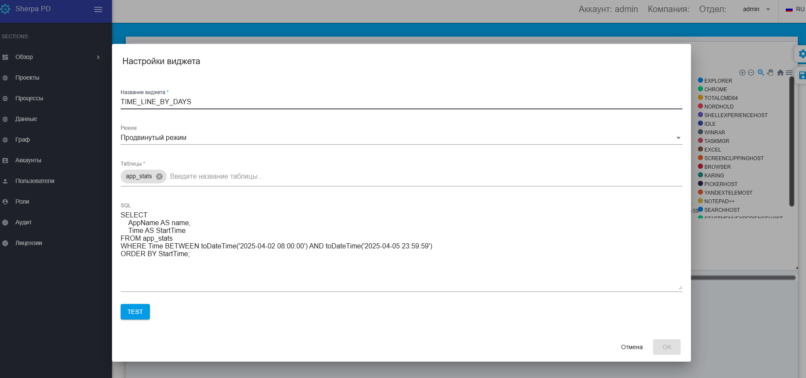

# Обзор

На экране "Обзор" реализована возможность создания и редактирования пользовательских Дашбордов с использованием конструктора или SQL консоли.&#x20;

Чтобы получить доступ ко всем инструментам и функциям, необходимым для создания Дашбордов выполните следующие шаги:

### 1. Открытие конструктора Дашбордов

Для того чтобы открыть конструктор Дашбордов, войдите в свою учетную запись в меню "Разделы" ("Sections"), и перейдите в раздел "Обзор" ("Dashboard");

<figure><figcaption></figcaption></figure>

Нажмите вкладку "Настройка панелей" ("Customize Dashboards");

### 2. Создание нового Дашборда

Для того, чтобы создать новый Дашборд:

* Нажмите кнопку “Создать”.
* Введите название вашего Дашборда в поле “Имя\*”. Заполните при необходимости поле “Описание”. Нажмите кнопку ОК.
* Кликните на иконку  (Дизайнер формы).

Теперь вы можете приступить к добавлению Виджетов.

### 3. Добавление виджетов на Дашборд

В меню конструктора найдите панель с доступными виджетами. Для этого нажмите на иконку всплывающего меню:

<figure><figcaption></figcaption></figure>

Во всплывающем окне можно воспользоваться следующими иконками в правом верхнем углу:

 – Изменить размер виджета;

 – Редактировать виджет;

 – Удалить виджет.

В окне "Настройки виджета" есть возможность выбрать параметры для настройки внешнего вида Дашборда.

<figure><figcaption></figcaption></figure>

### **Общие поля**

* **“Название виджета \*”** – текстовое поле, заполняется вручную с клавиатуры;
* **“Режим”** – всплывающий список, в котором нужно выбрать режим создания запроса для виджета:&#x20;

| **Название**       | **Описание**                                                                                                                                                                                                                                                                                       |
| ------------------ | -------------------------------------------------------------------------------------------------------------------------------------------------------------------------------------------------------------------------------------------------------------------------------------------------- |
| Режим конструктора | Позволяет собрать запрос из отдельных блоков. В каждом блоке (Объединение таблиц, Фильтры, Ряды виджета, Группировка по, Сортировка, Количество строк) есть возможность настроить нужные команды для работы с данными, арифметические и логические команды, операторы сравнения.                   |
| Продвинутый режим  | 
Позволяет ввести запрос вручную в поле SQL:

 |

* **“Таблицы”** – всплывающий список со всеми доступными таблицами базы данных.

Пример запроса, введенного вручную:

<figure><figcaption></figcaption></figure>

### 4. Управление Дашбордами и доступом

Для управления доступом к созданным вами Дашбордам:

1\) Перейдите в раздел Настройка панелей (Customize Dashboards);

2\) Кликните на иконку  справа от названия Дашборда, у которого необходимо изменить настройки доступа;

3\) Укажите, каким пользователям или группам пользователей будет предоставлен доступ к вашим Дашбордам, в поле Папка доступа (Access folder);

4\) Сохраните изменения нажатием кнопки “ОК”.

Управление доступом к Дашбордам обеспечивает конфиденциальность и безопасность информации.

### 5. Использование Дашборда по умолчанию

Для того, чтобы использовать Дашборд по умолчанию и видеть его при входе в систему:

1\) Заполните чек-бокс слева от названия Дашборда: ;

2\) Нажмите на кнопку .

### 6. Клонирование Дашборда

Для того, чтобы клонировать Дашборд:

1\) Заполните чек-бокс слева от названия Дашборда: ;

2\) Нажмите на кнопку .

### 7. Удаление Дашборда

Для того, чтобы удалить Дашборд используйте иконку справа от названия Дашборда , после чего появится окно: ,\
где нужно подтвердить действие нажатием кнопки “Да”, или:

1\) Заполните чек-бокс слева от названия Дашборда: ;

2\) Нажмите на кнопку .
