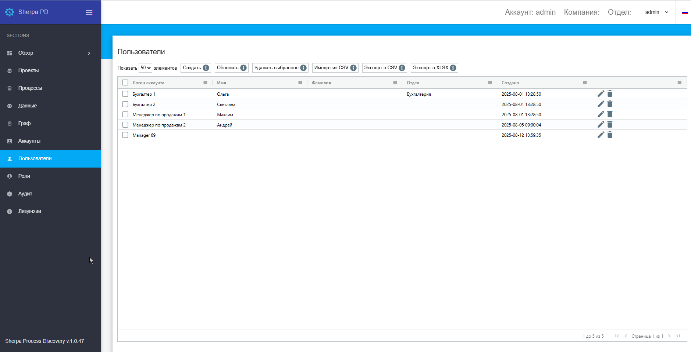

# Пользователи

**Пользователи** создаются в рамках Аккаунта. Каждому Пользователю присваивается определенная Роль на экране “Роли”, это необходимо сделать перед созданием Пользователя на экране “Пользователи”. Пользователю можно присвоить определенную Роль или несколько Ролей.

Экран Пользователи содержит таблицу “Пользователи”:

<figure><figcaption></figcaption></figure>

## **Создание нового Пользователя**

Для создания нового Пользователя необходимо нажать на кнопку “Создать” в таблице “Пользователи” и заполнить открывшуюся форму.

<table data-header-hidden><thead><tr><th width="52"></th><th></th></tr></thead><tbody><tr><td></td><td>При создании и/или редактировании Пользователя должно быть указано какой именно способ аутентификации для него использовать.</td></tr></tbody></table>

Форма создания нового Пользователя предлагает три варианта аутентификации, из которых можно выбрать нужную с помощью установки флага:&#x20;

* Локальная аутентификация;
* LDAP аутентификация;
* OpenID аутентификация.

## **Редактирование ранее созданного Пользователя**

Для просмотра и редактирования свойств конкретного Пользователя необходимо выбрать его в списке и нажать на иконку .png>). После этого откроется форма с настройками Пользователя, в которую можно внести необходимые изменения. Новых полей в ранее созданном Пользователе нет.
