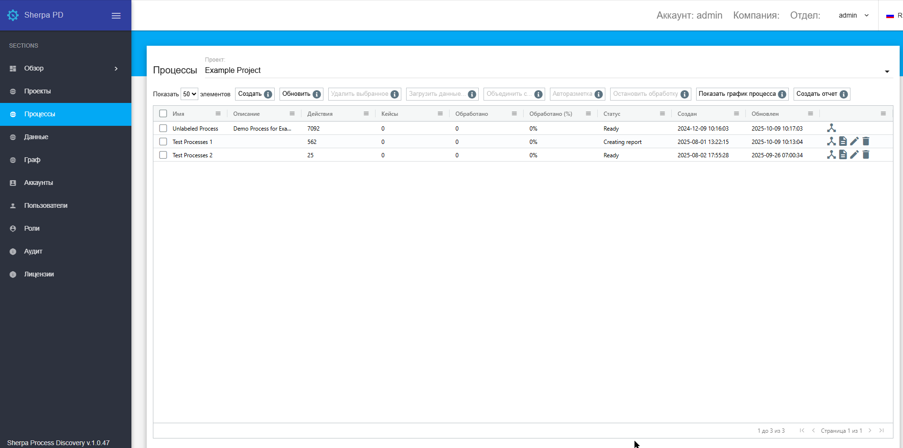

# Процессы

Окно "Процессы" служит для комплексного управления и контроля всех Процессов разметки данных. Оно содержит таблицу с ключевыми параметрами каждого Процесса.

Описание колонок таблицы "Процессы":

1. **Имя** — название процесса.
2. **Описание** — краткое пояснение, раскрывающий суть Процесса.
3. **Действия** — количество совершенных в Процессе действий, отображающих степень его активности.
4. **Кейсы** — количество кейсов (наборов данных или задач), связанных с Процессом.
5. **Обработано** — общее количество обработанных элементов данных в рамках Процесса.
6. **Обработано (%)** — процентное выражение прогресса обработки элементов данных в рамках Процесса.
7. **Статус** — текущий статус Процесса, информирующий о его состоянии.
8. **Создан** — дата и время создания Процесса.
9. **Обновлен** — дата и время последнего обновления данных Процесса.

Описание кнопок управления процессами, расположенных над таблицей:

1. **Создать** — позволяет инициировать новый Процесс.
2. **Обновить** — обновляет текущий список Процессов и их данные.
3. **Удалить выбранное** — удаляет выделенный в таблице Процесс или Процессы.
4. **Загрузить данные...** — предоставляет возможность импортировать данные в формате .csv для последующей обработки.
5. **Объединить с** — позволяет объединить выбранный Процесс с другим, для консолидации данных.
6. **Авторазметка** — запускает автоматическую разметку данных с использованием предустановленных алгоритмов.
7. **Остановить обработку** — прерывает текущий активный Процесс.
8. **Показать график процесса** — автоматически переводит Пользователя в окно "[Граф](graf.md)", где визуализируется ход выбранного Процесса в виде графика.
9. **Создать отчет** — генерирует подробный отчет по выбранному Процессу, включающий статистику и результаты.

<figure><figcaption></figcaption></figure>

Поле "Проект" над таблицей "Процессы" служит для выбора конкретного проекта, которому принадлежат отображаемые в таблице Процессы.

При выборе нужного проекта и строки "Unlabeled process" (не размеченные Процессы) в таблице "Процессы" Пользователь может нажать кнопку "Авторазметка". После этого откроется окно с двумя вариантами автоматической разметки:&#x20;

* "По существующим маркерам";
* "С помощью ИИ".

Выбрав вариант "По существующим маркерам", система автоматически добавит в таблицу новые строки с теми Процессами, которые разметчик обнаружил, анализируя данные в таблице на экране "[Данные](dannye.md)".&#x20;

<figure><figcaption></figcaption></figure>
