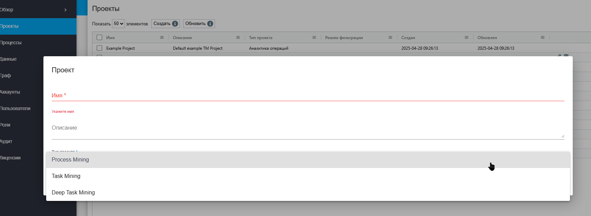
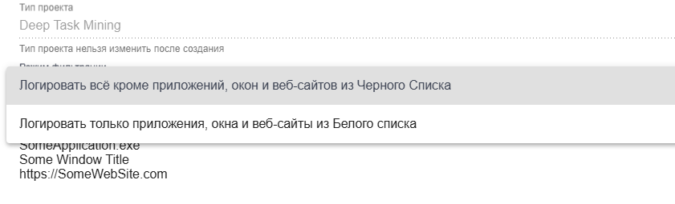

# Проекты

**Проект** — это структурированный набор данных, связанный с определённой инициативой, направленной на сбор, анализ и обработку информации для бизнес-аналитики.

Проект содержит следующие параметры:

* **Имя проекта** — наименование проекта, для идентификации его в систем&#x435;**.**
* **Описание проекта** — цели, области применения и особенности проекта.
* **Тип проекта** — категория, определяющая специфику собираемых данных и методов анализа:
  * **Аналитика операций ("Task mining")** — сбор данных о действиях сотрудников (клики мыши, прокрутки, перетаскивания, смены экранов), предназначенная для выявления повторяющихся действий и моделирования рабочих сценариев.
  * **Глубинная аналитика операций ("Deep task mining")** — включает все виды данных из предыдущего типа, а также создание принтскринов при каждом действии для более глубокого анализа визуальных элементов интерфейса.
  * **Аналитика процессов ("Process Mining")** — загрузка уже подготовленных данных из сторонних систем с информацией о бизнес-процессах для анализа и оптимизации.
* **Дата создания** — день, месяц и год создания конкретного проекта.
* **Дата обновления** — день, месяц и год последнего внесения изменений в проект.

Для создания нового Проекта в таблице “Проекты” нажмите на кнопку “Создать” и заполните открывшуюся форму:

<figure><figcaption></figcaption></figure>

Для просмотра и редактирования свойств конкретного Проекта необходимо выбрать его в списке и кликнуть на иконку .png>). После этого откроется форма с настройками Проекта, в которую можно внести необходимые изменения.

Помимо полей, заполняемых при создании Проектов, при редактировании в форме указан GUID (уникальный идентификатор, присвоенный Проекту после его создания). Данное поле нельзя отредактировать.

При редактировании Проекта есть возможность задать режим фильтрации и внести в список сайты и/или пути к файлам, которые будут попадать в лог.&#x20;

<figure><figcaption></figcaption></figure>

**Режим фильтрации** при редактировании проекта определяет, какие данные будут сохраняться, а какие - игнорироваться. Для его настройки необходимо выбрать один из двух вариантов:

1. **Логировать все, кроме приложений, окон и веб-сайтов из Черного списка** — сохранять все данные, за исключением тех, что указаны в черном списке.
2. **Логировать только приложения, окна и веб-сайты из Белого списка** — сохранять данные только для указанных в белом списке приложений, окон и веб-сайтов.

Далее в поле **Черный список/Белый список** необходимо внести URL или путь к файлу для дальнейшей фильтрации.&#x20;
