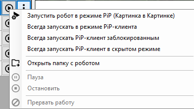

# Главный интерфейс Sherpa Assistant

Кликните на иконку Sherpa Assistant в трее и войдите в главный интерфейс, путём выбора строки "Роботы":

<figure><figcaption></figcaption></figure>

Главный интерфейс Sherpa Assistant содержит действия по управлению программными Роботами.

<table data-header-hidden><thead><tr><th width="57" valign="top"></th><th width="240" valign="top"></th><th valign="top"></th></tr></thead><tbody><tr><td valign="top"><strong>№ п/п</strong></td><td valign="top"><strong>Элемент</strong></td><td valign="top"><strong>Описание</strong></td></tr><tr><td valign="top">1.</td><td valign="top">кнопка “Добавить робота”</td><td valign="top">Позволяет добавить Робота из папки “MyRobots”.</td></tr><tr><td valign="top">2.</td><td valign="top">кнопка “Добавить удаленного робота”</td><td valign="top">Позволяет добавить удаленного Робота из папки “MyRobots”.</td></tr><tr><td valign="top">3.</td><td valign="top">кнопка “Удалить робот”</td><td valign="top">Позволяет удалить выбранного Робота.</td></tr><tr><td valign="top">4.</td><td valign="top">кнопка “Настройки”</td><td valign="top">Позволяет в открывшемся окне ввести логин и пароль.</td></tr><tr><td valign="top">5.</td><td valign="top">кнопка “Обновить”</td><td valign="top">Позволяет обновить перечень Роботов в окне Ассистента.</td></tr><tr><td valign="top">6.</td><td valign="top">колонка “Название робота”</td><td valign="top">Отображает название проекта.</td></tr><tr><td valign="top">7.</td><td valign="top">колонка “Горячая клавиша”</td><td valign="top">Позволяет просмотреть сочетания клавиш, по которому можно запустить проект (Робота).</td></tr><tr><td valign="top">8.</td><td valign="top">колонка “Автозагрузка”</td><td valign="top">Позволяет отметить флагом проекты (Роботов), которые будут запускаться вместе с запуском программы-агента. Для того чтобы Процесс запускался при запуске Windows требуется добавить программу-агент в список автозагрузки. Если выделить несколько Роботов, то они будут запускаться последовательно по Очереди.</td></tr><tr><td valign="top">9.</td><td valign="top">кнопка </td><td valign="top">Позволяет запустить Процесс при нажатии.</td></tr><tr><td valign="top">10.</td><td valign="top">кнопка </td><td valign="top">Позволяет вызвать контекстное меню с доступными опциями для выбранного проекта (Робота).</td></tr><tr><td valign="top">11.</td><td valign="top">поле “Горячая клавиша”</td><td valign="top">Позволяет указать горячие клавиши для выбранного проекта (Робота).</td></tr><tr><td valign="top">12.</td><td valign="top">кнопка “Задать клавиши”</td><td valign="top">Позволяет сохранить горячие клавиши для выбранного проекта (Робота).</td></tr></tbody></table>

Функция авторизации под конкретным Пользователем Оркестратора с последующей подгрузкой из Оркестратора Папок и Процессов, доступных именно этому Пользователю. Таким образом, у Пользователя появляется возможность использовать не только локальных Роботов, но и Роботов, доступ к которым предоставлен ему через Оркестратор.

Для этого необходимо:

* в верхней части окна нажать на кнопку “Настройки”:

<figure><figcaption></figcaption></figure>

* во всплывающем окне “Настройки” ввести логин и пароль Пользователя (который задан для этого Пользователя в Оркестраторе):

<figure><figcaption></figcaption></figure>

* нажать на кнопку “ОК”.

После входа Пользователю станут доступны Процессы, синхронизированные с Оркестратором:

<figure><figcaption></figcaption></figure>

Также их можно увидеть на экране [Процессы](https://docs.sherparpa.ru/sherpa-orchestrator/rabota-v-sherpa-orchestrator/ekrany/processy) Оркестратора:

<figure><figcaption></figcaption></figure>

Функционал Папок доступа в Оркестраторе позволяет:

1. Разграничить доступ Пользователям с разными Ролями к разным наборам Процессов;
2. Визуально разделить Процессы по разным папкам, что повышает удобство поиска и запуска нужных Процессов в окне Ассистента.

Для использования данного функционала совместно с Sherpa Assistant присвойте через Оркестратор разные Папки доступа разным Процессам в свойствах этих процессов. После этого в окне Sherpa Assistant залогиненый Пользователь увидит только те Процессы из Оркестратора, к которым он имеет доступ согласно присвоенным ему Ролям в Оркестраторе и доступным этим Ролям Папкам доступа (и соответственно Процессам в этих Папках доступа). Также залогиненый Пользователь увидит Процессы не в линейном списке, а разложенными по соответствующим Папкам доступа, как определено в Оркестраторе.

Для каждого Робота в списке в окне “Роботы - Sherpa Assistant” по кнопке  доступны следующие опции:

<figure><figcaption></figcaption></figure>

1. **Опция “Запустить робот в режиме PiP (Картинка в Картинке)”** позволяет включить функцию запуска в режиме PiP-клиента. В окне “Вы хотите запустить робот “...” в режиме PIP клиента” нажмите на кнопку “Да”.

Когда данный режим включен, рядом с опцией кнопка “Запустить робот” меняется на “Остановить робот”.

<figure><figcaption></figcaption></figure>

2. **Опция “Всегда запускать в режиме PiP-клиента”** – при включении этого параметра Робот будет всегда запускаться c отображением интерфейса PiP клиента, видимым для Пользователя.
3. **Опция “Всегда запускать PiP-клиент заблокированным”** – Робот запускается в заблокированном состоянии (интерфейс PiP-клиента открыт, но Пользователь не может повлиять на работу Робота).
4. **Опция “Всегда запускать PiP-клиент в скрытом режиме”** – Робот запускается, но окно PiP-клиента скрыто и не отображается на экране.

[Демонстрацию запуска attended-робота в дочерней сессии этого же пользователя в режиме PiP (Картинка в Картинке) можно посмотреть здесь.](https://sherparpa.ru/ucontent/?2wsb)

**Подробнее о режиме PiP:**



5. **Опция “Открыть папку с роботом”** позволяет открыть папку с Роботом на Вашем компьютере.

6. **Опция “Пауза”** позволяет поставить запущенного Робота на паузу.
7. **Опция “Остановить”** позволяет остановить работу запущенного Робота.
8. **Опция “Прервать работу”** позволяет прервать работу запущенного Робота.

> Опции “Пауза”, “Остановить” и “Прервать работу” активны в случае, если один или несколько Роботов уже запущены.
