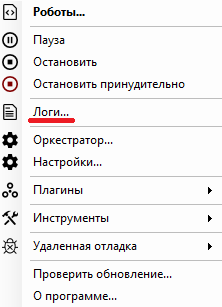

# Логи

Пункт контекстного меню “Логи…” позволяет открыть программную папку “Sherpa Assistant” с сохраненными в ней логами.&#x20;

<figure><figcaption></figcaption></figure>

Логи, в свою очередь, сохраняются в отдельные папки с указанием даты сохранения.

