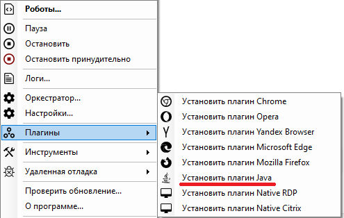

# Установка плагина Java

> Для установки данного плагина необходимо предварительно закрыть все приложения, использующие Java, а также установленная на Вашем компьютере ее версия должна быть x86 (32-битной).

Для установки плагина Java запустите Sherpa Assistant от имени администратора, затем в трее нажмите правой кнопкой мыши на значок  и, в контекстном меню, выберите пункт “Плагины”, а затем – "Установить плагин Java":

<figure><figcaption></figcaption></figure>

> Плагин разработан компанией Oracle. Выбирая этот пункт, Вы его только включаете в папке, где установлена Java. Все следующие пути указаны исходя из папки установки Java. Если Java поставляется вместе с программой, то убедитесь, что она так же x86 и пути будут относительно Java в папке с установленной программой.

Установка плагина заключается в следующих действиях:

1. В файле `jre/lib/accessibility.properties` раскомментируется строка:

```
assistive_technologies=com.sun.java.accessibility.AccessBridge
```

2. В папку `jre/lib/ext` копируются файлы из:

```
Robot\Java\
access-bridge-32.jar
jaccess.jar
```

3. В папку `jre/bin` копируются файлы из:&#x20;

```
Robot\Java\
JavaAccessBridge-32.dll
JAWTAccessBridge-32.dll
```

После установки плагина необходимо перезагрузить Ваш компьютер.

> В папке с Роботом (по нажатию правой кнопкой на ярлык Ассистента на рабочем столе, затем выбрать пункт "Расположение файла") есть программа "JavaPluginInstall.exe", которая позволяет установить плагин Java в выбранную папку, а не во всей системе.
