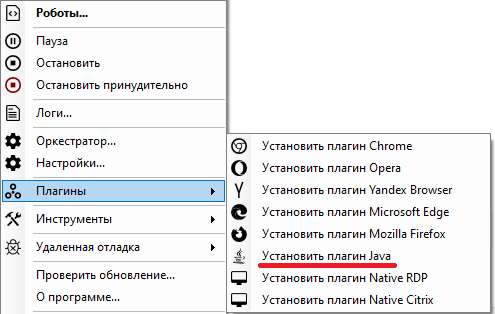

# Установка плагина Java

> Для установки данного плагина необходимо предварительно закрыть все приложения, использующие Java, а также установленная на Вашем компьютере ее версия должна быть x86 (32-битной).

Для установки плагина Java запустите Sherpa Assistant от имени администратора, затем в трее нажмите правой кнопкой мыши на значок  и, в контекстном меню, выберите пункт “Плагины”, а затем – "Установить плагин Java":

<figure><figcaption></figcaption></figure>

> Плагин разработан компанией Oracle. Выбирая этот пункт, Вы его только включаете в папке, где установлена Java.&#x20;

После установки плагина необходимо перезагрузить Ваш компьютер.

После установки плагина с правами администратора дальнейшее использование плагина может производиться с правами обычного пользователя.

> Если требуется установить плагин Java в выбранную папку, а не во всей системе, то в папке с Роботом есть программа "JavaPluginInstall.exe" . Чтобы перейти в папку с Роботом, необходимо нажать правой кнопкой мыши на ярлык Ассистента на рабочем столе, а затем выбрать пункт "Расположение файла".
