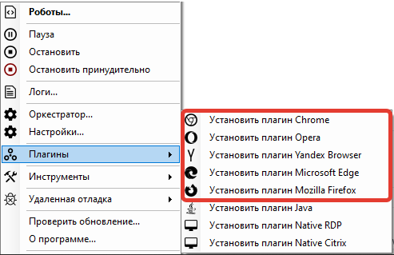

# Установка плагинов для браузеров

В Sherpa Assistant доступны для установки следующие плагины:

* Плагин Chrome;
* Плагин Opera;
* Плагин Yandex Browser;
* Плагин Microsoft Edge;
* Плагин Mozilla Firefox.

Для выбора плагина, который необходимо установить выберите в трее нажмите правой кнопкой мыши на значок  (1) (1) (1) (1) (1) (1).png>), в контекстном меню, выберите пункт “Плагины”, а затем – нужный плагин:

<figure><figcaption></figcaption></figure>

Для установки плагинов для браузеров необходимо:

* Открыть нужный браузер;
* Вставить в адресную строку ссылку из буфера обмена;
* Установить плагин из магазина Google Chrome.

> Адресная строка должна появиться после нажатия на нужный плагин.&#x20;
