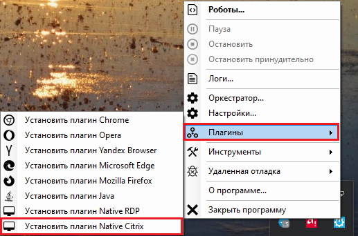

# Работа с Citrix

Для настройки корректной работы роботов через Citrix необходимо иметь клиентский компьютер, на котором будет запускаться Робот и удаленный рабочий стол (или удаленное оконное приложение), доступ к которому будет осуществляться с помощью Citrix. На клиентском компьютере можно установить любой тип Робота (Sherpa Designer + Attended Robot, просто Sherpa Attended Robot или Sherpa Unattended Robot). Именно с клиентского компьютера будет запускаться и работать сценарий работы. Далее следуйте инструкции.&#x20;

1. &#x20;**Установите Sherpa Runtime в режиме Attended для всех пользователей** на компьютер, к которому будет осуществляться удаленное подключение. Инструкция по установке находится [здесь](../../../../../sherpa-orchestrator/ustanovka-sherpa-orchestrator/ustanovka-sherpa-rpa-runtime.md).
2. **Установите плагин Native Citrix** на компьютер, с которого будет запускаться робот. Для этого запустите от администратора Sherpa Assistant, затем нажмите в трее правой кнопкой мыши на значок  выберите в контекстном меню, пункт “Плагины”, далее – “Установить плагин Native Citrix”.

<figure><figcaption></figcaption></figure>

**Примечание:** _установку плагина необходимо осуществлять от имени администратора (для дальнейшей работы права администратора не нужны)._&#x20;

После этого Робот с клиентской стороны может записывать и воспроизводить действия с помощью селекторов в окнах Citrix.

Далее всё работает автоматически. Рассмотрим конкретный пример:

Пользователь на клиентской стороне запускаете Дизайнер и с помощью инструмента[ "Запись действий пользователя"](../../../../../sherpa-designer/rabota-v-sherpa-designer/osnovnoe-menyu/panel-razrabotka/menyu-zapis/zapis-deistvii-polzovatelya/) и работает внутри окна Citrix (либо внутри оконного приложения) – Citrix-рекордер это сразу распознает. На данном этапе записи действий пользователя все элементы внутри Citrix-окна подсвечиваются как обычно селекторы также записываются как обычно. Сам записанный селектор будет содержать параметр Citrix в первой строке, однако остальном он будет выглядеть как обычный селектор. В Дизайнере есть специальная палитра блоков для работы с Citrix- и RDP-подключениями – "Удаленный рабочий стол RPD/Citrix".

<figure><figcaption></figcaption></figure>

Блоки данной палитры позволяют как создавать подключение, так и подключаться к уже существующей Citrix-сессии (однако, если Вы обычно создает Citrix-подключение через отдельный портал, то в данном случае, необходимо подключаться к уже существующему подключению).

Робот при запуске исполняет записанный сценарий как обычно: выполняет необходимые действия на клиентской стороне и на удаленной машине, согласно блокам диаграммы. Технически и архитектурно, используются именованные каналы передачи данных внутри самого Citrix-соединения, по ним локальный робот транслирует удаленному Sherpa Runtime (фактически это такой же робот) команды, которые нужно исполнить. В данном случае, открытие портов не требуется, вся удаленная работа идет по самому Citrix-соединению (например, по такому же принципу работает передача файлов в/из соединения и исполнение сценариев на удаленной стороне). \
\
