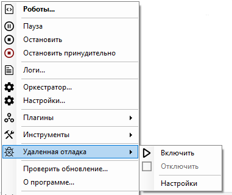

# Удаленная отладка

Пункт контекстного меню “Удаленная отладка” позволяет включить или отключить удаленную отладку, а также перейти в раздел “Настройки”.

<figure><figcaption></figcaption></figure>

Также перейти в настройки удаленной отладки во вкладке “Выполнение” окна настроек:

<figure><figcaption></figcaption></figure>

Для локального запуска Робота на Astra Linux и удаленной отладки через Sherpa Designer, следуйте видеоинструкции:



Для того, чтобы более подробно разобрать функционал удаленной отладки:

1. Ознакомьтесь с примером по ссылке:



2. Посмотрите соответствующий раздел Базы знаний:


