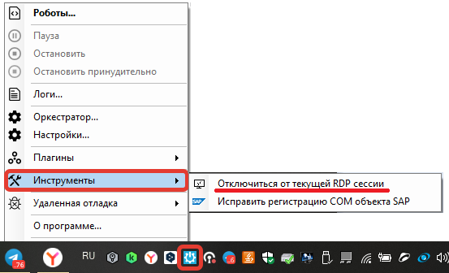

# Sherpa Assistant: ответы на часто задаваемые вопросы

## Причины ошибок работы Роботов/селекторов на удаленной машине при отключении от RDP

**Вопросы:**

1\) Почему при запуске Робота на удаленной машине, после отключения от нее, Робот перестает работать?

2\) Иногда на удаленной машине возникают ошибки работы селекторов. Отключаюсь от RDP с помощью программы closerdpsession, но это не помогает.

**Ответ:**&#x20;

**Возможные решения:**\
1\) Запустите Ассистент и в трее найдите пункт меню: "Инструменты" -> "Отключиться от текущей RDP сессии".

<figure><figcaption></figcaption></figure>

2\) На рабочем столе правой кнопкой мышки кликнуть по ярлыку Sherpa Assistant и перейти в папку с программой:

<figure><figcaption></figcaption></figure>

Там найти программу `closerdpsession.exe` и сделать на нее ярлык на рабочий стол.&#x20;

<figure><figcaption></figcaption></figure>

Выйти из подключения не по закрытию окна RDP, а двойным кликом на ярлык программы `closerdpsession.exe`.

<table data-header-hidden><thead><tr><th width="50"></th><th></th></tr></thead><tbody><tr><td></td><td>Так можно выйти только с одной машины. Для запуска программы требуются права администратора. Мы не гарантируем полную и 100% работу Робота на RDP машине, когда Вы отключаетесь от нее через Ассистент или программу <code>closerdpsession.exe</code>.</td></tr></tbody></table>

При отключении происходит переключение сессии Пользователя на консоль (это «костыль», который используется, чтобы контекст Пользователя оставался открытым). Однако, как ведет себя консоль и что с ней может случиться со временем, никто не знает (эту информацию Microsoft не разглашает).

Также следует учитывать, что так как консоль одна, если другой Пользователь зашел на эту же машину также по RDP (или другим методом), то Windows отключает консоль от другого подключенного Пользователя.

<table data-header-hidden><thead><tr><th width="58"></th><th></th></tr></thead><tbody><tr><td></td><td>Рекомендуется использовать Unattended-роботов, у которых такой проблемы нет.</td></tr></tbody></table>

## Может ли Робот работать при заблокированном экране?

**Вопрос:** Может ли Робот работать при заблокированном экране?

**Ответ:**&#x20;

Да, может.\
\
Существует несколько нюансов, связанных с интерактивной работой с графическим интерфейсом (GUI) в сценариях Робота. В частности, если интерфейс не отображается, возможность интерактивного взаимодействия с ним из сценария Робота становится невозможной. Однако, если переключить графический контекст сессии на консоль с помощью программы `closerdp`, то для Пользователя это будет выглядеть так, будто экран заблокирован, а работа с GUI будет продолжаться корректно.

## Как можно запустить робота из кода приложения на C# и передать ему необходимые параметры?

**Вопрос:** У меня есть приложение написанное на C#. В определенный момент мне нужно запускать робота из кода, и также нужно передать ему параметры определенные.  Могу ли я запускать файл .robot и передавать параметры для запуска?&#x20;

**Ответ:** следуйте инструкции [Настройка входных и выходных параметров в свойствах проекта](../sherpa-designer/sherpa-designer-otvety-na-chasto-zadavaemye-voprosy/nastroika-vkhodnykh-i-vykhodnykh-parametrov-v-svoistvakh-proekta.md).
