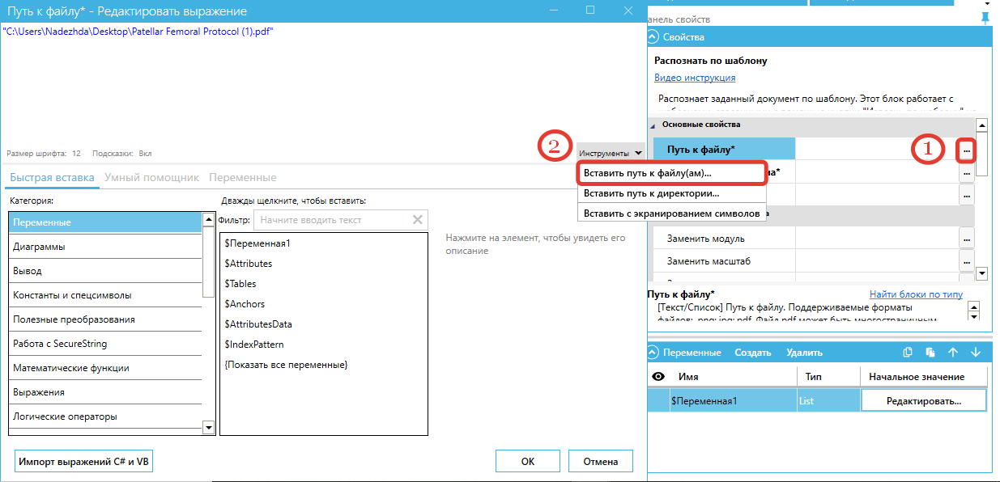

# Значения переменных

После создания шаблонов для каждого типа документа (их может быть несколько: 5, 10 и т.д.), можно пойти двумя путями:

1. Настроить работу сценария проекта с поочередным распознаванием по каждому шаблону, при этом добавлять в сценарий столько блоков, сколько было создано шаблонов.

<figure><figcaption></figcaption></figure>

1.  Запустить распознавание по списку шаблонов в одном блоке.

    Прежде чем использовать список, необходимо его задать в Переменных. Выбираем "Тип" переменной "List" (список), задаем имя переменной и редактируем значение переменной:&#x20;

    1. добавляем в список названия созданных нами шаблонов, по которым будет производиться распознавание. Например, "`ТОРГ12.json`", "`УПД.json`" и т.д.
    2. добавляем список с помощью знака `@` в формате `@("имя файла1","имя файла2")` , где `"имя файла1"` и `"имя файла2"` нужны для указания набора файлов, которые необходимо обработать. Например, "`@("ТОРГ12.json","УПД.json")`".

    <figure><figcaption></figcaption></figure>

На Панели свойств указываем "Путь к файлу\*" в формате `.pdf`.&#x20;

<figure><figcaption></figcaption></figure>

Файл может быть многостраничным. Также поддерживаются файлы формата `.png` и `.jpg`.

Далее указываем "Путь к файлу шаблона\*" для распознавания.&#x20;

<figure><figcaption></figcaption></figure>

При указании списка файлов шаблонов будут последовательно использоваться каждый файл, пока распознавание не закончится успешно. Если ни один из шаблонов не подойдет для документа, то будет сгенерировано исключение с ошибкой первого шаблона из списка.

В строке "Номер страницы" укажем `1`, тогда распознавание начнется с первой страницы документа.

<figure><figcaption></figcaption></figure>

При запуске работы блока "Распознать по шаблону", первым распознается документ, указанный в списке на панели "Переменные".&#x20;

В случае возникновения ошибки по одному из шаблонов, Робот переходит к распознаванию следующего шаблона. Если параметры распознавания страницы у шаблонов одинаковые, то при использовании списка скорость обработки нескольких шаблонов увеличивается. Если параметры распознавания различны, то время распознавания документа увеличивается.

Например, если для одного из шаблонов указан OCR-модуль Tesseract, а для другого шаблона – YandexVision (или разный масштаб, или язык), то для каждого из этих шаблонов Робот будет заново распознавать документ, т.к. указаны разные параметры. Поэтому рекомендуем при создании шаблонов для типовых стандартизированных документов оставлять настройки, заданные по умолчанию и менять их только в случае особой необходимости.

В случае, если параметры настроек некоторых шаблонов были изменены, то рекомендуем компоновать их по группам: сначала указать несколько шаблонов с одним видом настроек, затем несколько шаблонов с другим типом настроек.

### **Индекс шаблона**

После распознавания документа в строке "Индекс шаблона" будет определен индекс шаблона.

<figure><figcaption></figcaption></figure>

Используя блок "Условие" необходимо задать траекторию дальнейшего сценария согласно полученным индексам. (Например, если индекс `0` – то это УПД, если индекс `1` – Счет-фактура и т.д.)

Если для распознавания использовался один документ, а не список, то индекс по умолчанию всегда будет `0` (нулевой).

### **Атрибуты**

<figure><figcaption></figcaption></figure>

После обработки шаблона необходимо продолжить работу с созданными Атрибутами.

Атрибуты отображаются в окне «Результаты полного сканирования» Шаблонизатора (Имя, Значение).

Чтобы получить значения Атрибутов, необходимо обратиться к словарю и присвоить значение переменной. Для этого следует использовать блок "Присвоить значение переменной"_._

На панели свойств выберите значение переменной, нажав на кнопку `…` и отредактировав выражение. В открывшемся окне нажмите на категорию $Attributes.&#x20;

<figure><figcaption></figcaption></figure>

Укажите "Имя" Атрибута, которое ранее было задано в Шаблонизаторе, используя кавычки.

Далее необходимо задать имя переменной, с которой будет продолжаться дальнейшая работа. Имя переменной может быть задано произвольно, например, $AttributesZakaz или $MyOrganization.

### **Таблица**

Присваивая значение переменной для таблицы (или массива таблиц), необходимо использовать индексы таблицы, которые были присвоены в Шаблонизаторе автоматически (по порядку). Вручную присвоить значение переменной невозможно.

На панели "Свойства" выберите значение переменной и нажмите на `…`, после чего отредактируйте выражение. В открывшемся окне нажмите на категорию $Tables.&#x20;

Если необходимо, добавьте столько таблиц, сколько было добавлено в Шаблонизаторе и укажите индекс для каждой таблицы.

<figure><figcaption></figcaption></figure>

Далее необходимо задать имя переменной, с которой будет продолжаться работа. Имя переменной может быть задано произвольно, например, $TablesProducts или $MyTables.

После того как "Имя" и "Значение" переменных были заданы, можно приступать к дальнейшей работе.
