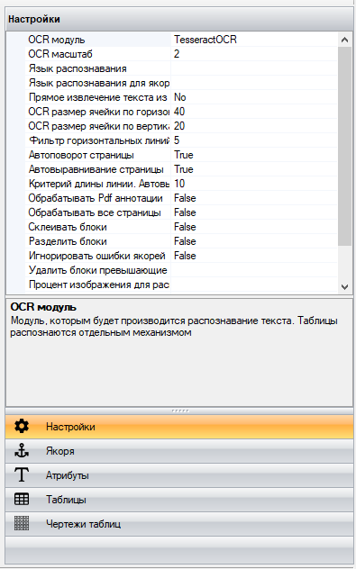

# Панель настроек Шаблонизатора

В “Панели настроек Шаблонизатора” находятся 5 основных блоков для создания и настройки шаблона:

* [Настройки](nastroiki.md);
* [Якоря](yakorya.md);
* [Атрибуты](atributy.md);
* [Таблицы](tablicy.md);
* [Чертежи таблиц](chertezhi-tablic.md).

<figure><figcaption></figcaption></figure>
