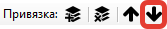

# Атрибуты

**Атрибуты** позволяют определить и обозначить области документа, данные из которых будут распознаваться Роботом и импортироваться в таблицу Результаты.

Основные инструменты для работы с Атрибутами:

<figure><figcaption></figcaption></figure>

<table data-header-hidden><thead><tr><th width="53"></th><th width="143"></th><th></th></tr></thead><tbody><tr><td><strong>№ п/п</strong></td><td><strong>Инструмент</strong></td><td><strong>Описание</strong></td></tr><tr><td>1.</td><td>кнопка </td><td>Позволяет добавить новый Атрибут. </td></tr><tr><td>2.</td><td>кнопка </td><td>Позволяет переместить Атрибут вверх.</td></tr><tr><td>3.</td><td>кнопка </td><td>Позволяет переместить Атрибут вниз.</td></tr><tr><td>4.</td><td>кнопка </td><td>Позволяет копировать выделенный Атрибут.</td></tr><tr><td>5.</td><td>кнопка </td><td>Позволяет удалить выделенный Атрибут.</td></tr><tr><td>6.</td><td>кнопка </td><td>Позволяет добавить новую привязку к выделенному Атрибуту.</td></tr><tr><td>7.</td><td>кнопка </td><td>Позволяет удалить выделенную привязку.</td></tr><tr><td>8.</td><td>кнопка </td><td>Позволяет переместить привязку вверх.</td></tr><tr><td>9.</td><td>кнопка </td><td>Позволяет переместить привязку вниз.</td></tr></tbody></table>

## **Свойства Атрибутов**

При создании нового Атрибута на рабочей панели открывается список свойств и инструментов для работы с Атрибутом.

<figure><figcaption></figcaption></figure>

Свойства и инструменты для работы с Атрибутом:

<table data-header-hidden><thead><tr><th width="58"></th><th width="172"></th><th></th></tr></thead><tbody><tr><td><strong>№ п/п</strong></td><td><strong>Свойство/инструмент</strong></td><td><strong>Описание</strong></td></tr><tr><td>1. </td><td>Имя</td><td>Имя Атрибута, которое будет отражено в результатах.</td></tr><tr><td>2.</td><td>Якорные привязки</td><td>Список якорных привязок Атрибута.</td></tr><tr><td>3.</td><td>Ограничение линиями</td><td>
При включенной настройке осуществляется поиск ограничения линиями. 

Атрибут может быть ограничен с любой стороны, относительно линий, распознанных OCR модулем. Эти линии отображаются при нажатии кнопки “OCR Линии”. Возможные значения:
<ul><li>None – отключено;</li><li>UpDown – сверху и снизу;</li><li>Up – сверху;</li><li>Down — снизу.</li></ul></td></tr><tr><td>4.</td><td>Корректировать угол</td><td>
При включенной настройке осуществляется корректировка угла наклона области.   Область корректируется, если она соприкасается с границами таблицы.

При включенном значении “Автовыравнивание” корректировку угла использовать не нужно.
</td></tr><tr><td>5.</td><td>Привязка области</td><td>
Привязка к области осуществляется по 4-м параметрам: 
<ul><li>координата X, </li><li>координата Y, </li><li>ширина, </li><li>высота области. </li></ul>
Исходная точка области - вверху слева.
</td></tr><tr><td>6.</td><td>Область</td><td>Прямоугольник области Атрибута на странице. </td></tr><tr><td>7.</td><td>Мин количество символов</td><td>
Минимальное количество символов, содержащихся в Атрибуте. 

По умолчанию указано значение <code>0</code>. 

Настройка используется, если Атрибут должен содержать в себе определенное количество символов, например, Атрибут “ИНН”. Если вычисленное значение меньше указанного будет сгенерирована ошибка.
</td></tr><tr><td>8.</td><td>Тип данных</td><td>
Тип данных для Атрибута. 

Возможные значения:
<ul><li>Text – текст;</li><li>Int – число;</li><li>Float – вещественное число;</li><li>Date Time – дата и время;</li><li>Chars – только буквы (исключаются цифры и другие символы);</li><li>CountColorHSV – количество точек в заданном интервале цвета.   Значение должно быть указано в формате “<code>H1-H2;S1-S2;V1-V2</code>”,  где <code>H1</code>, <code>S1</code>, <code>V1</code> – это минимальные значения, а <code>H2</code>, <code>S2</code>, <code>V2</code> – максимальные значения;</li><li>Regex – регулярное выражение.</li></ul></td></tr><tr><td>9.</td><td>Формат значения</td><td>
Формат значения Атрибута. Задается форматирование значения. 

Например: 
<ul><li>если тип значения дата и время то, чтобы получить только дату, необходимо указать “<code>dd.MM.yyyy</code>”;</li><li>если тип значения CountColorHSV, то необходимо указать интервал цвета в формате “<code>H1-H2;S1-S2;V1-V2</code>”. Формат указывается без кавычек;</li><li>Если тип значения Regex, то необходимо указать регулярное выражение.</li></ul></td></tr><tr><td>10.</td><td>Ошибка если значение пустое</td><td>Если при обработке шаблона значение Атрибута пустое, то будет сгенерирована ошибка распознавания. </td></tr><tr><td>11.</td><td>Проверять якорные привязки</td><td>Проверка якорных привязок Атрибута. При включенной настройке будет производиться проверка якорных привязок. Если хоть одна из привязок не будет найдена, то Атрибут также не будет найден.</td></tr><tr><td>12.</td><td>Режим работы</td><td>
Режим работы Атрибута. Возможные значения:
<ul><li>Default - стандартная работа Атрибута (его значение будет заполнено при первом успешном определении Якорей);</li><li>Append - добавление значения в Атрибут при каждом успешном определении Якорей на следующих страницах;</li><li>Overwrite - перезапись, а не добавление значения Атрибута.</li></ul></td></tr><tr><td>13.</td><td>Описание</td><td>Пользовательское описание Атрибута.</td></tr></tbody></table>
