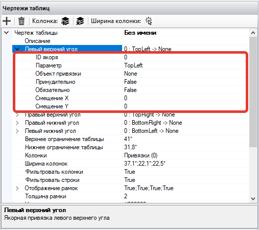

# Чертежи таблиц

Чертежи таблиц применяются для документов, в которых по каким-либо причинам отсутствуют границы таблиц. Это могут быть иностранные документы (например, Invoice), в которых линии таблиц не предусмотрены. Также это могут быть российские документы, в которых частично не прорисованы линии таблицы (отсутствуют межстрочные линии).

<figure><figcaption></figcaption></figure>

[Работа с использованием настройки "Чертежи таблиц" продемонстрирована здесь. ](https://sherparpa.ru/ucontent/?0E)

Основные инструменты для работы с чертежами таблиц:

<figure><figcaption></figcaption></figure>

<table data-header-hidden><thead><tr><th width="54"></th><th width="143"></th><th></th></tr></thead><tbody><tr><td><strong>№ п/п</strong></td><td><strong>Инструмент</strong></td><td><strong>Описание</strong></td></tr><tr><td>1.</td><td>кнопка </td><td>Позволяет добавить чертеж таблицы. </td></tr><tr><td>2.</td><td>кнопка </td><td>Позволяет удалить чертеж таблицы.</td></tr><tr><td>3.</td><td>кнопка </td><td>Позволяет добавить привязку колонки.</td></tr><tr><td>4.</td><td>кнопка </td><td>Позволяет удалить привязку колонки.</td></tr><tr><td>5.</td><td>кнопка </td><td>Позволяет добавить ширину колонки.</td></tr></tbody></table>

На рабочей панели справа отображаются все параметры, которые позволяют произвести настройку чертежа таблицы.

Свойства и инструменты для работы с чертежами таблиц:

<figure><figcaption></figcaption></figure>

<table data-header-hidden><thead><tr><th width="55"></th><th width="228"></th><th></th></tr></thead><tbody><tr><td><strong>№ п/п</strong></td><td><strong>Свойство/инструмент</strong></td><td><strong>Описание</strong></td></tr><tr><td>1.</td><td>Описание</td><td>Описание чертежа таблицы.</td></tr><tr><td>2.</td><td>Левый верхний угол</td><td>Якорная привязка левого верхнего угла.</td></tr><tr><td>3.</td><td>Правый верхний угол</td><td>Якорная привязка правого верхнего угла.</td></tr><tr><td>4.</td><td>Правый нижний угол</td><td>Якорная привязка правого нижнего угла.</td></tr><tr><td>5.</td><td>Левый нижний угол</td><td>Якорная привязка левого нижнего угла.</td></tr><tr><td>6.</td><td>Верхнее ограничение таблицы</td><td>
Ограничение таблицы сверху страницы. 

Можно указать значения в пикселях или процент, используя символ <code>*</code>. Например, <code>200*</code>.
</td></tr><tr><td>7.</td><td>Нижнее ограничение таблицы</td><td>
Ограничение таблицы снизу страницы. 

Можно указать значения в пикселях или процент, используя символ <code>*</code>. Например, <code>200*</code>.
</td></tr><tr><td>8.</td><td>Колонки</td><td>Якорные привязки для колонок.</td></tr><tr><td>9.</td><td>Ширина колонок</td><td>
Ширина колонок. 

Можно указать фиксированное значение или процент от всей ширины таблицы в формате <code>50*</code>, <code>10*</code>. Вся ширина таблицы равна <code>100</code>. 

Если сумма значений процентов всех указанных колонок равна или больше <code>100</code>, то ширина таблицы делится пропорционально указанным значениям. Иначе, последняя колонка будет заполняться автоматически до значения <code>100</code>.
</td></tr><tr><td>10.</td><td>Фильтровать колонки</td><td>При включенной настройке для распознавания таблицы будут учитываться только те линии, которые нарисованы в чертежи таблицы.</td></tr><tr><td>11.</td><td>Фильтровать строки</td><td>При включенной настройке для распознавания таблицы будут учитываться только те линии, которые нарисованы в чертеже таблицы.</td></tr><tr><td>12.</td><td>Отображение рамок</td><td>Управление отображением рамок чертежа таблицы.</td></tr><tr><td>13.</td><td>Толщина рамки</td><td>Толщина рамки таблицы в пикселях.</td></tr><tr><td>14.</td><td>Цвет рамки</td><td>Цвет рамки таблицы в формате RGB. Например, <code>#000000</code> — черный цвет, <code>#FF0000</code> — красный цвет.</td></tr><tr><td>15.</td><td>Обрамление колонок</td><td>При включенной настройке отображаются линии колонок на чертеже таблицы.</td></tr><tr><td>16.</td><td>Обрамление строк</td><td>При включенной настройке отображаются линии строк на чертеже таблицы.</td></tr><tr><td>17.</td><td>Обрамление заголовка</td><td>При включенной настройке отображается первая строка на чертеже страницы.</td></tr><tr><td>18.</td><td>Колонки для определения строк</td><td>Индексы колонок, по которым будут определяться строки. Если значение будет пустое, то будут участвовать все колонки. Индекс начинается с <code>0</code>.</td></tr><tr><td>19.</td><td>Привязка горизонтальной линии</td><td>
Параметр привязки горизонтальной линии. 

Возможные значения:
<ul><li>Center - по центру между блоками текста;</li><li>Top - верх нижнего блока текста;</li><li>Bottom - низ верхнего блока текста.</li></ul></td></tr><tr><td>20.</td><td>Смещение горизонтальной линии</td><td>
Смещение горизонтальной линии по оси Y в пикселях. 

Для точного смещения следует указывать значения в формате <code>+ -</code> . Например, <code>+10-20</code>.
</td></tr><tr><td>21.</td><td>Критерий поиска горизонтальных линий</td><td>
Смещение блоков текста для определения их пересечения. 

По умолчанию значение равно <code>10</code>.
</td></tr><tr><td>22.</td><td>Растягивать таблицу</td><td>
При включенной настройке  чертеж таблицы будет растягиваться на следующие страницы. 

Данный параметр необходим если заголовки таблицы есть только на первой странице.
</td></tr></tbody></table>

Для осуществления привязки границ таблицы для каждого угла чертежа необходимо указать Якорь, и задать параметры расположения линий относительно выбранного Якоря.

Параметры якорных привязок углов таблицы:

<figure><figcaption></figcaption></figure>

<table data-header-hidden><thead><tr><th width="52"></th><th width="169"></th><th></th></tr></thead><tbody><tr><td><strong>№ п/п</strong></td><td><strong>Параметр</strong></td><td><strong>Описание</strong></td></tr><tr><td>1.</td><td>ID якоря</td><td>ID Якоря, к которому происходит привязка.</td></tr><tr><td>2.</td><td>Параметр</td><td>
Параметр привязки. 

Возможные значения:
<ul><li>TopLeft – привязка левого верхнего угла Якоря к выбранному объекту привязки;</li><li>TopRight – привязка правого верхнего угла Якоря к выбранному объекту привязки;</li><li>BottomLeft – привязка левого нижнего угла Якоря к выбранному объекту привязки;</li><li>BottomRight – привязка правого нижнего угла Якоря к выбранному объекту привязки;</li><li>Left – привязка левой грани Якоря (посередине) к выбранному объекту привязки;</li><li>Top – привязка верхней грани Якоря (посередине) к выбранному объекту привязки;</li><li>Right – привязка правой грани Якоря (посередине) к выбранному объекту привязки;</li><li>Bottom – привязка верхней грани Якоря (посередине) к выбранному объекту привязки;</li><li>LeftArea – привязка всей левой области Якоря к выбранному объекту привязки;</li><li>RightArea – привязка всей правой области Якоря к выбранному объекту привязки;</li><li>BottomArea – привязка всей нижней области Якоря к выбранному объекту привязки;</li><li>TopArea — привязка всей верхней области Якоря к выбранному объекту привязки;</li><li>FullArea – привязка Якоря со всех сторон к выбранному объекту привязки.</li></ul></td></tr><tr><td>3.</td><td>Объект привязки</td><td>Точка или грань области Атрибута для привязки выбранного параметра.</td></tr><tr><td>4.</td><td>Принудительно</td><td>При включенной настройке указанный параметр Якоря будет задан к выбранному объекту привязки принудительно и без проверок.</td></tr><tr><td>5.</td><td>Обязательно</td><td>При включенной настройке ошибка данной привязки поиск всего элемента будет считаться неудачным.</td></tr><tr><td>6.</td><td>Смещение Х</td><td>
Смещение по оси X в пикселях. 

Для точного смещения следует указывать значения в формате <code>+ -</code> . Например, <code>+10-20</code>. 

Данная настройка используется в случае, когда после Якоря указывается какой-либо символ (скобка или двоеточие), который не должен попасть в область Атрибута.
</td></tr><tr><td>7.</td><td>Смещение Y</td><td>Смещение по оси Y в пикселях. Для точного смещения следует указывать значения в формате <code>+ -</code> . Например, <code>+10-20</code>.</td></tr></tbody></table>

Для отображения рамок чертежа таблицы необходимо задать параметры отображения каждой из рамок.

Параметры отображения рамок чертежа таблицы:

<figure><figcaption></figcaption></figure>

<table data-header-hidden><thead><tr><th width="58"></th><th width="173"></th><th></th></tr></thead><tbody><tr><td><strong>№ п/п</strong></td><td><strong>Параметр</strong></td><td><strong>Описание</strong></td></tr><tr><td>1.</td><td>Левая рамка</td><td>Отображение левой рамки чертежа таблицы.</td></tr><tr><td>2.</td><td>Верхняя рамка</td><td>Отображение верхней рамки чертежа таблицы.</td></tr><tr><td>3.</td><td>Правая рамка</td><td>Отображение правой рамки чертежа таблицы.</td></tr><tr><td>4.</td><td>Нижняя рамка</td><td>Отображение нижней рамки чертежа таблицы.</td></tr></tbody></table>
