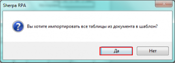

# Работа с таблицами

После сохранения шаблона переходим к работе с таблицами.

<figure><figcaption></figcaption></figure>

<figure><figcaption></figcaption></figure>

В левой части основной панели настроек выбираем вкладку «Таблицы» — нажимаем кнопку «Импортировать» .

Импортируем все таблицы документа, для этого в появившемся окне «Вы хотите импортировать все таблицы документа в шаблон?» выбираем «Да».

На рабочей панели справа отобразятся все таблицы шаблона, которые были распознаны. Их может быть одна-две и более. В нашем случае на скриншоте ниже мы видим, что OCR-модулем распознаны 3 таблицы шаблона.

<figure><figcaption></figcaption></figure>

Каждой таблице автоматически присваивается номер, нумерация начинается с 0. Также отображается количество колонок каждой распознанной таблицы. Именно по этому значению мы можем определить с какой (или с какими) таблицами мы продолжим работать.

В нашем примере нас интересуют данные из таблицы с 6-ю колонками, соответственно, остальные таблицы (с 2 и с 1 колонками) мы можем удалить из окна панели.

<figure><figcaption></figcaption></figure>

Удалить таблицу можно нажав на значок на верхней панели окна, предварительно выделив таблицу, которую нужно удалить.

**Индекс**

Индекс OCR-таблицы. В случае, если Шаблонизатор извлекает данные лишь из одной таблицы сканированного документа, необходимо указывать индекс, равный 0. При этом для улучшения привязки рекомендуется указывать минимальное количество колонок.

<figure><figcaption></figcaption></figure>

**Минимальное количество колонок**

Указывается минимальное количество колонок в OCR-таблице. Все таблицы с количеством меньше указанного будут пропущены.

**Максимальное количество колонок**

Указывается максимальное количество колонок в OCR-таблице. Все таблицы с количеством больше указанного будут пропущены.

<figure><figcaption></figcaption></figure>

При создании шаблона «Справки о стоимости выполненных работ и затрат» указываем минимальное количество колонок равное 5, т.к. нас интересуют данные из таблицы с 6 колонками. Остальные таблицы данного документа содержат менее 5 колонок.

Таким образом Шаблонизатор продолжит работу с интересующей нас таблицей.

При создании шаблонов для других типов документов (с большим количеством таблиц и колонок в таблицах) можно указывать и максимальное и минимальное количество колонок, тем самым задавая интервал, в который будут попадать таблицы с интересующими нас данными.

**Проверить**

Для проверки корректности отображения табличной части, из которой будут импортироваться данные нажимаем кнопку «Проверить» на верхней рабочей панели.

<figure><figcaption></figcaption></figure>

Также проверку можно запустить нажатием клавиши F5.

**Пропустить строки**

Указываем количество строк, которые нужно пропустить для того, чтобы данные этих строк не попали в результаты работы робота.

При выборе значения, равного 1, — первые строки будут пропущены. Наименования колонок будут соответствовать значениям первой строки.

Если задать названия колонок в шаблоне, то эти значения не будут изменены.

В нашем примере необходимо пропустить 5 верхних строк таблицы, т.к. значения интересующих нас данных указаны в таблице документа начиная с 6 строки.

Для этого в строке «Пропустить строки» указываем число 5.

<figure><figcaption></figcaption></figure>

**Строк в заголовке**

При построении таблицы, заданное количество строк будет использовано для создания заголовков колонок. При указании значения 0 заголовки будут взяты из шаблона колонок, в противном случае название будет суммироваться из ячеек колонки по заданному количеству строк.

Например, в шаблоне «Справки о стоимости выполненных работ и затрат» необходимо указать количество строк заголовке равное 2, т.к. в заголовок должна попасть информация, размещенная в двух верхних строках таблицы.

<figure><figcaption></figcaption></figure>

После выполненных действий необходимо проверить промежуточный результат. Нажимаем «Проверить» — далее «Выполнить полное сканирование».

**Результат полного сканирования**

Результат полного сканирования отобразится в виде таблицы с импортированными данными из табличной части сканированного документа.

<figure><figcaption></figcaption></figure>

**Определить колонки**

На этом этапе часть данных может отражаться некорректно, в частности, названия колонок могут не совпадать с теми значениями, которые ранее были заданы в сценарии проекта «Определить колонки.process» — в настройках «Панель свойств» — «Переменные».

Для корректировки выводимых результатов необходимо вернуться в сценарий проекта «Определить колонки.process», сопоставить значения переменных, заданных в настройках «Панель свойств», добавить указанные здесь колонки и определить для них названия.

<figure><figcaption></figcaption></figure>

**Добавление колонок «Количество», «НДС Сумма», «Ставка».**

В нашем примере в результатах полного сканирования отсутствует несколько колонок, в том числе колонка «Количество».

Название колонки должно соответствовать значению, присвоенному данной переменной «количество».

 

Добавление недостающих колонок производится на правой рабочей панели Шаблонизатора во вкладке «Таблицы». Нажимаем на кнопку , добавляем колонку, присваиваем колонке имя «Количество».

При повторной проверке в результатах полного сканирования Шаблонизатора появится колонка «Количество».

Производим проверку остальных колонок и корректируем их названия в зависимости от значений переменных в сценарии проекта «Определить колонки.process».

При создании шаблона «Справка о стоимости выполненных работ и затрат» аналогичным образом добавляем колонки: «НДС Сумма», «Ставка».

В случае, если название колонки не соответствует названию переменной, но содержание колонки соответствует значению переменной, то создавать дополнительную колонку не нужно, достаточно изменить название колонки в Шаблонизаторе.

Например, в таблице с результатами Шаблонизатора название колонки «Стоимость начала проведения работ», а название переменной «Цена», тогда мы вносим изменения в название колонки, предварительно убедившись в том, что именно в этой колонке отображается цена.

Аналогичным образом необходимо изменить названия всех колонок, которые не совпадают с названиями переменных.

Нумерация колонок таблицы в Шаблонизаторе начинается с 0.

<figure><figcaption></figcaption></figure>

В случае если название колонки сохранено по умолчанию и содержит в себе числовое значение (например, «Без имени1»), то в таблице результатов Шаблонизатора название указанной колонки определится автоматически и будет содержать в себе текст из соответствующей колонки сканированного документа.

Если название колонки мы изменили вручную, то в таблице результатов Шаблонизатора будет отображаться именно заданное нами название колонки.

Поэтому, рекомендуем обратить особое внимание на часть табличного документа, в котором название колонки указано в объединенных ячейках. Даже если при создании шаблона документа название колонки из объединенных ячеек было распознано корректно, в других документах название может быть указано со смещением.

В нашем примере слово «Стоимость» располагается в 4 ячейке таблицы, но в некоторых документах может сместиться в 5 ячейку. В таких случаях рекомендуем переименовать все ячейки, названия которых могут быть смещены.

<figure><figcaption></figcaption></figure>

По завершению работы с таблицей в Шаблонизаторе необходимо произвести проверку и удостовериться в корректности результатов полного сканирования.
