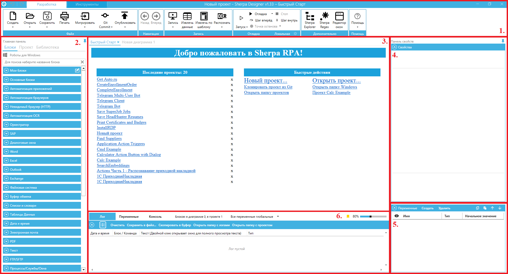

# Работа в Sherpa Designer

Пользовательский интерфейс Sherpa Designer, открываемый по умолчанию, состоит из основных областей:

1. Основное меню (верхняя панель).&#x20;
2. Главная панель  (левая панель).
3. Центральная рабочая область.
4. Панель свойств (правая верхняя панель).
5. Панель “Переменные” (правая нижняя панель).
6. Нижняя центральная панель.

<figure><figcaption></figcaption></figure>

<table data-header-hidden><thead><tr><th width="100"></th><th width="201"></th><th></th></tr></thead><tbody><tr><td><strong>№ п/п</strong></td><td><strong>Элемент интерфейса</strong></td><td><strong>Описание</strong></td></tr><tr><td>1.</td><td>“Основное меню”</td><td>
Содержит основные действия по настройке и управлению проектами и диаграммами роботов. В основное меню входит:
<ul><li>Меню “Файл”;</li><li>Меню “Навигация”;</li><li>Меню “Запись”;</li><li>Меню “Отладка”;</li><li>Меню “Дополнительно”;</li><li>Меню “Помощь”.</li></ul></td></tr><tr><td>1.1.</td><td>меню “Файл”</td><td>
Содержит действия, необходимые для работы с проектами:
<ul><li>Создать;</li><li>Открыть;</li><li>Сохранить;</li><li>Печать;</li><li>Мигрировать;</li><li>Git commit;</li><li>Опубликовать.</li></ul></td></tr><tr><td>1.2. </td><td>меню “Навигация”</td><td>Позволяет осуществлять навигацию между диаграммами роботов.</td></tr><tr><td>1.3.</td><td>меню “Запись”</td><td>
Содержит действия, необходимые при работе с записью действий пользователя в приложениях и на веб-ресурсах, а также с извлечением данных шаблонизатором:
<ul><li>Запись;</li><li>Извлечь данные;</li><li>Извлечь по шаблону;</li><li>Распознать.</li></ul></td></tr><tr><td>1.4.</td><td>меню “Отладка”</td><td>Содержит действия, необходимые при запуске отладки робота, а также удаленной отладке робота. </td></tr><tr><td>1.5.</td><td>меню “Дополнительно”</td><td>
Содержит дополнительные действия для работы с диаграммами роботов:
<ul><li>Sherpa Explorer;</li><li>Sherpa Regex;</li><li>Редактор окон.</li></ul></td></tr><tr><td>1.6.</td><td>меню “Помощь”</td><td>Позволяет обратиться к обучающим материалам: обучающим видео, примерам по работе с программой, демонстрационным проектам.</td></tr><tr><td>2. </td><td>“Главная панель”</td><td>
В главную панель входят следующие вкладки:
<ul><li>Блоки;</li><li>Проект,</li><li>Библиотека.</li></ul></td></tr><tr><td>2.1.</td><td>Вкладка “Блоки”</td><td>Позволяет открыть палитру функциональных блоков для создания проектов.</td></tr><tr><td>2.2.</td><td>вкладка “Проект”</td><td>Предоставляет доступ ко всем диаграммам и файлам текущего проекта, а также позволяет переименовывать, удалять или добавлять новые файлы в проект.. </td></tr><tr><td>2.3.</td><td>вкладка “Библиотека”</td><td>Позволяет открыть библиотеку готовых процессов.</td></tr><tr><td>3.</td><td>Центральная рабочая область</td><td>
Область предназначена для работы с блоками диаграммы текущего процесса.

 
</td></tr><tr><td>4. </td><td>Панель свойств</td><td>Панель предназначена для управления свойствами выбранного блока на диаграмме. </td></tr><tr><td>5.</td><td>панель “Переменные”</td><td>Панель предназначена для отображения переменных диаграммы текущего процесса. </td></tr><tr><td>6.</td><td>Нижняя центральная панель</td><td>Панель предназначена для отображения логов всех действий программного робота.</td></tr><tr><td>6.1.</td><td>вкладка “Лог”</td><td>Позволяет просмотреть логи всех всех действий программного робота.</td></tr><tr><td>6.2.</td><td>вкладка “Переменные”</td><td>Позволяет просмотреть все существующие переменные текущего процесса.</td></tr><tr><td>6.3.</td><td>вкладка “Консоль”</td><td>Позволяет  работать с консолью робота.</td></tr></tbody></table>

Также, пользовательский интерфейс Sherpa Designer имеет дополнительную панель инструментов, которая открывается при нажатии на вкладку “Инструменты” в верхней части интерфейса.

<table data-header-hidden><thead><tr><th width="102"></th><th width="197"></th><th></th></tr></thead><tbody><tr><td><strong>№ п/п</strong></td><td><strong>Элемент интерфейса</strong></td><td><strong>Описание</strong></td></tr><tr><td><ol><li> </li></ol></td><td>меню “Правка”</td><td>
Содержит действия, необходимые при работе с блоками диаграммы робота:
<ul><li>Вставить;</li><li>Вырезать;</li><li>Копировать;</li><li>Удалить;</li><li>Найти;</li><li>Найти далее;</li><li>Заменить.</li></ul></td></tr><tr><td><ol start="2"><li> </li></ol></td><td>меню “Диаграмма”</td><td>
Содержит действия, необходимые при построении с диаграммы робота:
<ul><li>Выровнять;</li><li>Расположение;</li><li>Полная проверка блоков;</li><li>Удалить неиспользуемые переменные;</li><li>Компилировать блоки вызова кода.</li></ul></td></tr><tr><td><ol start="3"><li> </li></ol></td><td>меню “Параметры”</td><td>
Содержит действия, необходимые при работе с параметрами программы:
<ul><li>Менеджер пакетов;</li><li>Параметры программы. </li></ul></td></tr><tr><td><ol start="4"><li> </li></ol></td><td>меню “Инструменты”</td><td>
Содержит действия, необходимые для удобной настройки интерфейса:
<ul><li>Русский (Россия) - язык;</li><li>Тема;</li><li>Обновить диаграмму.</li></ul></td></tr></tbody></table>

<figure><figcaption></figcaption></figure>

В верхней панели Дизайнера предусмотрены кнопки отмены и повтора последнего действия: по кнопкам .png>) и .png>), соответственно. Также по кнопке дублируются некоторые из действий Основного меню Дизайнера.

<figure><figcaption></figcaption></figure>
