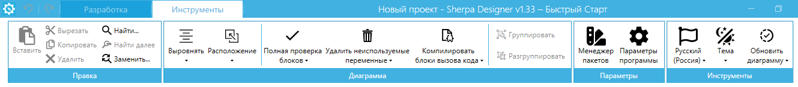

# Панель "Инструменты"

Панель "Инструменты" содержит основные действия по настройке и управлению проектами и диаграммами Роботов. В основное меню входит:

* Меню "Правка";
* Меню "Диаграмма";
* Меню "Параметры";
* Меню "Инструменты".

<figure><figcaption></figcaption></figure>
