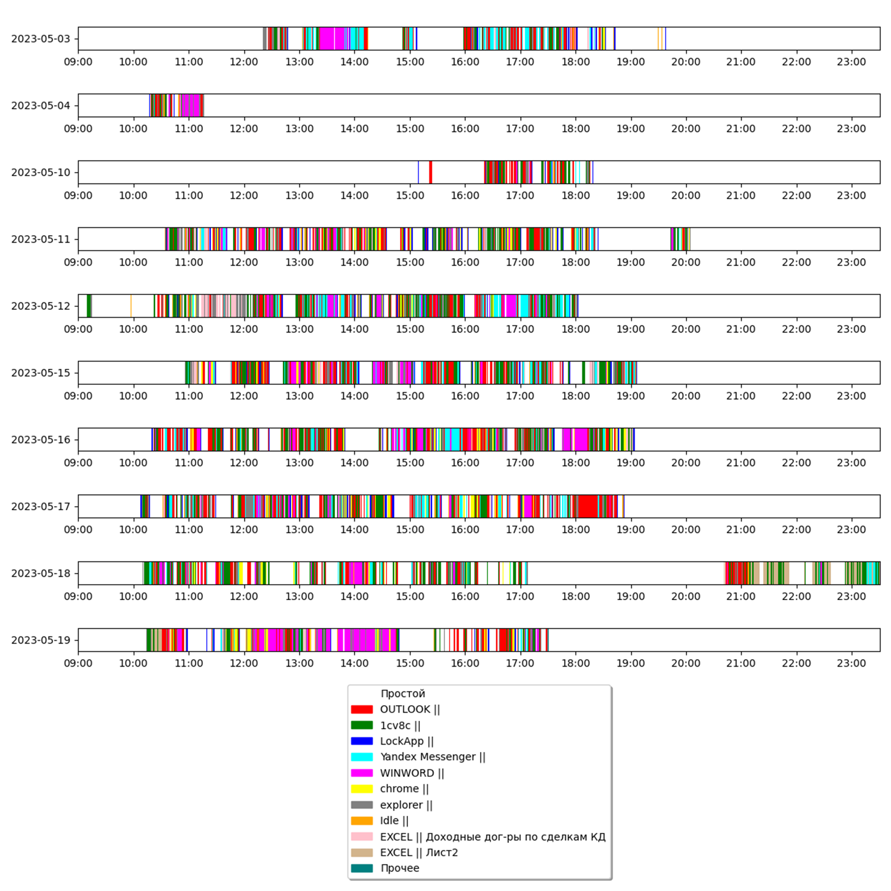

# Создание PDD кнопкой «Документировать...»

При нажатии на кнопку "Документировать…", если проект открыт, откроется окно "Документировать…", в котором будут доступны следующие элементы:

<figure><figcaption></figcaption></figure>

* Поле "Шаблон PDD", заполненное по умолчанию.

Подробнее про PDD-файл:



* Флаг "Сокращенную версию (без ИИ)", который включает создание обобщенной версии документации без использования искусственного интеллекта.
* Флаг "Полную версию (с ИИ)" (будет доступен в следующих версиях).
* Кнопка "Генерировать документацию", которая запускает процесс создания документа.
* Кнопка "Отмена", которая закрывает окно без выполнения генерации документации.

При нажатии на кнопку "Генерировать документацию" появится окно "Сохранение", в котором Пользователю необходимо выбрать нужную папку для сохранения будущего файла с документацией.

После выбора папки (и последующего подтверждения) начнется процесс генерации. В начале, в логах появится сообщение: "`Запущено генерирование документации. Пожалуйста, подождите…`". После завершения генерации в логах можно будет увидеть сообщение: "`Генерация завершена. Создан файл "C:\Users\<выбранная папка>\<имя файла>.docx"`".

<figure><figcaption></figcaption></figure>

Перейдя в выбранную папку, Пользователь сможет открыть сгенерированный DOCX-файл и просмотреть итоговую документацию.

<figure><figcaption></figcaption></figure>
