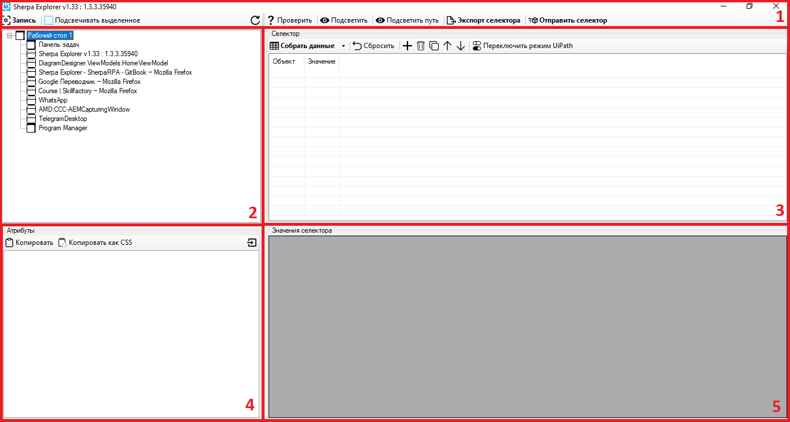
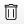
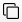

# Sherpa Explorer

Кнопка “**Sherpa Explorer**” в меню разработки позволяет открыть Sherpa Explorer.

**Sherpa Explorer** – инструмент для ручного подбора и тестирования селекторов. В нём, как и в обычном редакторе селекторов можно записать любой элемент интерактивно, а также исследовать иерархическое дерево любого Desktop-, Java- и веб-приложения, его доступные атрибуты, подобрать и протестировать нужное сочетание атрибутов.&#x20;

Пользовательский интерфейс Sherpa Explorer состоит из следующих основных областей:

1. Основное меню (верхняя панель);
2. Дерево элементов;
3. Селектор;
4. Атрибуты;
5. Значения селектора.

<figure><figcaption></figcaption></figure>

Основное меню Sherpa Explorer позволяет выделить нужный элемент нажатием клавиши CTRL, просмотреть полную иерархию элементов до текущего, проверить наличие элемента, экспортировать селектор элемента в блоки среды разработки Sherpa Designer в свойство “Селектор”.

<table data-header-hidden><thead><tr><th width="54"></th><th width="208"></th><th width="304"></th></tr></thead><tbody><tr><td><strong>№ п/п</strong></td><td><strong>Элемент интерфейса</strong></td><td><strong>Описание</strong></td></tr><tr><td>1.</td><td>кнопка “Запись”</td><td>При наведении курсора мыши на нужный элемент и нажатия клавиши CTRL позволяет вывести всю иерархию элементов в окно Sherpa Explorer.</td></tr><tr><td>2.</td><td>чекбокс “Подсвечивать выделенное”</td><td>При поиске элемента (использование кнопки “Запись”) позволяет подсвечивать элемент (появляется розовая рамка по краям элемента).</td></tr><tr><td>3.</td><td>кнопка “Проверить”</td><td>Позволяет проверить наличие элемента по заданным параметрам селектора.</td></tr><tr><td>4.</td><td>кнопка “Подсветить”</td><td>Подсвечивает элемент по заданному селектору.</td></tr><tr><td>5.</td><td>кнопка “Подсветить путь”</td><td>Подсвечивает элементы по заданному селектору, начиная по иерархии от верхнего до текущего.</td></tr><tr><td>6.</td><td>кнопка “Экспорт селектора”</td><td>Копирует значение селектора в буфер обмена, для дальнейшей вставки в соответствующий блок.</td></tr><tr><td>7.</td><td>кнопка “Отправить селектор”</td><td>Передает параметры, выбранные в Sherpa Explorer, в текущий активный блок для работы с селекторами при условии его открытых свойств.</td></tr></tbody></table>

## Дерево элементов

<figure><figcaption></figcaption></figure>

**Дерево элементов** отображает древовидную структуру пути к определенному элементу приложения. При двойном клике на элементе дерева открывается соответствующий путь, по которому можно получить доступ к данному элементу. Таким образом, можно спускаться до тех пор, пока не будет найден конечный элемент пути.

## Селектор

<figure><figcaption></figcaption></figure>

<table data-header-hidden><thead><tr><th width="54"></th><th width="189"></th><th width="319"></th></tr></thead><tbody><tr><td><strong>№ п/п</strong></td><td><strong>Элемент интерфейса</strong></td><td><strong>Описание</strong></td></tr><tr><td>1.</td><td>кнопка “Собрать данные”</td><td>Позволяет собрать данные элемента. Также, для выполнения действия можно воспользоваться клавишей F5.</td></tr><tr><td>2.</td><td>кнопка “Сбросить”</td><td>Позволяет сбросить данные селектора по умолчанию.</td></tr><tr><td>3.</td><td>кнопка </td><td>Позволяет добавить строку.</td></tr><tr><td>4.</td><td>кнопка </td><td>Позволяет удалить строку.</td></tr><tr><td>5.</td><td>кнопка </td><td>Позволяет клонировать строку.</td></tr><tr><td>6.</td><td>кнопка </td><td>Позволяет передвинуть строку вверх.</td></tr><tr><td>7.</td><td>кнопка </td><td>Позволяет передвинуть строку вниз.</td></tr><tr><td>8.</td><td>кнопка “Переключить UiPath”</td><td>Позволяет переключить режим UiPath.</td></tr><tr><td>9.</td><td>колонка “Объект”</td><td>Выводит тип элемента.</td></tr><tr><td>10.</td><td>колонка “Значение”</td><td>Выводит атрибуты элемента.</td></tr></tbody></table>

## Атрибуты

<figure><figcaption></figcaption></figure>

<table data-header-hidden><thead><tr><th width="53"></th><th width="209"></th><th width="304"></th></tr></thead><tbody><tr><td><strong>№ п/п</strong></td><td><strong>Элемент интерфейса</strong></td><td><strong>Описание</strong></td></tr><tr><td>1.</td><td>кнопка “Копировать”</td><td>Позволяет копировать значение в буфер обмена.</td></tr><tr><td>2.</td><td>кнопка “Копировать как CSS”</td><td>Позволяет копировать как часть CSS селектора в буфер обмена.</td></tr><tr><td>3. </td><td>кнопка </td><td>Позволяет импортировать значение в селектор.</td></tr><tr><td>4.</td><td>строка “BoundingRectangle”</td><td>Обозначает прямоугольную область, которая полностью охватывает элемент.</td></tr><tr><td>5.</td><td>строка “ClassName”</td><td>Имя класса элемента.</td></tr><tr><td>6.</td><td>строка “ControlType”</td><td>Тип элемента управления (например, кнопка, текстовое поле и т. д.).</td></tr><tr><td>7.</td><td>строка “FrameworkId”</td><td>Идентификатор используемого фреймворка (например, Win32, WPF и т. д.).</td></tr><tr><td>8.</td><td>строка “HasKeyboardFocus”</td><td>Если в данной строке введено значение <code>1</code>, то становится активен режим, когда Пользователь может набирать текст или использовать клавиши для управления элементом.   Если в данной строке введено значение <code>0</code>, тот данный элемент в интерфейсе в данный момент не получает фокус с клавиатуры.</td></tr><tr><td>9.</td><td>строка “Id”</td><td>Идентификатор элемента (обычно уникальный для каждого элемента).</td></tr><tr><td>8.</td><td>строка “Index”</td><td>Индекс элемента в списке подходящих элементов.</td></tr><tr><td>9.</td><td>строка “IsContentElement”</td><td>Показывает, является ли элемент частью содержимого контейнера.</td></tr><tr><td>10.</td><td>строка “IsControlElement”</td><td>Показывает, является ли элемент в интерфейсе управляющим или интерактивным элементом.</td></tr><tr><td>11.</td><td>строка “IsDataValidForForm”</td><td>Указывает, являются ли данные, полученные из элемента, допустимыми для использования в текущей форме.</td></tr><tr><td>12.</td><td>строка “IsEnabled”</td><td>Показывает, активен ли элемент для взаимодействия.</td></tr><tr><td>13.</td><td>строка “IsKeybordFocusable”</td><td>Показывает, может ли элемент получать фокус клавиатуры.</td></tr><tr><td>14.</td><td>строка “IsOffscreen”</td><td>Показывает, находится ли элемент вне области видимости экрана.</td></tr><tr><td>15.</td><td>строка “IsPassword”</td><td>Показывает, является ли элемент полем ввода пароля.</td></tr><tr><td>16.</td><td>строка “IsRequiredForForm”</td><td>Показывает, обязателен ли элемент для заполнения формы.</td></tr><tr><td>17.</td><td>строка “LocalizedControlType”</td><td>Локализованное описание типа элемента управления.</td></tr><tr><td>18.</td><td>строка “Name”</td><td>Имя элемента.</td></tr><tr><td>19.</td><td>строка “NativeWindowHandle”</td><td>Дескриптор окна, с которым связан элемент.</td></tr><tr><td>20.</td><td>строка “Orientation”</td><td>Ориентация элемента (например, горизонтальная или вертикальная).</td></tr><tr><td>21.</td><td>строка “ProcessId”</td><td>Идентификатор процесса, к которому относится элемент.</td></tr><tr><td>22.</td><td>строка “ProviderDescription”</td><td>Описание поставщика (интерфейса доступа к элементам).</td></tr><tr><td>23.</td><td>строка “Role”</td><td>Роль элемента (например, кнопка, поле ввода и т. д.).</td></tr><tr><td>24.</td><td>строка “States”</td><td>Состояния элемента (например, выбрано, развернуто и т. д.).</td></tr></tbody></table>

## Значения селектора

<figure><figcaption></figcaption></figure>

Область, где показываются конкретные значения, выбранные Пользователем через селектор.

## Демонстрация работы в Sherpa Explorer

* [Работа в Sherpa Explorer: варианты запуска, интерфейс, работа с селекторами](https://sherparpa.ru/ucontent/?0A)
* [Использование Sherpa Explorer для работы с браузером Chrome](https://sherparpa.ru/ucontent/?FaPW)
