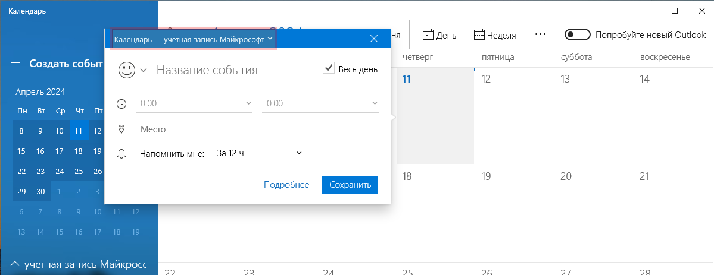

# Запись действий пользователя

Во время записи элементы пользовательского интерфейса выделяются красной рамкой, как показано на приведенном ниже скриншоте, что позволяет быть уверенным в правильности выбора соответствующих кнопок, полей и меню.

<figure><figcaption></figcaption></figure>

Блоки бизнес-процесса в диаграмме, созданные с помощью инструмента "Запись" , отличаются от блоков, добавленных из палитры. Отличие заключается в наличие символа  (1).png>), при наведении на который отображаются информативные снимки экрана, сделанные программой в момент выбора элемента управления. Маленьким крестиком показана точка, на которую пользователь кликнул при записи.

<figure><figcaption></figcaption></figure>

Функция Get OCR Text — получить текст с экрана методом распознавания образов.

<figure><figcaption></figcaption></figure>

Во время записи выделите область экрана, на которой нужно произвести поиск текста, то есть выделите область, в которой будет проводиться распознавание. Область ограничьте красной рамкой, которая появляется зажатием правой кнопки мыши. Распознавание текста проводится с помощью встроенных и внешних модулей распознавания:

* Tesseract OCR;
* Yandex Vision;
* Microsoft OCR;
* OCR Space;
* ABBYY Cloud OCR;
* ABBYY FineReader.

Выберите нужный модуль распознавания. Вы можете сразу видеть результаты распознавания в окне слева. Если результаты распознавания верны, нажмите "Сохранить". Если результаты распознавания не удовлетворяют, выберите другой модуль распознавания из списка и нажмите Обновить или измените доступные настройки распознавания.

**Доступны для подключения следующие OCR:**

* Tesseract OCR;
* ABBYY OCR;
* Microsoft OСR;
* Yandex Vision.
