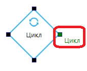

# Цикл

Цикл позволяет повторить цепочку действий (блоков) несколько раз и при этом посчитать количество итераций цикла, записывая текущее количество в специальную переменную (указанную в свойстве "Цикл"), которую можно затем использовать в других блоках.&#x20;

При первом входе в блок значение переменной из свойства "Цикл" приравнивается к "Начальному значению" ( (1) (1) (1) (1) (1) (1) (1) (1) (1) (1) (1) (1) (1) (1) (1) (1) (1) (1).png>)), а затем выполнение сценария продолжается в сторону выхода "Цикл" данного блока (в так называемое "тело цикла").&#x20;

<figure><figcaption></figcaption></figure>

Как только выполнение сценария вновь дойдет до данного блока, значение переменной "Цикл" увеличится на значение "Шаг", и вновь произойдёт переход в сторону выхода "Цикл". Как только значение переменной "Цикл" станет больше или равно "Конечному значению", выполнение сценария продолжится в сторону нижнего выхода блока. Не забудьте соединить выход последнего блока в теле цикла со входом данного блока или какого-либо из предшествующих блоков.

<table data-header-hidden><thead><tr><th width="247" valign="top"></th><th width="311" valign="top"></th></tr></thead><tbody><tr><td valign="top">Начальное значение</td><td valign="top">[Число] Начальное значение переменной из свойства Цикл, будет присвоено этой переменной в начале цикла.</td></tr><tr><td valign="top">Конечное значение</td><td valign="top">
[Число] Конечное значение переменной из свойства Цикл. 

Итерации цикла будут выполняться пока значение переменной Цикл меньше заданного в этом свойстве.
</td></tr><tr><td valign="top">Шаг</td><td valign="top">
[Число] Шаг приращения значения переменной из свойства Цикл в каждой итерации цикла. 

Шаг может иметь отрицательное значение, это полезно когда Начальное значение больше Конечного значения, и требуется считать в обратную сторону.
</td></tr><tr><td valign="top">Цикл</td><td valign="top">[Число] Переменная, в которую будет записано текущее значение цикла. Например, если: <code>Начальное значение = 0</code>, <code>Конечное значение = 7</code>, а <code>Шаг = 2</code>, то значениями цикла будут последовательно числа <code>0</code>,<code>2</code>,<code>4</code>,<code>6</code>.</td></tr><tr><td valign="top">Уровень обработки</td><td valign="top">
Выбор уровня обработки ошибок. Возможные значения: 
<ul><li>"Default" - по умолчанию; </li><li>"Ignore" - ошибки игнорируются; </li><li>"Handle" - ошибки обрабатываются. </li></ul>
Если выбрано значение "Default", то будет использоваться значение блока "Старт" данной диаграммы.
</td></tr><tr><td valign="top">Направление выхода</td><td valign="top">
Выбор направления выхода из блока при возникновении ошибки. Возможные значения: 
<ul><li>"Default" - по умолчанию; </li><li>"Right" - направо; </li><li>"Bottom" - вниз. </li></ul>
Данное свойство позволяет определить направление выхода при возникновении ошибок для блоков не содержащих коннектора "Если ошибка" (например, блок "Условие"). 

Если выбрано значение "Default", то будет использоваться значение блока "Старт" данной диаграммы.
</td></tr><tr><td valign="top">Уровень сообщений</td><td valign="top">
Выбор уровня сообщений, который будут выводить блоки при работе. Возможные значения: 
<ul><li>"Default" - по умолчанию; </li><li>"Release" - вывод отключен; </li><li>"Debug" - вывод основной информации; </li><li>"Detailed" - вывод подробной информации. </li></ul>
Если выбрано значение "Default", то будет использоваться значение блока "Старт" данной диаграммы.
</td></tr><tr><td valign="top">Текст ошибки</td><td valign="top">[Текст] Возвращает подробную информацию об ошибке в случае некорректного выполнения работы блока.</td></tr></tbody></table>
