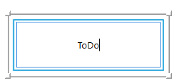

# ToDo

<figure><figcaption></figcaption></figure>

Блок можно использовать как заглушку или напоминание для планируемых к реализации функций. В отличие от блока Комментарий, данный блок является элементом сценария, но не выполняет никаких действий.
