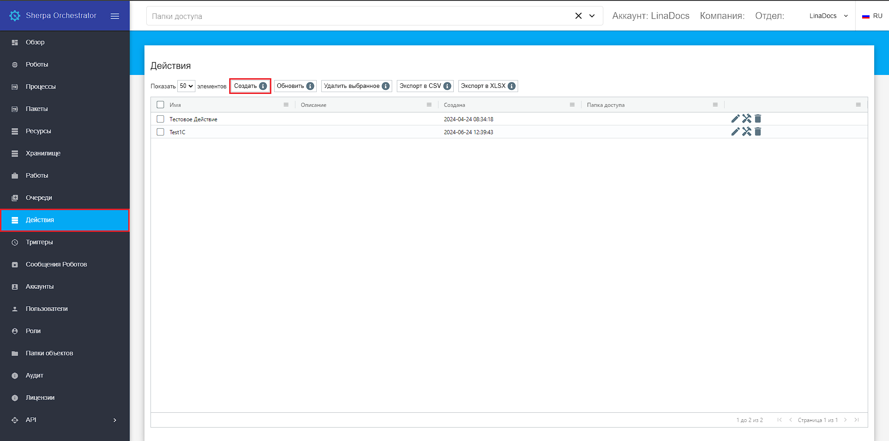

# Пример создания действия и его настройки

В данном примере описан вариант взаимодействия роботов и сотрудников, работающих на рабочем месте через экран “Действия”. [Видео-демонстрацию можно посмотреть здесь.](https://sherparpa.ru/ucontent/?0I)

Сначала один из роботов получает и распознает накладные, а затем создает Задачи по итогам распознавания и устанавливает в них теги 1CNew, после чего производится проверка правильности распознавания (и исправлен в случае необходимости)  данных на рабочем месте, созданном в рамках действия  , после чего в задаче меняется тег с 1CNew на 1СModified. Соответственно, другой робот будет забирать задачи с тегом 1СModified и вносить данные, которые в них есть в 1С.

Откройте экран “Действия” и нажмите кнопку “Создать”.

<figure><figcaption></figcaption></figure>

В открывшейся форме укажите название, рабочую очередь (необходимо создать ее заранее), статус задач и тег.&#x20;

<figure><figcaption></figcaption></figure>

Перейдите во вкладку “Кнопки действий”. Для первой кнопки укажите название и установите флаг “Сохранить изменения в текущей задаче”. Укажите тег, который нужно добавить и тег, который нужно удалить в соответствующих текстовых полях.

<figure><figcaption></figcaption></figure>

Сохраните и закройте форму, нажав кнопку “ОК”. Затем перейдите в “Дизайнер формы” у только что созданного действия.&#x20;

<figure><figcaption></figcaption></figure>

В “Дизайнере формы” добавьте два текстовых поля (Text) и укажите в них имена параметров в задаче. Эти имена необходимо указать при  создании задачи.

<figure><figcaption></figcaption></figure>

<figure><figcaption></figcaption></figure>

<figure><figcaption></figcaption></figure>

После этого добавьте поле табличных данных (Data Table) и укажите параметр задачи “Товары”

<figure><figcaption></figcaption></figure>

Далее добавьте поле “PDF” и укажите параметр задачи файла PDF.&#x20;

<figure><figcaption></figcaption></figure>

При необходимости измените размеры полей и переместить их.

<figure><figcaption></figcaption></figure>

Нажмите кнопку “Сохранить”. После этого нажмите кнопку, чтобы зайти в настройки созданного “Действия”, и во вкладке “Доступ” скопируйте ссылку для доступа к действию.

<figure><figcaption></figcaption></figure>

При переходе по ссылке доступна созданная форма.&#x20;

Если Вы запустили роботов  в процессе получения и распознавания накладных, то в очереди уже будет создана  задача и при ее выборе будут показаны распознанные данные.

<figure><figcaption></figcaption></figure>

После проверки данных и внесения корректировки нажмите кнопку  “Сохранить изменения”. У задачи поменяется тег по алгоритму, который Вы указали  в настройках “Действия” у этой кнопки. &#x20;

<figure><figcaption></figcaption></figure>

После выполнения указанных выше действий, данная задача больше не будет отображаться в списке формы рабочего места Действия.   Можно приступать к внесению данных из обработанных задач в 1С.

 
