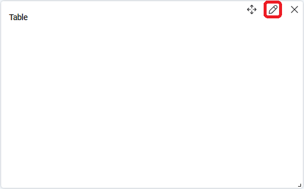

# TABLE

Виджет Table отображает таблицу. Каждая ячейка может содержать текст или число.

<figure><figcaption></figcaption></figure>

## Начало настройки виджета

Для настройки виджета нажмите на значок редактирования .&#x20;

<figure><figcaption></figcaption></figure>

Откроется всплывающее окно “Настройки виджета”:

<figure><figcaption></figcaption></figure>

Заполните нужные поля для настройки виджета.

## **Общие поля**

* **“Название виджета \*”** – текстовое поле, заполняется вручную с клавиатуры;
* **“Режим”** – всплывающий список, в котором нужно выбрать режим создания запроса для виджета:&#x20;

| **Название**                                       | **Описание**                                                                                                                                                                                                                                                                                       |
| -------------------------------------------------- | -------------------------------------------------------------------------------------------------------------------------------------------------------------------------------------------------------------------------------------------------------------------------------------------------- |
| [Режим конструктора](table.md#rezhim-konstruktora) | Позволяет собрать запрос из отдельных блоков. В каждом блоке (Объединение таблиц, Фильтры, Ряды виджета, Группировка по, Сортировка, Количество строк) есть возможность настроить нужные команды для работы с данными, арифметические и логические команды, операторы сравнения.                   |
| [Расширенный режим](table.md#rasshirennyi-rezhim)  | <p>Позволяет ввести запрос вручную в поле SQL:</p><p></p> |

* **“Таблицы”** – всплывающий список со всеми доступными таблицами базы данных;

## **Дополнительные поля, доступные для настройки только в Режиме конструктора**

### **Объединение таблиц**

Объединение таблиц необходимо для того, чтобы извлечь данные из нескольких связанных таблиц и сформировать более полные и информативные результаты.

Для сравнения двух таблиц, для последующего объединения, используются следующие операторы:

| **Название** | **Описание**                                                                                                          |
| ------------ | --------------------------------------------------------------------------------------------------------------------- |
| =            | Вернет строки из двух таблиц, где значения в указанных столбцах равны.                                                |
| !=           | Вернет строки из двух таблиц, где значения в указанных столбцах не равны.                                             |
| >            | Вернет строки, где значение в указанном столбце из первой таблицы больше значения в указанном столбце второй таблицы. |
| <            | Вернет строки, где значение в указанном столбце из первой таблицы меньше значения в указанном столбце второй таблицы. |

Если требуется объединить только 2 таблицы, то необходимо заполнить поля:

1. **“Столбец”** из всплывающего списка; &#x20;
2. **“Оператор”** из всплывающего списка;
3. **“Столбец 2”** из всплывающего списка;

Например,&#x20;

<figure><figcaption></figcaption></figure>

Если требуется объединить больше двух таблиц, то необходимо нажать кнопку , после чего заполнить нужные поля.

Если требуется удалить объединение таблиц, то необходимо нажать кнопку .

### **Фильтры**

Фильтры позволяют задавать условия для выбираемых данных с помощью операторов сравнения и логических операторов.

Для того, чтобы задать одно условие, необходимо заполнить поля:

1. **“Столбец”** из всплывающего списка;
2. **“Оператор”** из всплывающего списка;
3. **“Значение”** вручную с клавиатуры;

Например,&#x20;

<figure><figcaption></figcaption></figure>

Если требуется скомбинировать несколько условий в одно целое, например, ((robots.is\_deleted = 0) AND (robots.id > 13)), то необходимо использовать логические операторы. Для этого необходимо выбрать нужный оператор, кликнув на иконку , чтобы поменять её на OR, или , чтобы поменять её на AND. Далее нажать кнопку , после чего заполнить нужные поля:

<figure><figcaption></figcaption></figure>

Если требуется задать сложное условие для Фильтра, включающее в себя несколько скобок, то необходимо нажать кнопку , после чего заполнить нужные поля.

Если требуется удалить условие, то необходимо нажать кнопку .

### **Ряды виджета**

Ряды виджета используются для указания колонок данных, которые необходимо извлечь из базы данных. Они определяют, какие данные будут возвращены в результатах запроса.&#x20;

Для того, чтобы настроить Ряды виджета, необходимо заполнить поля:

1. **“Столбец”** из всплывающего списка;
2. **“Оператор”** из всплывающего списка;
3. **“Название ряда”** вручную с клавиатуры;

Например,

<figure><figcaption></figcaption></figure>

Если требуется вывести дополнительные данные на легенду, то следует нажать кнопку .

### **Группировка по**&#x20;

Поле для настройки процесса объединения строк данных с одинаковыми значениями в определенном столбце (или столбцах) в единый набор, что позволяет выполнять агрегатные операции над этими группами. Для объединения строк данных, необходимо заполнить поле столбец из выпадающего списка;

### **Сортировка**

Поля для настройки процесса упорядочивания данных в результирующем наборе в определенном порядке в зависимости от значений в одном или нескольких столбцах. Для сортировки по возрастанию, требуется внести в поле “Сортировка по” значение “ASC”. Для сортировки по убыванию, значение “DESC”. Далее необходимо заполнить поле “Столбец” из выпадающего списка;

### **Количество строк**

Поле заполняется вручную с клавиатуры или с помощью счетчика . Данное поле позволяет ограничить количество записей, которые возвращаются в результате запроса для построения Дашборда.

## Тестирование

Для того чтобы удостовериться, что запрос настроен верно, необходимо нажать на кнопку , после чего появится таблица с данными, по которым будет построен Дашборд Table.

Для вывода Дашборда на панель, следует нажать кнопку “ОК”.

Для удаления всех заполненных данных, следует нажать кнопку “Отмена”.

Пример:

<figure><figcaption></figcaption></figure>

Для вывода информации о Роботах на Дашборд Table, необходимо внести в соответствующие поля в окне "Настройки виджета" данные:

## Режим конструктора (пример)

<figure><figcaption></figcaption></figure>

<figure><figcaption></figcaption></figure>

<figure><figcaption></figcaption></figure>

Необходимо заполнить поля:

**Таблицы \***

_robots_

**Ряды виджета**

<table data-header-hidden><thead><tr><th width="234"></th><th></th><th></th></tr></thead><tbody><tr><td><strong>Столбец</strong></td><td></td><td><strong>Название ряда</strong></td></tr><tr><td><em>robots.guid</em></td><td></td><td><em>id</em></td></tr><tr><td><em>robots.name</em></td><td></td><td><em>name</em></td></tr><tr><td><em>robots.created</em></td><td></td><td><em>created</em></td></tr><tr><td><em>robots.updated</em></td><td></td><td><em>updated</em></td></tr><tr><td><em>robots.description</em></td><td></td><td><em>description</em></td></tr><tr><td><em>robots.local_robot_name</em></td><td></td><td><em>local_name</em></td></tr></tbody></table>

**Группировка по**

_robots.updated_

**Сортировка**

| **Столбец**      | **Сортировка по** |
| ---------------- | ----------------- |
| _robots.created_ | _ASC_             |

**Количество строк**

_10_

## Расширенный режим (пример)

Необходимо заполнить поле:

**SQL**

```sql
SELECT
    robots.guid AS id,
    robots.name AS name,
    robots.created AS created,
    robots.updated AS updated,
    robots.description AS description,
    robots.local_robot_name AS local_name
FROM
    robots
GROUP BY robots.updated
ORDER BY robots.created ASC;
LIMIT 10
```
