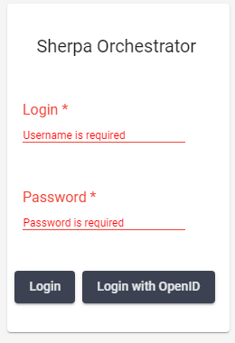

# Параметры Пользователя

Для осуществления авторизации Пользователя необходимо ввести логин и пароль Учетной записи на отдельной странице авторизации Оркестратора.\
В случае, если авторизация осуществляется Пользователем Аккаунта (подробнее об Аккаунтах описано [здесь](ekrany/akkaunty.md)), то необходимо ввести логин и пароль от Учетной записи Аккаунта, также поддерживается [авторизация через OpenID](ekrany/polzovateli/avtorizaciya-polzovatelei.md#openid-autentifikaciya).

<figure><figcaption></figcaption></figure>

Время жизни сессии без активных действий Пользователя — 15 минут. Кнопка .png>) (Выход/Logout) очищает текущую сессию Пользователя и возвращает Пользователя на экран авторизации. В рамках Аккаунта можно создать любое количество Пользователей, при этом каждый из Пользователей может быть участником только одного Аккаунта.

В верхней панели Оркестратора находится следующая информация:

<figure><figcaption></figcaption></figure>

* кнопка .png>). Вызывает всплывающее меню Sections;
* фильтр “**Папки доступа**”. Позволяет отфильтровать объекты на экранах по папкам объектов;

<figure><figcaption></figcaption></figure>

* нередактируемое поле “**Аккаунт:**”. Отображает имя текущего Аккаунта (если авторизация произведена через Аккаунт) или Аккаунта, к которому относится авторизованный Пользователь;&#x20;
* нередактируемое поле “**Компания:**”. Отображает компанию, которая была указана при создании Учетной записи Аккаунта, к которому относится авторизованный Пользователь;
* нередактируемое поле “**Отдел:**”. Отображает отдел компании, который был указан при создании текущей Учетной записи Аккаунта, к которому относится авторизованный Пользователь;
* иконка .png>). Отображает имя текущего Пользователя, по нажатию которое появляется кнопка Выход/Logout.
* кнопка .png>). Позволяет поменять язык интерфейса Оркестратора, если это необходимо.&#x20;

<figure><figcaption></figcaption></figure>
