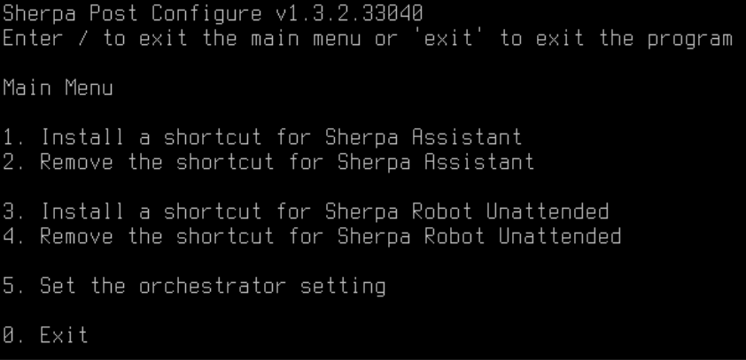

# Установка Sherpa Robot Unattended на RedOS

> Для установки необходимы права sudo

Если робот уже установлен, то перейдите к разделу [Скачивание и распаковка Робота](ustanovka-sherpa-robot-unattended-na-redos.md#skachivanie-i-raspakovka-robota) для его обновления.&#x20;

## Установка .NET Core 8 и Powershell

Общие инструкции по установке приведены на сайте Microsoft:





* Устанавите пакет .NET SDK версии 8.0:

```
sudo dnf install -y dotnet-sdk-8.0
```

* Установите RPM-пакет PowerShell версии 7.4.2:

```
sudo dnf install https://github.com/PowerShell/PowerShell/releases/download/v7.4.2/powershell-7.4.2-1.rh.x86_64.rpm
```

## Установка libgdiplus

Для работы эмуляции клавиатуры и мышки нужно установить библиотеку libgdiplus. Для этого выполните в терминале:

```
sudo dnf install libgdiplus
```

## Установка tesseract

Для работы с tesseract, выполните в терминале:

```
sudo dnf install tesseract-langpack-rus
```

## Установка python

Для работы с python, выполните в терминале:

```
sudo dnf install python3-devel.x86_64
```

## Установка сервера RDP

Для подключения к машине Координатора необходимо установить сервер xrdp.

**Выполните в терминале:**

* Установите xrdp:

```
sudo dnf install xrdp
```

* Перезапустите xrdp:

```
sudo systemctl restart xrdp
```

* Активируйте автоматический запуск xrdp при загрузке системы:

```
sudo systemctl enable xrdp --now
```

* Перезагрузите систему:

```
sudo reboot
```

## Скачивание и распаковка Робота

**Выполните в терминале:**

* Удалите файл sherpa-robot.zip:

```
rm -f sherpa-robot.zip
```

* Скачайте файл sherpa-robot.zip:

```
wget https://sherparpa.ru/downloads/linux/get-robot.php -O sherpa-robot.zip
```

* Распакуйте ZIP-архив:

```
sudo unzip -o sherpa-robot.zip -d /usr/lib
```

*   Перейдите в папку sherpa-robot и установите права на исполнение файлов:

    * Сделайте скрипт install\_host.sh исполняемым:

    `sudo chmod a+x /usr/lib/sherpa-robot/Chrome/install_host.sh`

    * Сделайте файл process-agent-host исполняемым:

    `sudo chmod a+x /usr/lib/sherpa-robot/Chrome/process-agent-host`

    * Сделайте файл process-agent исполняемым:

    `sudo chmod a+x /usr/lib/sherpa-robot/process-agent`

    * Сделайте файл sherpa-assistant исполняемым:

    `sudo chmod a+x /usr/lib/sherpa-robot/sherpa-assistant`

    * Сделайте файл sherpa-assistant-console исполняемым:

    `sudo chmod a+x /usr/lib/sherpa-robot/sherpa-assistant-console`

> Для установки или обновления робота до последней версии можно ввести в терминале эту команду. В ней собраны все выше описанные команды: `rm -f sherpa-robot.zip && wget https://sherparpa.ru/downloads/linux/get-robot.php -O sherpa-robot.zip && sudo unzip -o sherpa-robot.zip -d /usr/lib && sudo chmod a+x /usr/lib/sherpa-robot/Chrome/install_host.sh && sudo chmod a+x /usr/lib/sherpa-robot/Chrome/process-agent-host && sudo chmod a+x /usr/lib/sherpa-robot/process-agent && sudo chmod a+x /usr/lib/sherpa-robot/sherpa-assistant && sudo chmod a+x /usr/lib/sherpa-robot/sherpa-assistant-console`

## Добавление Пользователей для запуска Unattended-роботов

**Выполните в терминале:**

* Запустите "Центр управления" → "Управление пользователями";&#x20;
*   Первичная настройка для:

    * Добавления ярлыка для Sherpa Assistant,
    * Добавления ярлыков в автозагрузку для Unattended-роботов,
    * Указания сервера Оркестратора для Unattended-роботов,
    * Указания GUID Роботов для учетных записей Unattended-роботов.

    Предварительно необходимо создать учетные записи, на которых будут запускаться Unattended-роботы:

    * Сделайте файл post-configure исполняемым:

    `sudo chmod a+x /usr/lib/sherpa-robot/post-configure/post-configure`

    * Запустите файл post-configure с правами администратора:

    `sudo /usr/lib/sherpa-robot/post-configure/post-configure`

Вы увидите главное меню с командами:

<figure><figcaption></figcaption></figure>

1. Команда создает ярлыки на Sherpa Assistant на рабочем столе, а так же в меню "Пуск" → "Разработка".
2. Команда удаляет ярлыки Sherpa Assistant.
3. Команда создает ярлык в автозагрузке у Пользователя на запуск Unattended-робота.
4. Команда удаляет ярлык на запуск Unattended-робота.
5. Команда позволяет ввести сервер Оркестратора и указать GUID Роботов.

Все команды могут выполняться или для всех учетных записей, или выборочно:

<figure><figcaption></figcaption></figure>

## Установка Yandex Browser

Для работы Робота с Yandex Browser необходимо установить в него плагин.

Данное действие нужно выполнять для каждой учетной записи отдельно.

* Зайдите в учетную запись.
* Откройте браузер и перейдите в раздел "Дополнения".
* Запустите менеджер файлов и перейдите в папку:

```
/usr/lib/sherpa-robot/Chrome
```

* Перенесите файл plugin.crx в окно браузера.&#x20;
* Добавьте расширение и закройте браузер.
* Запустите окно терминала в текущей папке:

```
./install_host.sh
```

* Запустите браузер.&#x20;

Если значок плагина Sherpa RPA стал синим, значит плагин успешно установлен.

Так же плагин можно установить с сайта:&#x20;



И после этого выполнить пункты 4, 5, 6, 7.

## Установка Chromium

Для работы Робота с Chromium необходимо установить в него плагин:

* Перейдите по ссылке:&#x20;



* Установите плагин.
* Перейдите в папку:

```
 /home/user/sherpa-robot/Chrome
```

*   Запустите окно терминала в текущей папке:

    * Сделайте скрипт install\_host.sh исполняемым:

    `chmod +x install_host.sh`

    * Запустите скрипт install\_host.sh исполняемым:

    `./install_host.sh`

    * Скопируйте JSON-конфигурационный файл для расширений Native Messaging из Chrome в Chromium:

    `cp -f $HOME/.config/google-chrome/NativeMessagingHosts/processagent.sherparpa.json $HOME/.config/chromium/NativeMessagingHosts`
* Запустите браузер.&#x20;

Если значок плагина Sherpa RPA стал синим, значит плагин успешно установлен.
