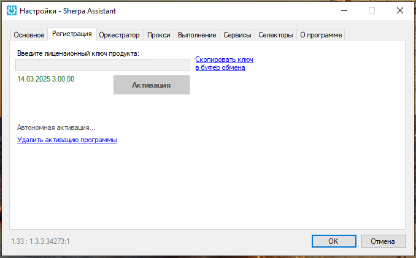

# Вкладка "Регистрация"

**Вкладка “Регистрация”** в окне настроек Sherpa Assistant имеет два вида, в зависимости от того, активирована у Вас [Лицензия](../../../../../licenzii/) или нет.&#x20;

<figure><figcaption></figcaption></figure>

<table data-header-hidden><thead><tr><th width="54"></th><th width="210"></th><th width="283"></th></tr></thead><tbody><tr><td><strong>№ п/п</strong></td><td><strong>Элемент интерфейса</strong></td><td><strong>Описание</strong></td></tr><tr><td>1.</td><td>поле “Введите лицензионный ключ продукта”</td><td>Поле для ввода лицензионного ключа продукта.</td></tr><tr><td>2.</td><td>Дата и время</td><td>Если у вас уже активирован лицензионный ключ продукта, то под полем для ввода лицензионного ключа будут указаны дата и время окончания срока действия лицензии.</td></tr><tr><td>3.</td><td>“Скопировать ключ в буфер обмена”</td><td>Позволяет скопировать лицензионный ключ продукта в буфер обмена.</td></tr><tr><td>4.</td><td>кнопка “Активация”</td><td>Позволяет активировать лицензионный ключ продукта.</td></tr><tr><td>5.</td><td>“Автономная активация”</td><td>Позволяет перейти к автономной активации лицензии. </td></tr><tr><td>6.</td><td>“Удалить активацию программы”</td><td>Позволяет удалить активацию программы. </td></tr></tbody></table>
